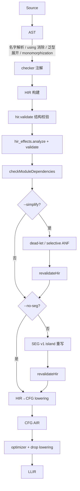
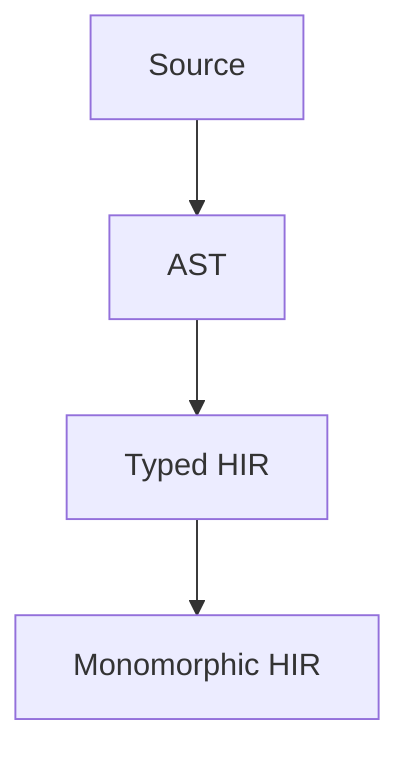

# Stilla HIR — 高级别中间表示

> **Status：HIR 是前端唯一 lowering 路径。**
>
> - **已实现**：数据结构（hir.zig）；AST→HIR 构建（hir_build.zig 与
>   hir_build_block / `_expr` / `_path` / `_call` / `_control` / `_pattern`）；
>   canonical 文本打印与解析（hir_print.zig / hir_parse.zig）；结构校验
>   （hir_validate.zig）；效果分析（hir_effects.zig，模型见 effects.zig）；
>   HIR→CFG lowering（hir_lower.zig 与 hir_lower_expr / `_control` / `_call` /
>   `_pattern`）；module-const 依赖检查。
> - **消费者**：dead-let + selective A-Normal Form + `never_returns` 后缀删除
>   （hir_simplify.zig，`--simplify`，默认关）；SEG v1（hir_seg.zig，可执行文件
>   默认开、`--no-seg` 关闭；库默认关、`Options.seg` 开启）。
> - **设计已定但未实现**（§11、[todo.md](todo.md)）：真正的 slotted e-graph、
>   HIRTypeId canonical 表、source span side table。
> - **阅读约定**：数据结构以 hir.zig 的落地形态为准；标 **Target** 的段落是
>   设计意图，不是现状。

## 1. 问题

### 1.1 直降的痛点（设计动机）

HIR 成为唯一路径之前，checker 在 AST 上完成名字解析、泛型展开
（monomorphization）与 ownership 注解，`lower.lowerProgram` 把注解后的
monomorphic AST 直接生成 CFG AIR。该直降路径**已删除**；以下是 HIR 的设计动机：

- AST 贴近源码（`using`、模块路径、泛型、source name 仍在），优化与 lowering
  耦合在 emit 路径里；
- 等式饱和需要 binder / 作用域的一等表示；AST 无法干净地做 α 等价、let
  化简、β-reduction；
- 新增 op / intrinsic 没有中间层：只能在 AST / emit 里特判，或把效果行与 SEG
  白名单散落多写。

### 1.2 语言特性给了这条路

| 特性 | 出处 | 对 HIR 意味着什么 |
| --- | --- | --- |
| 局部绑定不可变 | Core | let 天然可 canonical 成 binder，无赋值扰动 |
| 控制流表达式化、无 loop | Core | 没有 statement IR 与基本块级复杂度 |
| 函数单态且不捕获 | Core | 无运行时多态、无 closure capture，作用域可严格切断 |
| 从左到右、恰好一次求值 | Runtime | 求值次数可由**树结构**决定 |
| 显式 ownership（Copy/Unique/borrow） | Types & Ownership | 效果系统与所有权系统正交 |

### 1.3 设计目标（四条原则）

1. **名字不进入语义 IR——`BinderId` 才是身份。** 引用永远是 `Local(BinderId)`；
   shadowing 不依赖名字，α 等价在 binder / region 结构上可判定。
2. **Binder 作用域用一等 `Region` 表示。** let、函数 / λ 参数、match arm 的
   pattern 绑定统一为 region 的 params；没有独立 statement IR 或 pattern 作用域。
3. **Op 用 registry 扩展。** `ExprNode` 极小，op 语义（验证、效果、SEG 编码、
   lowering）挂在 `OpDescriptor` 上，不膨胀成递归 `union ExprKind`。
4. **SEG 只优化安全的纯 island，不接管整个 HIR。** v1 只接受 Copy、total、
   无 Unique 子值、无借用的子树。

### 1.4 非目标

- 不做传统递归 `enum Expr` AST。
- 不把 SEG 当主 IR：ownership、drop、求值顺序、trap 不能被等式饱和弄乱。
- 不处理 runtime polymorphism：泛型在 monomorphization 时已消解。
- 不做带 cost model 的通用 term 重写引擎：HIR 侧是固定小规则集 + 受限
  SEG island。

## 2. 方案概览

### 2.1 定位

> HIR 保存 Stilla 的精确语义；SEG 只是 HIR 的一个受限优化视图。

### 2.2 目标管线

**落地路径（[hir.md](hir.md) 描述的唯一前端路径）：**



`--simplify` 与 SEG **先后独立**：`--simplify` 默认关，SEG 默认开
（`--no-seg` 关闭）；两者都开时先 ANF 再 SEG，各自改写后都要
`revalidateHir`（§2.4）。两者都不长在 CFG 上。

**Target 形态（未立项）：**



即把 monomorphization 与 ownership 检查上移到「先建 Typed HIR 再特化」。本文描述
其架构意图，当前 HIR 落在 checker 与 CFG lowering 之间（下半部分）。

关键边界：**SEG 在 monomorphization 之后、CFG/SSA lowering 之前**。运行时没有
多态，SEG 不需要处理 runtime polymorphism。

### 2.3 与现状管线的边界

现状（唯一路径）：`module graph → checker（AST 注解）→ HIR 构建 → 结构校验 →
效果分析校验 → module-const 检查 → [--simplify] → SEG（默认开，`--no-seg`关）→
重新校验 →
HIR→CFG lowering → optimizer → LLIR`。直降路径不再存在。

HIR 落在 checker 与 CFG lowering 之间，是**兼容边界**，不是对两者的重写：

- **输入边界** — HIR 构建只消费 checker 的注解输出（已判决的名字解析、具体
  类型、ownership、monomorphize 后的单态体），原样**搬移**为 HIR 标注，不重新
  推理（§2.4）。
- **输出边界** — HIR→CFG 按 CFG lowering 语义逐条对齐（§9），复用既有
  block / value / drop 发射机制。回归门禁做 AIR **表示往返**（compile →
  canonical AIR → standalone cfg parser round-trip），不是语义等价证明。
- **范围边界** — 本文的 HIR 形态只做规范形，覆盖全部现有语言形态，**不含
  SEG**；SEG（§8）是可选的受限视图。
- **远期边界（Target）** — 把 monomorphization 与 ownership 检查上移到
  「先建 Typed HIR 再特化」，HIR 构建向上游扩展。本文描述其架构意图，未立项
  （[todo.md](todo.md)）。

### 2.4 两份语义的归属

- **静态结论搬移**：名字解析、具体类型、Copy/Unique 分类、borrow 合法性、
  match 穷尽、maybe-unique 状态，在 HIR 构建时搬移为 HIR 标注，不在 HIR 层重算。
- **运行时语义留在 CFG 后**：drop 展开、LLIR lifecycle 释放计划仍在 CFG 之后；
  HIR 只做计划 / 标注（§9）。
- **搬移只对初始构建成立**：任何变换（含 SEG island 替换、合成 let）之后，
  必须对受影响区域**重新校验**结构与效果（`revalidateHir`），不能假定 checker
  结论在重写后仍成立。

### 2.5 阅读导航

先读 §3（数据结构）、§4（文本形式）、§5（绑定 / 作用域 / 控制流），再读 §6
（ownership 与效果摘要）、§7（核心 op 与类型专门化）、§8（SEG 桥与重写合法性）、
§9（HIR→CFG 契约）、§10（验证）、§11（落地现状）。

## 3. 核心数据结构：arena、间接节点与身份注册

### 3.1 一览

| 概念 | 形态 | 作用 |
| --- | --- | --- |
| 句柄 | 稠密 u32 索引 | `ExprId RegionId BinderId PatternId ScopeId FullExprId SemanticInfoId SourceOriginId AttrSetId OpId FuncId HostBindingId ConstId` |
| 类型 | 内联 `meta.Type` | `ExprNode.ty` / `Binder.ty`；无独立 HIR TypeId（§3.8） |
| 名字 / span | 仅 side table | 不参与结构比较；source span 目前**未填充** |
| 容器 | arena + 扁平缓冲 | `exprs / regions / binders / patterns / scopes / full_exprs / semantic_infos` + `expr_buffer / region_buffer / binder_buffer` |
| 节点 | `ExprNode` | 极小：op / ty / operands / regions / attrs / sema / full_expr / origin / payload / access_hops |
| op | registry | `OpId` 单表条目 + `OpDescriptor` |
| 类型 capability | 派生 | Copy / Unique 由 checker 的类型 least-Copy fixpoint 推出，不存 `TypeInfo` 结构 |

### 3.2 容器

```text
hir.Program
 ├─ expr_buffer:    []ExprId     // ExprNode.operands 的扁平缓冲
 ├─ region_buffer:  []RegionId   // ExprNode.regions 的扁平缓冲
 ├─ binder_buffer:  []BinderId   // Region.params 的扁平缓冲
 ├─ exprs:          Arena<ExprNode>
 ├─ regions:        Arena<Region>
 ├─ binders:        Arena<Binder>
 ├─ patterns:       Arena<Pattern>
 ├─ scopes:         Arena<Scope>
 ├─ full_exprs:     Arena<FullExpr>
 ├─ semantic_infos: Arena<SemanticInfo>
 ├─ effect_interner: effects.Interner
 └─ sema_map:       (view, state) → SemanticInfoId interning 表

hir.BuiltProgram
 ├─ program, arena
 ├─ modules, funcs（FuncRecord）, consts, hosts
 └─ types: []meta.TypeDecl
```

- id 0 是哨兵：`sema` 初始为 owned/pending，`full_expr` 初始为 0。
- `attrs` 只有 `AttrSetId = u32` 与哨兵 `attr_empty = 0`，**无 interner**。
- `origin` 是 `SourceOriginId`（0 = none）；span side table **尚未落地**。

### 3.3 ExprNode

```text
ExprNode {
    op:         OpId,
    ty:         meta.Type,          // 类型内联，无第二个类型世界
    operands:   Range,             // expr_buffer 切片
    regions:    Range,             // region_buffer 切片
    attrs:      AttrSetId,         // v1 哨兵 0
    sema:       SemanticInfoId,    // ownership view / effect state
    full_expr:  FullExprId,        // 所属 full expression（§5.6）
    origin:     SourceOriginId,    // 0 = none
    payload:    Payload,           // op 专属数据（类型化 union）
    access_hops: []const AccessHop,// 值位叶的已解析模块访问路径（§7.4）
}

Payload = none | const_value(meta.ConstValue) | binder(BinderId)
        | func(FuncRef) | module_const(ConstId) | field(u32) | tag(u32)
```

- `operands` / `regions` 是**扁平缓冲的切片**，不是 arena 的连续下标；region 的
  params 同理切 `binder_buffer`。子节点按源码序在创建时 append，求值顺序因此
  在结构上可枚举（配合 op 的 EvalPolicy，§5.5）。
- op 专属数据走 `payload`，**不是**递归 `ExprKind`。

### 3.4 Region 与 Binder

```text
Region {
    params:  Range,           // binder_buffer 切片
    root:    ExprId,
    pattern: ?PatternId,      // 仅 match arm / 解构 let
}

Binder {
    ty:     meta.Type,
    mode:   BinderMode,
}

BinderMode = value | move | borrow
```

- `BinderMode` 是**声明侧**契约：value（Copy 或 fresh Unique）、move（move 参数 /
  consuming pattern）、borrow（borrow 参数 / 非 consuming match 的借用视图）。
- 函数体是一个 `lambda` 节点，其参数 region 的 params 即形参。source name 是否
  叫 `x` 对 HIR 无意义：只差参数名的两个函数结构相同，是可判定的 α 等价。

### 3.5 Op、OpId 与 OpDescriptor

身份只有三类，类别由**注册表归属**承担，不由名字前缀承担：

1. **核心 opcode** —— 单段小写名，见 §7.1。
2. **rep 参数化（typed）opcode** —— 同一 registry 的独立实例，类型写在 opcode
   之后作后缀：`add.i32`、`div.i64`、`mul.u32`。
3. **(module, member) 函数目标** —— `fn_ref(FuncId)` / `module_const(ConstId)` /
   host binding Id；**不是 op**，不进 registry。调用一律是 `call` 的 callee；
   host binding 在 AIR/LLIR 投影为 `syscall`。

`host`、`list`、`math` 是**模块**，其成员按类别 3 解析。新增能力只有两条正规
通道：新增 opcode（走 spec 流程），或新增模块成员 / intrinsic。

```text
OpDescriptor {
    name, class, operands, regions,
    policy:     EvalPolicy,          // 语言语义（§5.5）
    typed:      bool, rep: ?ScalarRep,
    uses:       UsePolicy,           // operand use 的解析策略
    operand_uses: []OperandUse,      // uses == static_list 时使用
    own_effect: effects.Summary,     // op 自身摘要
    transfer:   TransferKind,        // own_effect 与 operand/region/callee 的组合规则
    seg:        ?SegEncoding,        // 可选 SEG 编码 facet；null = island 边界
}
```

- `eval_policy` 是设计期名字，落地字段名是 `policy`；`operand_uses` 是
  `uses` 策略 + 可选显式切片；`effect_transfer` 拆为 `own_effect` +
  `transfer`（数据标签，由 `hir_effects.compute` 单一函数消费）。
- `uses` / `own_effect` / `transfer` **无默认值**：新 op 省略即编译错误，结构上
  不存在「默认 Pure」。
- `TransferKind = atom | strict_ltr | let_ | branch | match | call | lambda |
  drop_effect | module_const | field_get`。
- `UsePolicy = none | all_read | all_consume | callee_params |
  operand_capability | static_list`。
- `SegEncoding = atom | slot | binder | app | branch | construct | project |
  numeric`；`null` 是硬边界。

**完整性护栏**：`OpRegistry.validate`（comptime）断言名字 / rep 后缀唯一、
`static_list` 元数正确、typed 行效果行完整（div/rem 整数 `MayTrap`、float total）、
SEG 编码与 op class 配对（§10.1）。lowering 发射与 printer / parser 对称性由各自
测试套件保证，不做表内字段断言。

### 3.6 SemanticInfo：view 与 effect 分离

```text
SemanticInfo {
    ownership_view: OwnershipView,   // owned | borrowed | destruction_view
    effect:         effects.State,   // pending | ready(EffectSummaryId)
}
```

- 新节点默认 `pending`——**绝不是「已证纯」**；`hir_effects` 把可达节点发布为
  `ready`，§10.1 第二级校验要求全部 `ready`。
- `ownership_view` 与 `effect` 正交。
- **capability 不是存储字段**：`Copy | Unique` 是类型属性，由 checker 的类型
  least-Copy fixpoint 推出（type_shape.zig 的 `ownershipOf`）；HIR 侧按
  occurrence 用它解析 `OperandUse`（`operand_capability`）。规范同样区分：
  类型决定 Copy/Unique，view 是值 / 借用状态。

### 3.7 HIR 是树，禁止 DAG

- Monomorphic、let 化的 HIR 里大子树天然只有一个父；构建期不做 CSE，也不重复
  内嵌同一子树。
- **validator 拒绝同一个 `ExprId` 出现在多个 operand / region 切片里**；region
  也只能有一个 owning expr。
- 需要值复用时用显式 `let`。extraction 若共享子项也必须 materialize 成 `let`。
- 结构 = 求值次数：计数只由树结构与顺序决定；pass 可按 `ExprId` 自由缓存。
  结构共享**不是**运行时 memoization——共享节点每出现一次仍按位置求值一次。

### 3.8 TypeId 与常量（Target）

- 落地形态：monomorphic HIR 直接内联 `meta.Type`；名义类型走 moduleinfo
  intern 的 `meta.TypeId`，结构类型（list / box / tuple / function）是
  `meta.Type` 结构值。**不引入第二个类型世界**，`meta.Type` 是发射到 AIR/LLIR 的
  唯一 ground truth。
- **Target**：若 SEG 需要 O(1) 类型相等与摘要 interning，对 `meta.Type` 加一张
  **薄 canonical 表**（`intern(meta.Type) → HIRTypeId`，结构哈希去重）。该表
  **当前不存在**；`meta.Type` 中 CFG 层专属 tag（如 `cleanup`）不进表。
- 概念上的 canonical 类型词汇（用于阅读，不是落地 enum）：
  `Primitive | NominalStruct | NominalUnion | Opaque | List | Box | Tuple | Fn |
  Any | HostData | Never`。
- 常量 op 携带编译期 `meta.ConstValue`；`fn_ref` 携带单态目标（`FuncRef`）。

## 4. HIR 文本形式（打印与解析）

本节定义 HIR 的**规范化文本表达**，是 printer 与 parser 的共同契约。用途：
调试 dump；等价测试与文本 round-trip（§10.3）；SEG 验收与 golden。
设计原则：无歧义、可解析、**名字自由**、求值次数可由结构读出、region 与
full-expression 边界可见。它是**优化前 / 后、CFG 之前**的形态，不要与 CFG AIR
文本混淆。

### 4.1 约定

- **前缀 + 显式括号、无优先级**：歧义靠括号消除；排版无语义，parser 忽略空白。
  printer 输出规范化缩进（§4.8），布局是树结构的纯函数。
- **名字自由**：printer 按首次引入序给 binder 连续编号 `B0, B1, …`（region
  params 先，body 内新 binder 后）。α 等价的程序文本相同。
- **声明 vs 引用**：声明写裸 `Bk`，引用写 `%Bk`。
- **FE 边界当前不打印、不解析**：`fe[ … ]` 是设计预留（§4.6）。
- **派生标注不进语义**：设计上 effect / view 以 `//` 注释出现，parser 忽略注释；
  printer 当前不输出任何标注，canonical 打印只有 §4.3 的结构。

### 4.2 词法（token）

```text
标点     ( ) { } [ ] , : = -> @ _ .. ::
数字     [0-9]+ | 0x[0-9a-fA-F]+
标识符   [A-Za-z_][A-Za-z0-9_]*（可带点段）
Binder   Bk，引用 %Bk        FuncRef  Fk        HostRef  Hk
ModConst Ck
关键字   let fn if else and or match panic seq void true false fnref
         module box byte any hostdata never
注释     // 到行尾   /* … */
字符串   "…"
```

- `.` 同时用于 typed opcode 后缀与名义路径，按**最长点段标识符**匹配；`::` 用于
  variant 路径；`..` 用于 list pattern 的 rest。
- `Fk` / `Ck` / `Hk` 是**打印局部身份**，跨文本身份由 §4.8 引用字典承担。

### 4.3 表达式语法

```text
expr    := lit | ref | 'panic'
         | op ('[' member ']')? '(' (expr (',' expr)*)? ')' (':' ty)?   // 结果类型标注可省
         | 'let' (binder | pattern) '=' expr block
         | 'fn' '(' binderList? ')' ('->' ty)? block
         | ('if' | 'and' | 'or') expr block ('else' block)?
         | 'match' expr '{' armList '}'
         | '(' expr ')'

lit     := 'void' | 'true' | 'false' | IntLit | FloatLit | StringLit
op      := 点段标识符（核心或 typed opcode）
member  := ident | digits                 // 字段 / variant 名或 tuple 下标
binder  := BinderId ':' ty ('@' mode)?   // 默认 value；打印为 '@move' / '@borrow'
ref     := '%' BinderId | 'fnref' (Fk | Hk) (':' ty)? | 'module' Ck
pattern := '_' | Binder | lit | '(' pattern (',' pattern)* ')'
         | '[' pattern (',' pattern)* ('..' pattern)? ']'
         | NomPath '{' (fieldPat (',' fieldPat)*)? '}'
         | VariantPath ('(' pattern ')')?
         | ty Binder
fieldPat := ident (':' pattern)?
arm      := pattern? block               // 无 pattern 的占位 arm 只有 block
block    := '{' expr '}'                 // 每个 region body 一个 brace block
armList  := arm*                         // arm 之间不需要分隔符
```

要点：

- `let Bk: ty = <init> { <body> }`：`<init>` 是唯一 eager operand，且在 region
  **之外**求值；`Bk` 只在 `<body>` 可见。
- **解构 let**（§5.2）写作 `let <pattern> = <init> { <body> }`：pattern 的叶子
  按序消费 region params，无 binder 类型标注；parser 先解析 `<init>` 得到
  scrutinee 类型，再回头解析 pattern（init 里不可见 pattern 的 binder）。
- `fn (…) { … }` 是 lambda **值**；参数 region 的 params 即括号里的 binderList。
  仅当声明的返回类型 ≠ body 的类型（`never` body 配非 `never` 声明）时才写
  `-> ty`，否则返回类型由 body 推出。
- `if` 的 then/else 是两个无参 region，写作 `if c { t } else { e }`；缺省 else
  表示 void 分支。
- `match` 每个 arm 是一个 region，arm 写成 `pattern { body }`（无 pattern 的占位
  arm 只有 `{ body }`）；arm 之间不需要分隔符。
- eager apply 的 operands 按书写序（LTR）求值。
- **结果类型标注**：opcode 自身不含类型时（`num_cast`、`any_cast`、空
  `list_make`、三个 aggregate 形态等）用尾缀 `: ty`；typed opcode 的结果类型由
  符号确定，可省。`fnref Fk`／`fnref Hk` 也只在节点类型 ≠ SerCtx 声明类型时
  才写 `: ty`（泛型 host 实例化），否则由引用字典的声明类型推出。

### 4.4 op → 文本形态

| 类别 | HIR op | 文本形态 | 例 |
| --- | --- | --- | --- |
| 原子 | `const` | 类型化字面量 | `1i32` `1.5f64` `"hi"` `true` |
| 原子 | `local` | `%Bk` | `%B3` |
| 原子 | `fn_ref` | `fnref Fk` / `fnref Hk`（可接 `: ty`） | `fnref F0` `fnref H1: fn (i32) -> str` |
| 原子 | `module_const` | `module Ck` | `module C2` |
| binding | `let` | `let Bk: ty = e { body }`；解构为 `let pattern = e { body }` | `let B1: i32 = add.i32(%B0, 1i32) { %B1 }` |
| sequencing | `seq` | `seq(e, e, …)` | `seq(call(%f), panic)` |
| function | `lambda` | `fn (params) (-> ret)? { body }` | `fn (B0: i32) { mul.i32(%B0, 2i32) }` |
| function | `call` | `call(callee, arg, …)` | `call(fn (B0: i32) { %B0 }, %x)` |
| control | `if` | `if c { t } else { e }` | `if %c { 1i32 } else { 0i32 }` |
| control | `and` / `or` | 同 `if` 形状 | `and %c { %a } else { false }` |
| control | `match` | `match s { arm* }` | 见 §4.7 |
| aggregate | `struct_make` | `struct_make(e, …) : ty` | `struct_make(1i32, 2i32) : Point` |
| aggregate | `field_get` | `field_get[member](e) : ty` | `field_get[x](%p) : i32` `field_get[1](%t) : i64` |
| aggregate | `variant_make` | `variant_make[Variant](e, …) : ty` | `variant_make[some](%v) : Shape` |
| aggregate | `tuple_make` / `list_make` | `tuple_make(e, …)` / `list_make(e, …)` | `tuple_make(%a, %b)` |
| ownership | `move` / `borrow` / `drop` | 一元前缀 | `move(%f)` `borrow(%f)` `drop(%f)` |
| dynamic | `any_pack` / `any_cast` | 一元前缀 | `any_pack(%x)` `any_cast(%a)` |
| conversion | `num_cast` | `num_cast(e) : ty` | `num_cast(%b) : i64` |
| runtime | `panic` | `panic` | — |

`struct_make` 的成员身份由结果类型 + operand 的声明序给定；`variant_make` 额外
在 `[…]` 写 variant 名（tag 由 union 声明解析）；`field_get` 在 `[…]` 写
struct 字段名或 tuple 下标（由 operand 的基类型解析），结果类型始终显式。
三者的 operand 数必须与声明的字段 / payload 数一致，成员不存在或数目不符时
parser 报错，绝不静默降级。

带 region 的 op **没有文本形态**：printer 对 `desc.regions != .none` 且无命名
形状的 op 报 `NotSerializable`（§4.10）。通用形 `op(args) { region }`
是设计预留，parser 也不接受。v1 可序列化的 op 全部由上面的命名形状覆盖。

### 4.5 类型与字面量

```text
ty := 'i32'|'i64'|'u32'|'u64'|'f32'|'f64'|'bool'|'byte'|'str'|'void'|'never'|'any'|'hostdata'
    | '(' ty (',' ty)* ')'            // tuple
    | '[' ty ']'                      // list[T]
    | 'box' '(' ty ')'                // box[T]
    | NomPath                         // std.option.Option[i32]
    | 'fn' '(' (('move' | 'borrow')? ty (',' ('move' | 'borrow')? ty)*)? ')' '->' ty
```

字面量带类型后缀：`5i32`、`-7i64`、`0x1Fu32`、`1.5f32`、`2.0f64`、`true`、
`"text"`、`void`。短名 ↔ `meta.Type` 映射：`int32→i32`、`int64→i64`、
`uint32→u32`、`uint64→u64`、`float32→f32`、`float64→f64`。整份文本二选一，
混用视为错误。函数类型的参数模式（`move`／`borrow`）是类型的一部分
（`meta.Type.eql` 比较它），故显式打印与解析；整数的声明宽度不做范围校验——
builder 可能在一个窄类型下保留超范围的字面量 bits（`buildInt` 存源字面量的
bits），printer 逐字打印该 payload，parser 逐字还原。

### 4.6 派生标注与 full-expression 边界

canonical 文本只含 §4.3 的结构。**派生标注 / FE 显式包裹尚未实现**：printer
不输出它们，parser 也不接受。设计预留的形态：

```text
// { view: Owned | Borrowed | DestructionView }
// { eff: E<n> | Pure | Top }
// { fe: #<n> }
fe[ … ]        // 显式包裹 FE root（SEG 验收输出）
```

（原文档把它们描述为可开关的打印模式；hir_print.zig / hir_parse.zig 里没有对应
代码，§5.6 也说明 FE 边界本未标注。）

### 4.7 完整示例

```text
// 1) double——纯算术 λ：
fn (B0: i32) {
  mul.i32(%B0, 2i32)
}

// 2) match（borrow 视图的 Option）：arm 用 pattern 绑定 B1
fn (B0: Option[i32]) {
  match %B0 {
    Option::Some(B1) {
      add.i32(%B1, 1i32)
    }
    Option::None {
      0i32
    }
  }
}

// 3) λ + call + let：
fn (B0: i32) {
  let B1: i32 = call(
    fn (B2: i32) {
      add.i32(%B2, 0i32)
    },
    %B0) {
    mul.i32(%B1, 1i32)
  }
}
```

### 4.8 打印（canonical 输出）

- printer 走 ExprNode 前序：opcode / 字面量 → operands → regions（region 的
  params 写在 block 之前，body 落在 `{ … }` 内）。输出必须落在 §4.3–§4.4 语法内。
- **brace region**：每个 region body 都是一个 `{ … }` block——`fn (params)
  { body }`、`let B: ty = init { body }`、`if c { t } else { e }`、match arm
  `pat { body }`。`{` / `}` 成对，region 边界可以用括号配对直接定位。
- **规范化排版**：上述 block 总是换行并缩进（每层 2 空格）；其余节点内联打印，
  除非某个 eager op 的 operand 跨多行，此时 operand 逐个换行缩进（闭合 `)` 跟
  在最后一个 operand 后）。布局是树结构的纯函数（无宽度参数），parser 忽略
  空白，故排版无语义。
- **`{` 前的控制表达式加括号**：条件、`let` init、`match` scrutinee 若本身是带
  region 的节点，打印时加括号（`let B = (if c { a } else { b }) { … }`），避免
  相邻 block 视觉上连成一片。parser 视 `(e)` 为 `e`，纯排版。
- 输出确定性：同一 HIR 两次打印逐字相等（编号、拼写与排版都由结构决定）。
- **引用字典**：正文含 `fnref Fk` / `module Ck` / host 引用时，正文前附
  `#refs: F0 = string.concat, H0 = host.clock.now, C1 = config.x`，把打印号映射到
  **稳定语义键**（模块限定名 + 特化参数；host 为绑定名），打印号按键排序分配，
  打印顺序为 F 组、H 组、C 组。同一引用（同一 FuncId / ConstId / HostBindingId）
  只登记一行；实例化键的末段是数字（`list.index_of_from.11`），键词法因此允许
  数字开头的点段。
  同一源码在不同 invocation / 加载序下正文逐字相等。
- 泛型 host 的同一绑定（如 `builtin.unbox`）不同实例化共享一个引用号，实例化
  类型由每个 `fnref` 节点自己的 `: ty` 标注携带（§4.4），否则由字典的声明类型
  推出。
- 输出不含 side table 的 source span / 原始名字（除注释诊断模式与引用字典）。

### 4.9 解析与重建（round-trip）

- parser 是递归下降 + 分派 `OpRegistry`：opcode 先查 registry，再按 descriptor
  的元数 / 形态解析 operands 与 regions；未知 opcode 报错。
- **binder 重编号**：文本 `Bk` 在 region 边界映射到 arena 新分配的 BinderId；
  round-trip 不要求与原内存 HIR 的 BinderId 一致，只要解析后过 §10.1 校验。
- `Fk` / `Ck` / `Hk` 按引用字典的稳定键解析；出现在正文但不在字典里的号码是
  错误，不得按数值顺序猜测。
- **round-trip 验收**：`parse(print(hir))` 过校验器、并与原 HIR 逐节点 α 等价
  （`alphaEq`）。文本 round-trip 即 §10.3 的等价门禁（无 SEG 阶段）。

### 4.10 工具与测试归属

- printer / parser 是 HIR 属主模块的普通代码；golden / round-trip 测试放 HIR
  自有套件与独立 seg 套件（§10.2）。
- **CLI 转储（`--emit-hir`）**：把编译期构建的 HIR 按 canonical 文本打印到
  stdout（或 `--output <file>`），每个函数根表达式前加 `// @<module>.<name>`
  注释，函数块之间空一行。注释无语义，整份转储是多个根表达式的拼接，**不是**
  单个可解析表达式。
- `--emit-hir` 与 `--emit-asm` / `--emit-bin` / `--run` 互斥；与 `--output` /
  `--no-entry-fn` 可同用。
- 未覆盖的节点使转储失败：带 `access_hops` 的模块链叶子与带 region 的非命名 op
  报 `NotSerializable`，CLI 输出函数名与错误并以退出码 1 结束。（第 16 项后，
  aggregate 成员身份与解构 let 已可序列化；这两类保留缺口是设计边界，不是
  待修项。）

## 5. 绑定、作用域与控制流语义

### 5.1 BinderId 即身份

```stilla
let x = 1;
{
    let x = x + 1;   // 内层遮蔽：右侧 x 引用外层
    x
}
```

HIR 里两个 `x` 互不相干；shadowing 不依赖名字。

### 5.2 let 是 binder，不是语句

Stilla block 是表达式、`let` 不可变，canonical 成 `let x = init in body`：

```text
Let
 ├─ operand: init        // 在 region 之外求值
 └─ region: bind x; body
```

```stilla
{ let x = foo(); let y = x + 1; y * 2 }
```

```text
let B0: i32 = call(fnref F0) in
    let B1: i32 = add.i32(%B0, 1i32) in
        mul.i32(%B1, 2i32)
```

HIR 没有 statement IR：block 就是一条 `let` 链（副作用节点用 `seq` 串接），节点
全部是表达式。

**解构 let**：`let (a, b) = e` 保持为 `let` region——region 的 params 是 pattern
的绑定叶，`Region.pattern` 记录不可反驳的 pattern 形状（wildcard / bind /
tuple / struct / list）；literal、variant、type-test 可反驳，只属于 match arm。
纯标识 `let x = e` 仍是单 binder、无 pattern 形式。

### 5.3 Region 的作用域规则

- **可见性**：region params 在其 `root` 子树内可见；内层 region 可遮蔽外层同名
  source name，但 BinderId 不同。
- **初始化排除**：`let` 的 init operand 位于其 region **之外**——init 里的 `x`
  引用外层 binder。
- **父链**：每个 region 恰好被一条 expr 拥有（该 expr 的 `regions` 引用它）。
- **函数边界（查找必须在此停止）**：binder 引用沿词法父链解析，遇到最近的
  函数 / λ region 根就停止——λ / 函数体只能引用自身 region 的 params 与体内
  嵌套 let 的 binder。越界引用是**无约束引用**，由 HIR 校验拒绝（不捕获是结构
  不变量）。
- **绑定作用域 ≠ 销毁作用域**：Region 只定义可见性；销毁点挂在 `ScopeId`（词法
  作用域）与 full expression 上（§5.6）。
- shadowing 合法性由 checker 判决，HIR 只搬移。

### 5.4 match arm 是 binder region；pattern 绑定

```stilla
match (x) { Option::Some(v) => v + 1, Option::None => 0 }
```

```text
match %B0 {
  Option::Some(B1) {
    add.i32(%B1, 1i32)
  }
  Option::None {
    0i32
  }
}
```

不是 `Pattern { name = "v" }`：pattern binder 与 let binder、λ 参数完全统一为
region params。pattern 的形状（解构路径、variant tag、`_`）留在 pattern arena，
**绑定身份**一律走 region params。`Region.pattern` 仅 match arm 与解构 let 携带。

### 5.5 求值顺序：EvalPolicy 与 region 惰性

Stilla 要求子表达式恰好一次、从左到右（Runtime）。EvalPolicy 在 op descriptor 上：

```text
EvalPolicy =
    strict_ltr      // operands 按序恰好一次（call / 聚合 / 二元 op…）
  | short_circuit   // and / or
  | branch          // cond 先，只求值一个 region（if）
  | match           // scrutinee 先，只求值一个 arm region（match）
  | region          // let 的 continuation / lambda 的 deferred body（op 自声明）
```

- **region 是惰性分支**：`if` / `match` 的 region 只在被选中时求值；
  `call` / 聚合的 operands 全部求值且 LTR。两者合起来，求值序与次数由结构决定。
- 求值顺序是**硬约束**：任何优化（含 SEG）不得重排 effectful 子表达式。
- EvalPolicy 是语言语义，与 effects 正交；可交换是可证明的派生事实
  （`reorderable`），默认仍是 LTR。
- `if` 与 `and` / `or` 的 CFG 发射不同构（短路菱形 vs then/else），所以
  `and` / `or` 保留为独立 registry 行，不编码为 `if` 简写。

### 5.6 full-expression 栅栏

Unique 临时量在所属 full expression 结束时销毁、反向创建序。因此每个 `ExprNode`
带 `full_expr: FullExprId`，SEG 不跨 FE 边界。

> **现状：节点级边界已标注。** `FullExpr` 仍是身份记录（无字段：身份即 id），
> 但 builder 的清理登记步骤（`passes/hir_build_cleanup.zig`）在按语句 / let
> 初始化器切分 FE 的同时，把真实 FE id 写进每个节点的 `ExprNode.full_expr`
> （`lambda` 根用其体 FE；FE 0 只作种子默认，构造上无节点归属）。同一 FE 的每个
> 已证明全表达式 Unique 临时量仍登记带 FE id 与 `registration_index` 的
> `full_expression` `CleanupToken`，非借用 Unique region 绑定（`let` /
> `match` arm / λ 参数）再登记 `scope_end` token——同一张 token 表、同一
> FE 内创建序计数器（[effects.md](effects.md) §11.2）。因此：
>
> - §10.1 的结构校验检查 `full_expr` 的 **id 边界**：`full_expression` token 的
>   `origin_expr` 归属其 `full_expr` 且类型与节点一致；`scope_end` token 的锚
>   （region root）归属其 `full_expr`、类型等于绑定类型、锚确为该 region 的
>   root。「不跨 FE」由 effect 分析的 `ownershipGate` 强制，SEG 的 island 准入
>   因此真的拒绝跨 FE 子树（§8.1）；
> - 清理敏感查询走 token footprint（`cleanupEffect`，[effects.md](effects.md)
>   §11.2）；scope-end 绑定清理已建模，源级 Unique `let`、`match` 绑定与
>   λ 参数不再落入保守 `Top`（§5.7）；构建期之后的合成绑定（ANF 的 Unique
>   `let`、β 克隆、CSE 共享）由各自契约保证不产生新的 scope-end 析构，不登记。
>
> §8.7 的 FE 例子现在是校验器能强制的事实；跨 FE 的 let 折叠已落地（§8.3 / §8.7），
> 按 boundary-rewrite 契约逐分支准入，不经 island 门。

**HIR / CFG 分界**：HIR 持有 full-expression 身份、临时量创建 / 所有权事实与
FE 内顺序约束；CFG lowering 消费这些事实**重新构造可执行销毁计划**（同一 FE
内临时量沿用 per-expression 临时栈在表达式尾反向销毁，见 cfg-lowering.md）。
HIR 不重算「谁属于哪个 FE」，CFG 也不重算 ownership 事实。

### 5.7 Selective A-Normal Form（而非全面 A-Normal 化）

> effectful / 可能 trap / Unique 的表达式提为 let；纯 Copy 表达式保留树结构。

```stilla
f(host.read(), a + b * c)
```

```text
let B0: i32 = call(fnref H0) in       // host binding：effectful → 提为 let
    call(fnref F0, %B0, add.i32(%B1, mul.i32(%B2, %B3)))   // 纯 Copy：保留树
```

- 「提还是不提」由派生查询 `can_float_as_tree` 决定（total / observable_effect_free
  / 清理上下文），不硬编码 op 名单。
- 假定 callee 是已求值的原子引用；callee 本身是表达式时先按 LTR 绑定 callee，
  再按序提实参。**绝不**从惰性分支内部向外提升。
- 合成 let 只能从**同一 full expression 内**提子表达式并保持 LTR；**不改变**
  临时量的销毁注册。

> **消费者（hir_simplify.zig，`--simplify`，默认关）**：以 `can_float_as_tree`
> 逐 operand 判定，父节点为 `strict_ltr` 时每轮只提**第一个**不可浮动 operand
> （链从外向内）；惰性 region 内不跨边界提升。**Copy operand 总是可提**；
> **Unique operand 仅在父节点已转移或就地处弃它时可提**：合成的 `let` 绑定在
> 外层作用域末尾销毁，只有 (a) 父节点按 `Consume` 使用（调用实参、聚合元素、
> `move` / `drop`）——合成局部量与匿名临时量一样被转移、两侧都不销毁，或
> (b) 父节点是 `Class.seq` 的非末位 operand（被丢弃的语句）——序列的
> `discardValue` 在原语句处销毁合成局部量，析构点才与原匿名临时量的
> full-expression 边界重合。`Read` / `Borrow` operand 仍留在树内。此外
> sequence 提升后来 operand 时，其先前的 operand 必须全为 Copy：Unique 绑定的
> 就地处弃仍在 `can_float_as_tree` 的清理模型之外（该析构发生在语句位置、不是
> 绑定 token 的 scope-end 锚点），跨过它会推迟一个可观察析构。合成绑定的析构
> 点由此与未改写逐字重合（[effects.md](effects.md) §11.2）；其绑定不登记
> scope-end token（契约已证无 scope-end 析构）。

## 6. ownership、效果与借用

### 6.1 capability 与 view 分离

- **类型**：`Copy | Unique`（结构分类，checker 派生，§3.6）。
- **值 / view**：`Owned | Borrowed | DestructionView`，记在 SemanticInfo。
- **operand occurrence**：`OperandUse = Read | Borrow | Consume`（权威定义
  [effects.md](effects.md) §4）。
- **声明侧**：`BinderMode = Value | Move | Borrow`（§3.4）。

全文只用这两套词汇，不再有 `UseKind = CopyRead | Borrow | Move` 这类第三套。

```stilla
consume(move file);
```

```text
call(fnref consume, move(%B0))
```

### 6.2 效果维度摘要（HIR 视角，自含）

一个 HIR op 的语义是 **`Type × EvalPolicy × OperandUse × EffectSummary`** 四维
正交。表达式内部的词法（read / move / borrow local）**不进入** EffectSummary——
它们属于 ownership / 数据流维度。

```text
EffectSummary {
    accesses:        AccessSet,   // 资源访问集合（Read/Write/Allocate/Release，按抽象语义域）
    may_trap:        bool,        // 可能异常终止，含 panic
    may_diverge:     bool,        // 可能发散
    nondeterministic:bool,        // 两次求值结果可不同
}
```

- **effect 层中 panic = trap**：都置 `may_trap = true`，运行时都跳过销毁。
- **不跟踪 `may_return_normally`**：正常返回是默认假设；后缀 DCE 由独立 must
  事实 `never_returns` 恢复（已落地，见 [effects.md](effects.md) §10.1 / §12.4）。
- **may-摘要遗忘顺序**：`E ; F` 与 `E ⊔ F` 当前公式同式（`;` 与 `⊔` 同式、
  摘要层可交换）。这只说明摘要不携带顺序信息；程序级交换仍只由 `reorderable`
  放行。
- `effect_transfer` 组合（`hir_effects.compute`）：callee 表达式求值 → LTR
  实参 → 所得 callable 的 `effect_bound`；函数体摘要含正常退出清理。间接调用先经
  [effects.md](effects.md) §9.2 的局部目标收窄解析有限目标集；解析不出、缺失
  摘要、缺失 host metadata 一律 `Top`。
- 递归函数在 call-graph SCC 上求 least fixpoint（Kosaraju + callee-first
  Kleene 迭代），递归 SCC 保守 seed `may_diverge`；任何变换后摘要重算。

**typed opcode 的静态效果行**（数值 trap 语义只写一处）：

```text
add.i32 / mul.i32 / add.i64 …      {}            // wrapping、无 trap
div.i32 / rem.i32                  MayTrap       // 仅除零（min/-1 回绕）
div.i64                            MayTrap       // 除零 + int64_min / -1
rem.i64                            MayTrap       // 仅除零（min rem -1 = 0）
u32/u64 div 与 rem                  MayTrap       // 仅除零
div.f32 / div.f64 / rem.f32 …      {}            // IEEE 754，永不 trap
num_cast                           {}            // LLIR cvt，永不 trap
any 恢复（any → T 不匹配）           MayTrap       // invalid any recovery
host binding 调用（call → syscall）  TOP 或 host metadata
```

**派生查询（不存派生 bool；每个都组合 effects × uses × capability/view ×
ownership 门）：**

| 属性 | 判定要点 |
| --- | --- |
| `total` | `!may_trap ∧ !may_diverge` |
| `observable_effect_free` | 无 `Write/Allocate/Release`、无未知资源；读默认非可观察 |
| `discardable` | `total` + 无可观察效果 + 清理上下文下 `discard_view(observed_effect) == Pure` + ownership 门——**不要求 !Q** |
| `duplicable` | `discardable` + 结果 Copy + operand 全 Read + **无 Q** |
| `speculatable` | `total` + 无有序 / 可观察效果 + **无 Q**；**上下文属性** |
| `reorderable(a,b)` | **位置上下文**：sibling 对 + 父 EvalPolicy（`canSwapOperands` / `canMove`） |
| `seg_safe` | Copy + total + 无可观察效果 + 无 Q + cleanup 安全 + 递归子树同判 + ownership 门 |
| `can_float_as_tree` | selective ANF 的准入：total + observable_effect_free + 清理上下文 |

**强约束**：`move.effects == {}` **不**使 move 变得 discardable / duplicable /
speculatable——每个查询都要组合 effect、operand uses、结果 capability/view、
ownership 与 lifetime 栅栏。`speculatable` / `reorderable` 是**上下文属性**
（API 形如 `canMove` / `canSwapOperands`），此表仅为可读性简写；权威定义见
[effects.md](effects.md) §10.5。**Q 与可观察交互分离**：`discardable` 不要求 `!Q`；
`duplicable` / CSE / speculate / move 要求 `!Q`。

### 6.3 move / drop 显式，且是 SEG 禁区

- `move x` 机器层往往什么也不做，但 HIR 必须保留：对 Unique 它的语义是 owner
  转移 + 源 dead。use-after-move 被 checker 拒绝后 HIR 不再产生它，但 `move` /
  `drop` / consuming match 的**节点身份**是 drop planning 与 lowering 的输入。
- `move` / `drop` / consuming match → **SEG 禁区**（v1 起）。

### 6.4 区分「无 trap / 无效果」与「可丢弃」是必须的

```text
let B0: i32 = div.i32(1i32, %B1) in 0i32   // B0 未使用；%B1 == 0 时 div trap
```

dead-let 规则因此自动正确：

```text
let Bk: ty = v in body  →  body
    若 Bk ∉ FV(body)  ∧  discardable(v)
```

推论：

- **Copy 结果 ≠ 操作安全**：`field_get` 在借用的 Unique owner 上取值，结果虽
  Copy，合法性仍取决于 owner 的借用 lifetime 与 view。
- **代数 rewrite 的合法性按 typed opcode + 具体语义域判定**（integer wrapping、
  除法 trap、IEEE 754、`str` 拼接各不相同），SEG 规则不带「通用 BinaryOp」。
- **λ 创建效果与潜在调用效果分离**：λ / fn_ref 的**创建**无效果、total；
  `call` 先组合 callee 与实参求值效果，再组合 callee 的 `effect_bound`。直接
  调用用 callee 摘要；间接调用先经局部目标收窄（[effects.md](effects.md)
  §9.2），解析不出才取 `Top`。

### 6.5 module_const 不是字面量

- 模块路径 resolution 后解析成 `module_const(ConstId)` / `fn_ref(FuncId)`，
  不再走 `field(field(...))` 值流。
- 但 `module_const` **不自动是编译期字面量，也不自动 total**：读它依赖 module
  init 已按 schedule 执行。`ModuleConst(C)` 是 EffectResource，函数摘要里的
  `Read(ModuleConst)` 集合驱动 Core 的两条对称规则（初始化顺序、teardown 顺序，
  跨函数 transitive）。
- 只有该 const 求值已被 constant folding 具体化、且无可观察初始化依赖时才可在
  SEG 内折叠；v1 保守地**不**在 SEG 里碰 `module_const`。

## 7. 核心 Op 清单与类型专门化

### 7.1 v1 核心 op 表

| 类别 | HIR op | 说明 |
| --- | --- | --- |
| 原子 | `const` | 编译期常量（按类型） |
| 原子 | `local` | `BinderId` 引用 |
| 原子 | `fn_ref` | 单态函数 / host binding 引用 |
| 原子 | `module_const` | 已解析模块常量 |
| binding | `let` | operand + 单 binder region |
| sequencing | `seq` | 保证求值顺序 |
| function | `lambda` | 参数 region（不捕获） |
| function | `call` | callee + 有序 operands |
| control | `if` | cond + 两个惰性 region |
| control | `and` / `or` | 短路分支：cond + 两个惰性 region |
| control | `match` | scrutinee + arm regions |
| aggregate | `struct_make` | nominal 构造 |
| aggregate | `field_get` | 字段读取（view 传播见 §6.4） |
| aggregate | `variant_make` | union variant |
| aggregate | `tuple_make` | tuple |
| aggregate | `list_make` | list |
| ownership | `move` | whole-owner consume（SEG 禁区） |
| ownership | `borrow` | 借用视图 |
| ownership | `drop` | 显式销毁（SEG 禁区） |
| dynamic | `any_pack` | T → any |
| dynamic | `any_cast` | any → T |
| conversion | `num_cast` | 数值转换 |
| runtime | `panic` | terminating op |

共 24 行（`and` / `or` 各算一行）。消解清单（**不**保留到 monomorphic HIR）：
`using` 别名、import 语法、泛型语法、source name、type alias。host 绑定与 stdlib
成员不是 op（类别 3）；intrinsic 在 canonical HIR 无表示。

### 7.2 monomorphic 后类型专门化

不用通用 `BinaryOp { op: Add, lhs, rhs }`。typed 实例拼作 `opcode.rep`：

```text
add.i32  add.u32  add.i64  add.u64
div.i32  div.u64            // trap 行为不同
add.f32  add.f64            // IEEE 754
```

- 数值语义不一致（integer wrapping、除法 trap、IEEE 754 各不相同），所以每个
  rep 是 registry 里的独立实例（`typed_descriptors` 当前 120 行）。
- 字符串拼接是 typed opcode `concat.str`（`str + str` 由 builder 发射）；
  stdlib 的 `string.concat` 是另一个模块函数（类别 3），两者不同。
- 两层合法性：**applicability**（代数 / 值前提，按 typed opcode 写死，规则库
  内部事实）与 **operational legality**（discard / duplicate / reorder / effect /
  ownership，由派生查询判定，legality 引擎不 switch opcode）。见 [effects.md](effects.md) §10.3。
- `byte` 无算术，唯一数值运算经 u32 家族降级；typed 行含 `eq/ne/lt/le/gt/ge.byte`。

### 7.3 canonical TypeId 与 alias 展开

alias 在进 SEG **之前**彻底展开：SEG 中不出现 `UserId` 与 `int32` 并存。
泛型特化后 `Option[int32]` 直接有一个 canonical 类型值（§3.8）。

### 7.4 模块成员解析为定义 Id

- 模块值不能进入普通局部值流，只能存在于 module-level const。`std.math.sqrt`
  resolution 后直接是 `fn_ref(FuncId)`；host binding 解析为专用 HostBindingId
  （HIR 层不展开，AIR/LLIR 投影为 `syscall`）；普通 `field_get` 只处理 struct 值。
- 但需按 §6.5 保留 module init 语义，不能把 `fn_ref` / `module_const` 当无初始化
  依赖的裸指针。
- **dotted 模块值路径**：路径穿过 module-valued 成员（`lib.math.sqrt`）时逐段重放
  `module_ref` + 每 hop 一次 `load_member`（module 身份经 AIR 传递）。HIR 在值位叶
  记录**已解析访问路径** `ExprNode.access_hops`（有序中间 module 值成员）；HIR→CFG
  依序重放并把 module_of 记到每个结果上，链尾值上装载最终成员，**绝不新发**最终
  模块的 `module_ref`。调用位不受影响（直接调用按 qname）。结构校验限制 path 只挂
  const / fn_ref / module_const 叶；文本形式不携带 hop 身份（printer 显式拒绝）。

## 8. SEG 桥与重写合法性

> **现状：v1 是原位树重写器，不是 e-graph。** 实现（hir_seg.zig）在结构 admissible
> 的 island 上做定点、确定性的局部重写：`computeIslands` 标出 island，`applyRules`
> 逐节点改写，每轮重导效果分析。**没有** e-class、union-find、saturation、SLOT
> 编号或 extraction。下文 §8.1–§8.2 的 Slotted E-Graph / 投影-抽取是 **Target**
> 形态，读作设计意图；§8.3 表按现状标注。

### 8.1 Island 模型与准入谓词

不把整个 HIR 塞进同一个 e-graph。v1 的 island 由两个条件递归定义（不 switch op）：

```text
op(e).seg_encoding 已注册        // has_seg_encoding
&& isSegSafe(ctx, e)             // 派生查询（§6.2）
&& e 的所有 operand / region root 也同为 island 成员
```

```text
isSegSafe(e)  ==
    type(e) 及其所有子值 capability == Copy
    && total(e) && observable_effect_free(e)
    && 无 nondeterministic（Q = 0：结果须稳定）
    && e 的所有 operand 均非 Borrowed view
    && 对 lazy-branch op：每个可选 region body 亦满足本谓词（递归）
    && 不跨越 full-expression 边界
```

即 **supported、递归安全的纯 Copy island；不含 Unique / borrow / drop / host
操作**。不属于任何 island 的部分保持原样。

full-expression 边界现在是节点级真值（§5.6）：`isSegSafe` 的 ownership gate
真的会拒绝跨 FE 子树，源级 `let`（init 自成 FE）因此不是 island 成员（§8.3）。

> **两类重写**：普通 SEG 重写必须 full-expression-preserving；**boundary
> rewrite**（v1 有 β、η 与 `let` 三族）绕过 island 的编码 / 成员资格。β 把 λ 体搬进调用
> 点：callee 是 `fn_ref`（无 SEG 编码），call 节点本就不是 island 成员，语义安全
> 仍要过 `isSegSafe` 的残余部分——`tryBeta` 对 call 节点只要求 Copy 结果、
> cleanup-free 求值子树与 ownership gate（**不要求实参 total / 无可观察效果**），
> 对 λ 体仍调用完整 `isSegSafe`，再逐条检查 §8.4 的契约。η（§8.5）只重定向值
> 位置的 `fn_ref` payload，节点树、FE、清理 token 都不变，由 §8.5 的契约
> `tryEta` 准入。`let` 折叠（§8.3 / §8.7）的 init 自成 FE（源级 `let` 因此
> 不是 island 成员），其三个分支各由 `let_dead_rule` / `let_forward_rule` /
> `let_atom_rule` 的契约准入。β 的契约已落为 `passes/rewrite_contract.zig` 的
> `RewriteContract`（`beta_rule` 声明，`tryBeta` 经 `checkCleanup` /
> `checkCleanupProof` 消费）；η 的契约仍内联在 `tryEta`。

### 8.2 投影与抽取（Target）

> 以下记录目标是 Slotted E-Graph 形态；v1 实现无此机制。

```text
BinderId        -> Slot
Local(Binder)   -> var(slot)
Let             -> binder term
Lambda          -> binder term

encode_hir(e, scope) -> SEGTerm?
extract(eclass)      -> ExprId
```

- 不支持的 op `encode` 返回 `None`，自然形成边界。
- extraction 回 HIR 时：分配 fresh BinderId；island 外原 binder 不得混淆；共享
  子项必须 materialize 成显式 `let`（§3.7）。
- **cost model**：v1 用最小节点数 + 确定性 tie-break（规则的确定顺序），不用
  per-opcode 权重。cost 是优化器事实，不进 op descriptor。let / 折叠 / 代数规则
  严格减小节点数；β 按 §8.4 契约准入，known-variant `match` 按覆盖 / arity 证明
  准入，CSE sharing（§8.3）按 `isDuplicable` 与同 FE 准入——多 payload 的
  `match`（每个绑定叶合成一个 `let`）与 CSE（materialize 共享子项）节点数可能
  不降。
- **终止契约：有界轮数，非严格递减度量。** v1 **不**给出全局递减度量：`match`
  与 CSE 可增节点，要对含 β 克隆在内的整个规则集证明一个严格递减的势函数既
  不可行又有正确性风险。契约是**有界轮数**——`hir_seg.optimize` 至多跑
  `Config.max_iterations`（默认 8）轮「重导效果分析 → 原位重写」后停止；
  `hir_seg.Stats.converged` 报告退出方式（安静轮 = 当前规则集的不动点；否则是
  撞到轮界）。撞轮界**永远安全**：每条准入重写都保语义，故任一「分析 → 重写」
  轮前缀仍是正确程序，提前停止只是放弃后续重写，是错过优化的上界而非正确性
  上界。默认界在实践中的充分性来自各规则自身的消耗性守卫：每个 λ 至多内联一次
  （`beta_done`，β 按 λ 记录有界）、每个 `match` 节点只被消费一次、CSE 合成的
  绑定至少两处使用且 init 非平凡（`ruleLet` 无法撤销），其余规则严格减小
  `costOf`。编译时间预算（[todo.md](todo.md) 第 12 项）即建立在该界之上。

### 8.3 v1 重写规则集

| 优化 | v1 | 备注 |
| --- | --- | --- |
| β-reduction → `let` | ✅ | boundary rewrite，契约见 §8.4；实参限 Copy，call 子树 cleanup-free / ownership gate（可 effectful） |
| dead let | ✅ | `x ∉ FV(body)` 且 init `isDiscardable`（含其全表达式清理面）+ binder 析构可丢弃；boundary rewrite，跨 FE |
| used-once let forwarding | ✅ | 单次使用：把 init 内容搬进使用点；init 需为 island 成员（Copy、cleanup-free） |
| trivial-atom forwarding | ✅ | const / local / fn_ref 无求值、无 region，可复制到每个使用点；原子需 `isDuplicable` |
| constant folding | ✅ | 按 typed rep；**可能 trap 的折叠被拒**（trap 归运行时） |
| integer algebra identities | ✅ | `x + 0 → x`、`x * 1 → x` 等，仅 integer rep |
| constant `if` / `and` / `or` | ✅ | 常量条件选中已求值分支（另一分支是 island 成员） |
| η-reduction | ✅ | 值位置 `fn_ref` 重定向；λ 记录不动（§8.5） |
| known variant `match` | ✅ | 已知 tag 的 `variant_make` scrutinee → 覆盖 arm 的 `let` 链；payload 仅 bind / wildcard 叶 |
| struct projection | ✅ | `field_get(struct_make(v0, …, vn), i) → vi`（已知字段下标；越界 / 非构造基拒绝）。`struct_make` 的 operand 按声明序，payload `field` 是声明字段下标——即 `hir_build_expr.fieldRead` 的索引。乱序书写的构造被 builder 的临时 `let` 链隔开（§5.6），故不触发 |
| tuple / list projection | ❌ | 无规则：`tuple_make` / `list_make` 无 SEG 编码（`seg == null`） |
| α-equivalence | ✅* | 由 β 克隆时的**捕获规避** fresh-binder 重映射承担，不是 e-graph 的 α-合并 |
| CSE-style sharing | ✅ | 同一 island 内、**同一节点的 operand 列表**中 α-相等且 `isDuplicable` 的纯子树 materialize 成一个合成 `let`，后续出现改为该绑定量的 `local` 引用（详见下） |
| associativity / commutativity | ❌ | 搜索空间问题，未立项 |
| Unique rewrite | ❌ | 需线性等式系统 |
| host calls / `drop` / consuming match / panic 重排 | ❌ | — |

> v1 的 let 规则也是 **boundary rewrite（§8.7）**：源级 `let` 的 init 自成 FE
> （§5.6），所以 `let` 不是 island 成员，规则由各分支的契约准入（`hir_seg.zig`
> 的 `let_dead_rule` / `let_forward_rule` / `let_atom_rule`），并只在 pass
> 驱动层对非 island 节点单独尝试：
>
> - **dead**（binder 未使用）：`isDiscardable(init)` + `binder_destruction`
>   清理证明——丢弃 init 求值与删除 scope-end 析构都需可丢弃。
> - **used-once forwarding**：init 仍是 island 成员（Copy、单一 FE、cleanup-free、
>   过 ownership gate）且本轮未被改写，再经 `cleanup_free_subtree` 证明；搬移的
>   子树重新盖上使用点的 FE。
> - **trivial-atom forwarding**：原子 init 需 `isDuplicable`（借用的 view 过不了
>   ownership gate，`Q` 读过不了 no-`Q` 子句）——v1 缺的准入证明。
>
> 匹配层另外拒两种形状：binder 被 `move` / `drop` 作为 operand 读取（它们从
> operand 节点自身的 binder payload 下降，只有 `local` init 可搬入该槽），以及
> binder 类型与 init 节点类型不同（隐式强制转换，如 `let b: any = %value`，
> 替换会抹掉它）。源级 dead-let 在 `hir_simplify.tryDeadLet` 侧另有一条
> 不经 island 门的消费者路径。

**CSE sharing 的 v1 形态与准入**（`hir_seg.ruleCse`）。共享子项必须同时满足：

- op 无 region 且 `EvalPolicy` 为 `strict_ltr`——typed opcode、`call`、`seq`、
  `struct_make` / `variant_make`。`let` / `lambda` / `if` / `match` / `and` / `or`
  带 region（作用域或惰性），整节点跳过；而 `seq`、以及 callee 为 `fn_ref`
  （无 SEG 编码，§8.1）的 `call` 本身不是 island 成员，所以 v1 实际能共享的
  子项限于纯算术 / 聚合 island（imm-offset 的直接调用不触发）；
- 候选 operand 是 island 成员（`encOf`）、与父节点**同一 full-expression**、
  非 trivial atom（const / local / fn_ref）、且 `isDuplicable`——结果 Copy、total、
  无可观察效果、operand 全 `Read`、无 `Q`；
- 两个候选 α-相等（`alphaEq`：region param 按位置映射，未映射的自由 binder
  按原始 id 比较，故引用同一外层绑定的两处同形可合并）；
- 该 operand 本轮尚未被原位改写（`Rewriter.dirty`）：改写后的节点其
  `encOf` / 效果结论描述的是已不存在的形状，一律拒绝，留待下一轮由重跑的
  效果分析重新判定。

`strict_ltr` 保证每个 operand 恰好求值一次、LTR；候选是 duplicable 的纯、
total、确定性子项，故把首次出现提到合成 `let` 的 init、后续出现读绑定量，
求值次数与顺序的可观察行为不变。合成 `let` 与所有候选共享父节点的 FE，故不
跨 FE；`isDuplicable` 强制 Copy 结果与整棵子树的 `ownershipGate`（每个 `.owned`
节点 Copy、无 borrowed view、无 `Consume`），而 `CleanupToken` 只为 owned
Unique 临时量登记——故合成 `let` 不改变清理注册，donor 也没有需要重映射的
token。非 sibling 的共享（跨语句 / 分支的同形，即 PRE）不在 v1：两个源级
`let`-init 各自在自己的 FE 里，本身不是同一节点的 operand，天然不触发；
（let 折叠把它们搬进同一节点后就是 sibling，CSE 即可合法共享——`seg_cse_refused` 的
`cross_fe` 因 binder 被两次读取而保留 `let`，两棵 `mul` 因此仍分居两 FE。）
真正的 PRE 属 CFG 优化器。

### 8.4 β-reduction 必须生成 let

Stilla 是 strict call-by-value，实参恰好一次、LTR。数学的
`(λx. body) arg → body[x:=arg]` 不能直接用：

```stilla
(fn(x) { x + x })(foo())     // 直接替换成 foo() + foo() 就错了
```

正确形式是多参数逐参数嵌套 let：

```text
call(fn (B0: i32) { add.i32(%B0, %B0) }, call(fnref F1))
    →  let B0: i32 = call(fnref F1) { add.i32(%B0, %B0) }

call(fn (B0: i32, B1: i32) { mul.i32(%B0, %B1) }, call(fnref Ff), call(fnref Fg))
    →  let B0: i32 = call(fnref Ff) {
         let B1: i32 = call(fnref Fg) {
           mul.i32(%B0, %B1)
         }
       }
```

绝不许交换实参顺序。β 以**显式契约**进入：

```text
RewriteContract {
    preserves_eval_count: bool,        // 实参恰好一次（β→let 保证）
    preserves_order:      bool,        // LTR：逐参数嵌套 let，不交换
    maps_scope:           BinderMap,   // λ 体 binder → 调用点 fresh binder
    maps_full_expr:       FullExprMap, // λ 体 FE → 调用点 FE
    preserves_cleanup:    CleanupProof,// 实参侧 + λ 体侧清理证明
}
```

β-to-let 的 v1 契约实例（`beta_rule` 声明，`tryBeta` 消费）：

```text
beta_rule = RewriteRule {
    name: "beta", applicability: .shape,
    legality: [EvaluationCountPreserved],
    contract: RewriteContract {
        effect: PreservesEvaluationCount + PreservesOrder,
        maps_scope: true, maps_full_expr: true,
        preserves_cleanup: cleanup_free_subtree,
    },
}
```

- `preserves_eval_count` / `preserves_order`：逐参数嵌套、LTR，不复制不重排；
- `maps_scope`：λ 参数与体内 binder 全部映射为 fresh binder（不捕获使映射无
  闭包逃逸）；
- `maps_full_expr`：v1 只对 cleanup-free 的单表达式 λ 体做 β，其唯一 FE 并入
  调用点 FE；
- `preserves_cleanup`：契约声明 `cleanup_free_subtree`，`tryBeta` 经
  `checkCleanupProof` 用派生查询出证：call 被求值的子树 cleanup-free、过
  ownership gate（body 是延迟的，不计入 call 子树）；实参限 **Copy**，且
  `tryBeta` 显式复查 call 结果与每个实参的 Copy（ownership gate 对 λ 节点
  短路，不能单独承担这一条）。λ 体 cleanup-free。**实参不再
  要求 total / 无可观察效果**：β→let 不删除、不复制、不重排实参，故 effectful
  实参按原序求值一次即可。下游规则因此不得把 β 生成的 `let` 的 init 当纯值处置
  ——dead-let / used-once forwarding 只有 init 仍是 island 成员时才准入
  （`ruleLet` 的 `encOf(init)` 门），否则删除或搬移会丢掉 / 重排效果。

「校验器每次 rewrite 后重跑」是必要非充分（destructor timing 变化校验收不到），
所以由**契约准入**兜底。多语句 / 带清理 λ 的 β 待 `drop_effect` 精化后再提供
契约实例（[effects.md](effects.md) §10.4）。

### 8.5 η-reduction

设计意图：

```text
fn (B0: f32) { call(fnref abs, %B0) }     →   fnref abs
```

前提（即 `hir_seg.tryEta` 的准入）：

- exact same fn type（含参数模式）；
- `x` 在 callee 中不自由（不捕获天然满足）；
- callee 求值 total（无效果、无 trap）。

v1 只允许 `callee = fn_ref`：不捕获 ≠ 参数必然缺席，更一般的 callee 表达式在 η
展开后可能改变求值行为。第二条由「body 恰好是 `call(fn_ref, %B0, …)`，实参是
自己的参数、按序各恰好一次」结构保证（`fn_ref` 不闭包任何 binder）；第三条读
body call 的摘要（`isTotal ∧ observable_effect_free`；`callBound` 与实参无关，
即 callee 的摘要或 host 声明）。

**落地形态**：λ 节点只作为 `FuncRecord.root` 存在（`buildLambda` 返回的是
`fn_ref` 值），所以规则的操作形式是**重定向值位置的 `fn_ref` payload**，而不是
改写 λ 记录根——后者会破坏 lowering 的「函数根是 λ」不变量。它是与 β 并列的
boundary rewrite：`fn_ref` 无 SEG 编码（`encOf` 恒 false），故不经过 island 门，
由上面的契约 `tryEta` 准入。链 `fid → F → G` 在**一次调用内**解析到终点，
`max_eta_chain` 轮的界拒绝环 / 超长链，因此每轮幂等、不会来回震荡。

### 8.6 match 高层保留与 consuming match 排除

`if / match / block` 在 SEG 前不要过早 lower 成 CFG——它们本身是表达式。

- **match Copy 值**：✅（known variant 化简 → `let`）——scrutinee 是已知 tag 的
  `variant_make`、结果 Copy、各 arm cleanup-free 且无可观察效果时，覆盖 arm 的
  payload 叶按构造函数次序绑定为嵌套 `let`；nested / refutable payload 叶、
  consuming / borrowed scrutinee 拒绝；
- **borrowed Unique 的 match**：❌（借用在分支间分流）；
- **consuming match**：❌——ownership transfer，条件路径上的 move / drop 构成
  maybe-unique 状态，编译器必须在未消费分支 join 前插入 destruction；需线性
  等式系统，未做。

### 8.7 完整例子

```stilla
let result = (fn(x: int32) -> int32 { x + 0 })(value);
result * 1
```

HIR（value 为参数 B0；FE1 = init，FE2 = `result * 1`）：

> **该例演示边界机制**。FE 边界标注已落地（§5.6）：源级 `let` 因此不是 island
> 成员，它的三个折叠分支（dead / used-once / trivial-atom）都是 §8.3 的
> boundary rewrite，由契约而非 island 成员资格准入；β / match 拼接的 `let`
> 其 init 与 `let` 同 FE，在 FE 内继续化简。

```text
let B1: i32 = call(fn (B2: i32) { add.i32(%B2, 0i32) }, %B0) {   // FE1
  mul.i32(%B1, 1i32)                                             // FE2
}
```

FE1 内：β → `let B2: i32 = %B0 { add.i32(%B2, 0i32) }`；再 `%B2 + 0 → %B2`；
再 `let B2 = %B0 { %B2 } → %B0`。FE2 内：`%B1 * 1 → %B1`。

```text
let B1: i32 = %B0 {
  %B1
}
```

最外层 `let B1 = %B0 { %B1 }` 的折叠跨 FE1 / FE2：它是 used-once forwarding，
init（这时已是 `%B0`）是 island 成员、与本轮分析一致，故下一轮以
`cleanup_free_subtree` 证明准入，搬移的子树重新盖上 FE2，结果就是 `%B0`。
轮次上：FE1 内的重写（β → let 折叠）本轮先把 init 的**内容**改成 `%B0`，
而 island 表是本轮开始时的快照（那时 init 还是 `call`），所以外层的折叠等到
下一轮（重新计算 island 后才生效）——这也是 §8.2 的有界轮数契约在
`let` 上的代价：延后一轮，不是放弃。

## 9. HIR → CFG/AIR lowering 契约

原则：把 HIR 的语义不变量翻译成 CFG 结构，不重新发明 CFG 层的职责。
入口 `hir_lower.lowerProgram`。

| HIR 结构 | CFG 发射 |
| --- | --- |
| 有序 `let` / `seq`（LTR operands） | 块内按序指令；FE 内临时量沿用 per-expression 临时栈在表达式尾反向销毁（CFG 侧既有机制，不消费 HIR 的 FE 标注） |
| `if` / `match` 的惰性 region | 条件分支；join 处 phi / 控制汇合；pattern binders → 解构序列（`unpack`、`read_tag` + switch） |
| 作用域出口的普通销毁 | normal-path cleanup：scope-end drop 与 join 处 maybe-unique 边 drop |
| `panic` / trap 路径 | **不做清理**（现有 `trap` terminator 无 drop） |
| `ty == never` 的节点 | 求值后发射 `trap`（Core §13.2 底类型无值）——直接/value/host call 本已按 callee 的 ret 发 trap，该结构规则让 `never_returns` 消费者可把结构推导的 never 调用结果类型特化为 `never`（[effects.md](effects.md) §10.1 / §12.4） |
| `move` / `borrow` / `drop` | 直接映射现有 AIR ownership op，不优化掉 |
| `access_hops`（§7.4） | 逐段重放 `module_ref` + `load_member`，module_of 记到每个结果 |

**保持不变的既有责任**：

- post-CFG **drop lowering**——结构 / 元组 / box / union 的静态展开仍在 CFG 之后；
- **LLIR lifecycle**（lifecycle plan → edge blocks → 每边 kill 计划）——消费的是
  CFG，与 HIR 无关。

因此 AIR 本身、CFG validator、optimizer 都不需要动；改的是「进 CFG 之前」的一段。

## 10. 验证与测试

### 10.1 HIR 自身不变量（validator）

`hir_validate.validate` 检查（**只做结构校验**，不含 ownership 数据流与效果）：

- **作用域**：region params 只在 root 子树可见；`let` init 在 region 之外；无
  约束 binder 引用（不捕获）；同一 region 无重复 BinderId；binder 至多是一个
  region 的 param。
- **树形（无 DAG）**：同一 `ExprId` / `RegionId` 不重复出现；region 只有一个
  owning expr。
- **registry 一致**：op 在范围内；operand / region 元数与 descriptor 相符；
  payload 与 opcode 配对；`access_hops` 只挂 const / fn_ref / module_const 叶；
  `let` region 恰好一个 binder（或不可反驳 pattern）；`if` / `and` / `or` region
  无 binder；match arm pattern 叶与 params 双射。
- **id 边界**：`sema` / `full_expr` 是有效下标。`sema` 仅 membership；`full_expr`
  的节点归属与 token 归属一致性由清理 token 表校验（§5.6、
  [effects.md](effects.md) §11.2）：每个 live token 的 `origin_expr` 节点的
  `full_expr` 必须等于 token 的 `full_expr`。SEG 的「不跨 FE」是 island 准入
  谓词，不在本层。
- **清理 token 表**（program 级，`checkCleanupTokens`）：每个未退役 token 的
  `origin_expr` 是有效下标且其 `ty` 与节点一致、其节点的 `full_expr` 等于 token
  的 `full_expr`，`full_expr` 是有效下标，同一 FE 内 `registration_index` 按
  list 序为 `0..n-1`。退役 token（`no_expr`）跳过。
- **不包含**：ownership 数据流与 SEG 检查（由 checker / effects 各自负责）。

**效果分析校验**（`hir_effects.validate`，前端 pipeline 强制执行）：

- 每个可达节点必须 `ready`（`pending` 即违例）；越界摘要 id 拒绝；
- 存储摘要是 `hir_effects.compute`（设计名 `effect_transfer`）递归汇总的
  **可靠上近似**（`derived ≤ stored`，
  `Top` 合法）——低于派生值的注解（under-approximation）拒绝；
- `validate` 先清 per-node memo，再**重跑 SCC least fixpoint**后才比对，因此
  低报 callee 摘要的节点注解会被拒绝（拿注解与自身比对不算校验）。
- EvalPolicy 的结构一致性（operand / region 元数按 descriptor 校验）属于第一级
  `hir.validate`；效果级校验不重复做结构检查。

### 10.2 测试分层与文件放置

按 AGENTS.md 的分区约定（白盒在属主模块 `test{}`，黑盒 / 跨模块在对应
`*_tests.zig` 并由 root.zig 导入）：

- HIR 构建与打印的白盒测试放属主模块；跨模块行为（AST→HIR→CFG 等价回归）放
  hir_tests.zig 黑盒；
- **效果模型与查询的白盒测试放属主模块**：effects.zig 放格代数 / law 测试；
  hir_effects.zig 放 transfer / 函数摘要 / 派生查询的定向用例；语料级效果发布
  与校验放 hir_tests.zig；
- 不要长在 frontend_tests.zig 里；
- SEG 测试放独立套件（hir_seg_tests.zig 黑盒 + hir_seg.zig 白盒），每规则一个
  定向用例 + 不变量断言（fresh binder、无 effect 重复求值、无 borrow 进 island）。

### 10.3 语义等价回归

- 无 SEG 的 monomorphic HIR 验收 = 现有全部 suite 不改语义地通过。hir_tests.zig
  的 AirRoundTrip 验证 AIR **表示往返**（examples + probes → canonical AIR →
  独立 cfg parser round-trip），不是语义等价证明；语义正确性由定向语义测试与
  优化开关前后的解释器执行差分承载。
- 每个 SEG 规则用例同时验证「rewrite 后校验通过」与「求值次数 / 销毁顺序不变」
  ——后者靠 §8.4 的准入限定，不由校验器单独保证。

## 11. 验收与落地现状

HIR 是前端**唯一** lowering 路径：checker 注解 → HIR 构建 → 结构校验 → 效果
分析 + 注解校验 → module-const 依赖检查 → *[可选]* 消费者 / SEG → HIR→CFG
lowering。可选变换每轮原位重写后重新跑结构 + 效果校验（§2.4）。

实现与测试文件：

- 数据结构 hir.zig；构建 hir_build.zig（+ hir_build_block / `_expr` / `_path` /
  `_call` / `_control` / `_pattern`）；
- 文本形式 hir_print.zig / hir_parse.zig（§4）；
- 结构校验 hir_validate.zig（§10.1 第一级）；
- 效果模型 effects.zig；HIR 集成 / 派生查询 / 函数摘要 SCC fixpoint / 精确
  `drop_effect(T)` / module-const 检查 hir_effects.zig；
- 消费者：hir_simplify.zig（`--simplify`，默认关；dead-let / selective ANF /
  `never_returns` 后缀删除）、hir_seg.zig（可执行文件默认开、`--no-seg` 关；库默认关）；
- lowering hir_lower.zig（+ hir_lower_expr / `_control` / `_call` / `_pattern`），
  复用 lower.zig / cfg_lower_* 发射机制；
- 测试：hir_tests.zig / hir_simplify_tests.zig / hir_seg_tests.zig。

**SEG 编译时间 / 轮数基线**（第 12 项验收；`hir_seg_tests.zig` 的 `SEG budget`
测试在 CI 每次打印，基线取 2026-09-13、macOS/arm64 的一次运行）：`probes/` +
`examples/` 全语料 **58 个程序 / 4551 个可达节点**，SEG 接受 **2404 个
island 成员（≈53%）**，共 **86 轮**、**94 次重写**，总编译时间 **≈94 ms**
（单文件最慢 `examples/fold` 11 ms / 2 轮 / 163 islands）；每个程序都在
`hir_seg.Config.max_iterations` 界内收敛（`Stats.converged == true`）。测试
断言收敛（CI 稳定），时间仅记录、不断言（CI 计时不是稳定 oracle）。
§8.3 的跨 FE `let` 折叠把 70 轮 / 51 次重写推到 85 轮 / 94 次：它新增的
重写是 let 三规则，新增的轮数是在 island 表快照之外的那一轮（§8.7）。

落地档映射（历史里程碑编号）：

| 档 | 内容 | 落点 |
| --- | --- | --- |
| M1a | 结构 HIR：AST→HIR 构建、结构校验、HIR→CFG lowering；直降路径删除后成为唯一前端路径 | hir_build.zig / hir_validate.zig / hir_lower.zig |
| M1b | 效果基础设施：`SemanticInfo.effect`、固定乘积格、transfer、cleanup 门、派生查询、host 语义注册表 | effects.zig / hir_effects.zig |
| M2a | SEG v1 规则子集（β / η / let / 常折叠 / 整数代数 / struct 投影 / known-variant match / CSE sharing），可执行文件默认开、`--no-seg` 关 | hir_seg.zig |
| M2b | 摘要化消费者：函数摘要 SCC least fixpoint、精确 `drop_effect(T)`、module-const 检查、dead-let / selective ANF / `never_returns` 后缀删除 | hir_effects.zig / hir_simplify.zig |

**尚未实现**（完整清单见 [todo.md](todo.md)）：真正的 slotted e-graph /
extraction；HIRTypeId canonical 表。

## 12. 开放问题

- §3.7 树形禁止 DAG、§8.2 cost 用最小节点数 + 确定性 tie-break、§3.8 复用
  `meta.Type`——取舍已成正文规范。
- 效果模型的开放问题在 [effects.md](effects.md) 定稿。
- 其余本文级开放点随实现推进（HIR→CFG 的等价门禁暴露表述缺口时）按需补充。
