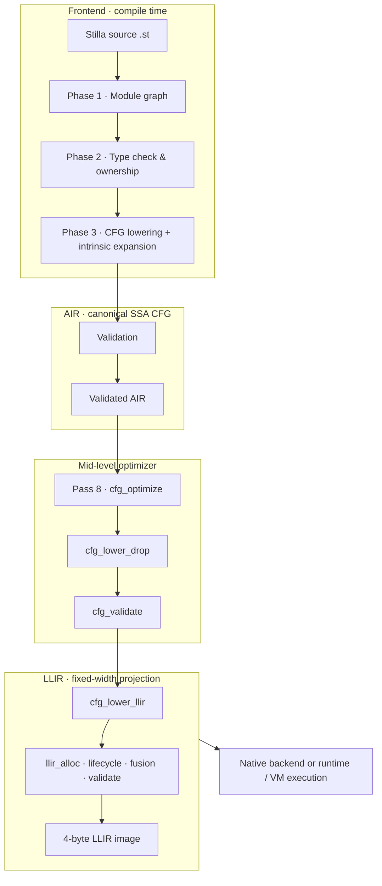
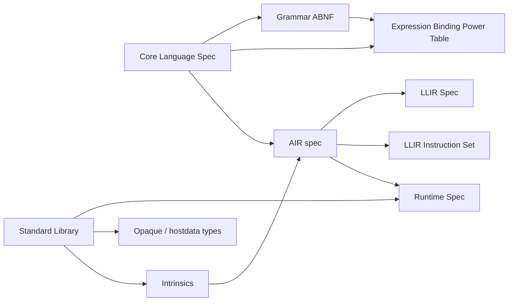

# Stilla v1.3 Specification Suite

> **Version:** v1.3 Draft
>
> This directory holds the normative specifications of the **Stilla runtime and
> frontend compiler**: the source language, the canonical SSA CFG mid-level IR,
> the fixed-width backend projection, the execution model, and the standard
> library. Each document is self-contained; the index below shows how they fit
> together along the compile-and-run pipeline.

## Quick reference

- [Stilla v1.3 Cheat Sheet](cheatsheet.md) — a fast-reference companion covering the whole language, runtime, AIR, and LLIR surface.
- [Stilla Grammar Diagrams](Stilla%20Grammar%20Diagrams.md) — railroad-style Mermaid views of the statement-level grammar (Stilla Core Grammar Draft.abnf). Non-normative.

## The pipeline at a glance

## Document map

| Document | Defines | Pipeline position |
| --- | --- | --- |
| [Stilla Core Language Specification](Stilla%20Core%20Language%20Specification.md) | Language structure: files & modules, the `builtin` module, bindings, module constants, functions, control flow | Phases 1–2 (checks) and the source contract |
| [Stilla Core Types & Ownership Specification](Stilla%20Core%20Types%20%26%20Ownership%20Specification.md) | Values and ownership: structs, construction, destruction, ownership, algebraic data types, generics, patterns, member access, operators | Phase 2 (type & ownership checks) |
| [Stilla Core Static Semantics](Stilla%20Core%20Static%20Semantics.md) | The normative formal static semantics | Phase 2 (static validation) |
| [Stilla Core Grammar Draft.abnf](Stilla%20Core%20Grammar%20Draft.abnf) | Normative lexical and syntactic grammar (ABNF), defined down to the statement level; expressions are specified in the companion Expression Binding Power Table | lexer / parser |
| [Stilla Expression Binding Power Table](Stilla%20Expression%20Binding%20Power%20Table.md) | Expression grammar in Pratt-parser form: binding powers, associativity, prefix/postfix/primary forms, and the expression-level parser decisions | lexer / parser (expressions) |
| [Stilla Runtime Specification](Stilla%20Runtime%20Specification.md) | Execution model, module instantiation, evaluation order, cleanup, panic, host contract | Runtime / VM |
| [Stilla AIR Specification](air.md) | The canonical SSA control-flow-graph IR: values, instructions, ownership, module storage, text form | Phase 3 output |
| [Stilla LLIR Specification](Stilla%20LLIR%20Specification.md) | The fixed-width LLIR projection: program image, registers, frames, call/return contract | AIR → LLIR |
| [Stilla LLIR Instruction Set](Stilla%20LLIR%20Instruction%20Set.md) | The canonical instruction set: 4-byte R/B/I/C/E/U encoding, typed opcode tables, operand and special-register rules, descriptor records | LLIR encoding |
| [Stilla Standard Library](Stilla%20Standard%20Library.md) | The importable standard-library modules and the opaque-collection contract | Runtime modules |
| [Stilla Intrinsics Specification](Stilla%20Intrinsics%20Specification.md) | Frontend recognition and mandatory expansion of non-source standard-library leaves | Standard library → AIR |

## How the pieces relate

## How to read the suite

1. **Start with the Core Language Specification** — what the language is, what it
   deliberately omits, and the rules a conforming compiler must enforce.
2. **The Runtime Specification** governs what the program *does* when it runs:
   it wins where the two documents overlap, and it owns the host contract.
3. **The AIR** is the boundary between the two halves — the CFG the frontend
   actually emits, with ownership and destruction explicit, ready to be
   interpreted, lowered, or optimized by any consumer.
4. **LLIR** is one such backend projection: air.md defines the source IR, while
   the LLIR documents define its fixed-width projection and instruction encoding.
5. **The Standard Library** is ordinary importable modules sitting on top of the
   language core, including the host-backed opaque collections.
6. **The Intrinsics Specification** defines how the non-source leaves of that
   library are identified and expanded into ordinary AIR before LLIR lowering.

> Implementation notes (the pipeline driver, optimizer design, and interpreter
> design) live outside this directory, in the repository's `docs/` tree:
> [frontend](../docs/frontend.md),
> [phase1-module-graph](../docs/phase1-module-graph.md),
> [phase2-checker](../docs/phase2-checker.md),
> [phase3-cfg-lowering](../docs/phase3-cfg-lowering.md),
> [optimizer](../docs/optimizer.md), and
> [interpreter-vm](../docs/interpreter-vm.md).
