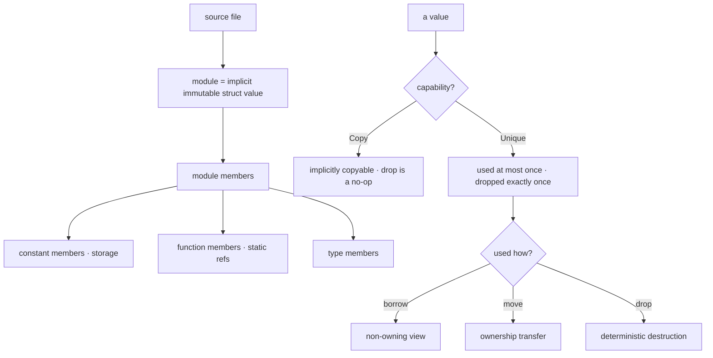

# Stilla Core Language Specification

> **Version:** v1.3 Draft

This document is part of the **Stilla core language** specification, split into
three companion files:

- **This file** — language structure: modules, bindings, functions, control flow.
- [Stilla Core Types & Ownership Specification](Stilla%20Core%20Types%20%26%20Ownership%20Specification.md) — structs, construction, destruction, ownership, algebraic data types, generics, patterns, member access, operators.
- [Stilla Core Static Semantics](Stilla%20Core%20Static%20Semantics.md) — the normative formal static semantics.

Where these and the other Stilla specs overlap on execution behavior, the
Runtime specification governs.

## Table of Contents

1. [Introduction](#1-introduction)
2. [Files, Modules, and Namespaces](#2-files-modules-and-namespaces)
3. [The `builtin` Module](#3-the-builtin-module)
4. [Bindings](#4-bindings)
5. [Module Constants](#5-module-constants)
6. [Functions](#6-functions)
7. [Control Flow](#13-control-flow)
8. [Example Resource Module](#17-example-resource-module)

---

# 1. Introduction

## 1.1 What Stilla is

**Stilla** is a small, statically typed language designed for:

- embedded scripting;
- deterministic execution;
- host integration;
- machine-generated code.

Stilla is engineered around a model that is *visible from the source code*: a program should be easy to parse, statically analyze, and reason about without hidden machinery. Ownership, destruction, and evaluation order are explicit and deterministic.

The **Core specification suite** defines the Stilla v1.3 syntax and the
compile-time constraints a conforming compiler must enforce: the type system,
ownership checking, generic specialization, and static module rules. This
document defines the language structure; its companion Core documents define
types, ownership, grammar, and formal static semantics. The **Runtime
specification** defines the execution model: module instantiation, evaluation
order, runtime destruction, panic semantics, and the embedding-host contract.

The boundary between the Core and Runtime specifications is drawn where a
program transitions from a static artifact into a running execution context.

The body of the specification explains the model; the normative requirement is the **formal static semantics** of [Stilla Core Static Semantics](Stilla%20Core%20Static%20Semantics.md). The normative lexical and syntactic grammar is defined in the standalone [`Stilla Core Grammar Draft.abnf`](Stilla%20Core%20Grammar%20Draft.abnf).

## 1.2 Design principles

The design principles below give the character of the language. They fall into five groups.

**Immutability and determinism**

- immutable bindings;
- deterministic destruction on normal control flow;
- deterministic left-to-right evaluation;
- no mutable global state.

**Values are first-class; state is not**

- algebraic data types;
- structs as ordinary nominal record values;
- files as implicit immutable module structs;
- no implicit receiver;
- no inheritance.

**Ownership is explicit and by value**

- explicit borrowing with `borrow`;
- explicit ownership transfer with `move`;
- no tracing garbage collector.

**Functions are monomorphic and capture-free**

- expression-oriented control flow;
- first-class monomorphic non-capturing functions;
- compile-time generic specialization;
- no general associated-function or static-method mechanism.

**Modularity by values, statically resolved**

- modules restricted to module-scope bindings;
- static module resolution through `import`.

## 1.3 Central rules

The language rests on a small number of central rules. They are stated here once and expanded in the sections that follow.

> **Ownership rule.** Borrowing never transfers ownership. Moving always transfers ownership. Destruction is compiler-managed on normal control flow.

> **Construction rule.** Types describe values; ordinary functions construct values, and a named struct may define at most one destruction hook.

> **Generic rule.** Generics are compile-time templates; every runtime function value is monomorphic.

> **Namespace rule.** Runtime member access is ordinary `value.member`; module values are simply restricted to module scope.

> **Termination rule.** Normal control flow destroys deterministically; panic terminates without unwinding and hands cleanup to the embedding host.

The runtime consequences of the termination rule are defined in the Runtime specification.

## 1.4 Deliberate omissions

Stilla deliberately omits the following mechanisms:

- a tracing garbage collector — resources are owned and destroyed deterministically (Stilla Core Types & Ownership Specification);
- an implicit receiver — no method-style `receiver.foo()` sugar (No implicit receiver);
- inheritance — data is expressed with nominal structs and unions (Stilla Core Types & Ownership Specification);
- mutable global state — all bindings are immutable (Bindings, Module Constants);
- a general associated-function or static-method mechanism — construction and helpers are ordinary functions (Stilla Core Types & Ownership Specification);
- exception-style unwinding on panic — a panic terminates the execution context without running `drop` hooks (the Runtime specification).

A panic or runtime trap is therefore not normal control flow. It terminates the current Stilla execution context without language-level unwinding; control of cleanup then belongs to the embedding host.

## 1.5 Key terminology

These terms are used throughout the core-language suite.

- **module** — a source file compiled into one implicit immutable struct value (Stilla Core Language Specification).
- **module value / module-resident** — a value of a compiler-generated module type; it may appear only in module-level `const` bindings (Stilla Core Language Specification).
- **binding** — a name bound to an immutable value. `let` creates local bindings (Stilla Core Language Specification); `const` creates module constants (Stilla Core Language Specification).
- **Copy** — a capability held by some types: a *Copy* value may be implicitly copied, such as `int32` or `str`; dropping a *Copy* value does nothing (Stilla Core Types & Ownership Specification).
- **Unique** — a value without the *Copy* capability: it may be used at most once and must be destroyed exactly once; it is not implicitly copyable (Stilla Core Types & Ownership Specification).
- **owner** — a binding or location that holds a value; every value has ownership (Stilla Core Types & Ownership Specification).
- **maybe-unique** — a *Unique* binding released on some but not all normal paths through a conditional construct; it is unusable after the join, and the compiler destroys it on every non-consuming edge before the join (Stilla Core Types & Ownership Specification).
- **borrow** — a non-owning, read-only view of a value; it never transfers ownership (Stilla Core Types & Ownership Specification).
- **move** — explicit ownership transfer of a complete local owner (Stilla Core Types & Ownership Specification).
- **drop** — deterministic destruction: a user `drop` hook, an explicit `drop` statement, or automatic destruction when a scope ends (Stilla Core Types & Ownership Specification).
- **nominal type** — a type defined by a `struct`, `union`, or `opaque` declaration; it is distinct from every other type even if shape-identical (Stilla Core Types & Ownership Specification).
- **monomorphic function** — a function value whose parameter and return types are fully concrete; there are no runtime generic function values (Stilla Core Types & Ownership Specification).
- **specialization** — compile-time expansion of generic code to concrete types (Stilla Core Types & Ownership Specification).
- **top type** — `any`, the type every value type coerces to; its counterpart is the bottom type `never`, which has no values and coerces to every type (Stilla Core Types & Ownership Specification).
- **destruction view** — the special borrowed view of a value seen inside its own `drop` hook (Stilla Core Types & Ownership Specification).
- **full expression** — an expression that is not a subexpression of a
  larger expression: a statement-level expression, a binding or constant
  initializer, an argument, a field initializer, a match-arm body, or a
  block's final expression. *Unique* temporaries are destroyed at the end
  of the innermost enclosing full expression (the Runtime specification).
- **host-backed opaque nominal type** — a nominal type declared by a
  standard-library or host-provided module interface as `opaque type
  Name[params];`; its representation, storage, and construction are
  entirely host-side, and it is *Unique* by declaration (Stilla Core Types
  & Ownership Specification).

Runtime-side terms (execution context, module storage, teardown, host) are defined in the Runtime specification.

## 1.6 How the suite is organized

The core language is split into three companion files:

- **`Stilla Core Language Specification`** (this file) — the language structure: files and modules, the `builtin` module, bindings, module constants, functions, control flow, and a worked resource module.
- **`Stilla Core Types & Ownership Specification`** — values and ownership: structs, construction, destruction, ownership, algebraic data types, generics, patterns, member access, and operators.
- **`Stilla Core Static Semantics`** — the normative formal static semantics.

Module instantiation, destruction timing and order, and evaluation order are defined in the Runtime specification.

At the heart of the model is the dichotomy between *Copy* and *Unique* values, and
how a *Unique* value is used exactly once:



The companion **Runtime specification** covers: the execution context, module instantiation, the host environment, the required `builtin` interface, evaluation order, destruction at runtime, termination and traps, and the core runtime model.

---

# 2. Files, Modules, and Namespaces

## 2.1 Every file defines a module

Every Stilla source file defines one implicit immutable **module struct**.

For example, `calc.st`:

```stilla
const pi: float32 = 3.141592653589793;

fn add(a: int32, b: int32) -> int32 {
    a + b
}

fn square(x: float32) -> float32 {
    x * x
}
```

defines a module containing the runtime members:

```text
pi
add
square
```

A source file is therefore both a compilation unit and the definition of one module instance.

Each resolved module has its own compiler-generated **nominal struct type**. There is no separate runtime `module` type category: layout, immutability, and `.` member access use the same value/member model as structs. The generated type is not directly nameable or constructible in Stilla source.

The compiler additionally marks values of these generated module structs as **module-resident**, which imposes the placement restrictions stated in **Module values are module-scope only**. Ordinary source-defined struct values remain first-class values.

Stilla has no independent runtime `namespace` construct.

## 2.2 Importing a module

Modules are imported with:

```stilla
import("specifier")
```

An `import` expression may appear only as the initializer of a module-level `const` binding.

Example:

```stilla
const calc = import("calc");
const builtin = import("builtin");

fn main() -> void {
    builtin.print(
        builtin.str(calc.add(20, 22))
    );
}
```

`import("calc")` produces a stable reference to the module instance for the current execution context (the Runtime specification).

Therefore:

```stilla
calc.add
```

is ordinary value-member access on the imported module value. It is not a static function lookup.

## 2.3 Module values are module-scope only

A module-resident value may exist only in a module-level `const` binding (including module-valued members of another module).

Outside module storage, a module-resident value may not be:

- bound by local `let`;
- passed as a function argument;
- returned from a function;
- stored in a struct, union, tuple, list, or box;
- moved or explicitly dropped.

A module-level module binding may be initialized by `import(...)` or by another statically known module binding:

```stilla
const math = import("math");
const public_math = math;
```

The compiler preserves the resolved module identity through such aliases.

This restriction keeps module type lookup static while allowing module member access to use the same runtime `.` semantics as structs.

## 2.4 Import resolution

The argument to `import` must be a string literal.

Examples:

```stilla
import("math")
import("lib/math")
import("./utils")
```

The compiler or runtime resolves the specifier to exactly one of:

1. a Stilla source module;
2. a standard-library module;
3. a host-provided module.

Resolution is implementation-defined, but a specifier must resolve unambiguously before execution.

Import cycles among source modules are rejected at compile time in Stilla v1.3 (the Runtime specification covers initialization cycles that arise at load among independently produced artifacts).

The standard library is specified separately.

The load-time resolution process is defined in the Runtime specification.

## 2.5 Runtime and type members

Runtime constants and monomorphic functions are runtime members of a module.

Types declared by a module participate only in compile-time type lookup.

For example:

```stilla
const geometry = import("geometry");

let p: geometry.Point =
    geometry.make_point(1.0, 2.0);
```

Here `geometry.make_point` is runtime member access after any required generic specialization, while `geometry.Point` is compile-time qualified type lookup.

Types are not runtime values.

Because module values cannot enter local value flow, every qualified module type path is statically resolvable.

## 2.6 Host-provided modules

An embedding host may register modules before compilation or execution.

A host module must expose a statically known Stilla-compatible interface.

A host module's function members may be **host bindings** — function
declarations without a Stilla body (Grammar `func-def`, second form) — and
its constant members may be **host constants** — `const` declarations
without an initializer (Grammar `const-def`, second form). The host
supplies the implementation or value: a host binding is callable only as a
runtime system call, its body is never lowered, and a host constant is
read as a runtime value the host provides at instantiation (the Runtime specification).
Standard-library modules use the same declaration forms for members with no
Stilla body or initializer. The compiler resolves such a member from the
implementation-supplied standard-library bundle as an intrinsic and expands it
during source-to-AIR lowering, rather than treating it as an embedding-host binding (the Standard Library and the
[Intrinsics Specification](Stilla%20Intrinsics%20Specification.md)).

A standard-library or host-provided module may additionally declare a
**host-backed opaque nominal type** — `opaque type Name[params];`
(Grammar `opaque-def`) — a nominal type whose representation, storage,
and construction are entirely host-side (Host-backed opaque nominal types).
A Stilla source module may not declare one.

Conceptually:

```stilla
struct Database {
    query: fn(str) -> str;
    execute: fn(str) -> int32;
}
```

This structural illustration does not make module values ordinary first-class struct values. It means their runtime member layout follows the same immutable record/member-access model.

Source modules, standard-library modules, and host modules use the same `.` member-access syntax.

The host-side registration and integration contract is defined in the Runtime specification.

## 2.7 Nested libraries

A module may expose another imported module as a runtime constant.

`std.st`:

```stilla
const math = import("math");
const string = import("string");
```

Here `math` is the standard-library `math` module (the Standard Library), and `string` is the standard-library `string` module
(the Standard Library).

Consumer:

```stilla
const std = import("std");
const builtin = import("builtin");

fn main() -> void {
    let x =
        std.math.sqrt(16.0);

    builtin.print(
        std.string.upper("hello")
    );
}
```

The expression:

```stilla
std.math.sqrt
```

is chained value-member access (Stilla Core Types & Ownership Specification).

No nested runtime namespace mechanism is required.

## 2.8 Path aliases with `using`

A **path alias** introduces a new name for a path in the current scope.
Path aliases use:

```stilla
using
```

Examples:

```stilla
const builtin = import("builtin");

using builtin.Option;      // Option = builtin.Option
using string.repeat as re; // re = string.repeat
```

Without `as`, the alias name is the final segment of the path; with `as`, it
is the identifier that follows. The alias refers to the path as a whole, and
at a use site denotes whatever the path denotes — a type, a value, or a
module member (Grammar `using-decl`).

A `using` declaration:

- may appear at module scope and inside blocks (Grammar `module-item`,
  `statement`);
- is scoped: the alias is visible from the declaration point to the end of
  the enclosing module or block, and is not visible to sibling or outer
  scopes;
- may shadow an outer binding, and may itself be shadowed, with the same
  rules as `let` (Bindings);
- is a compile-time binding: it does not create a runtime member, is not
  present on the module struct, and cannot be assigned, moved, or dropped;
- requires the path to resolve; a path alias for an unresolved path is a
  compile-time error.

Example:

```stilla
const string = import("string");

using string.upper as up;

fn shout(text: str) -> str {
    up(text)
}
```

Here `up` is the alias of `string.upper` within the module.

---

# 3. The `builtin` Module

`builtin` is an ordinary importable standard-library module (the Standard Library). A program brings it into scope like any other module:

```stilla
const builtin = import("builtin");
```

There is no implicitly available module binding and no reserved word:
`builtin` may be bound, aliased, and shadowed like any other identifier.

Core helpers include:

```stilla
builtin.print
builtin.str
builtin.box
builtin.unbox
builtin.panic
builtin.assert
builtin.hash
```

The `builtin` module also exposes one **type member**, `builtin.Option` — the standard-library option type returned by lookups that can fail (`hashmap.get`, `string.index_of`, `list.index_of`, `list.head`); its formal definition is in the [Stilla Standard Library](Stilla%20Standard%20Library.md).

(The `list` module — not `builtin` — provides `list.len` and
`list.range`; their signatures are defined in the Runtime specification.)

There are no implicitly injected functions such as:

```stilla
print(...)
len(...)
```

The explicit forms are always:

```stilla
const builtin = import("builtin");
const lists = import("list");

builtin.print(...)
lists.len(...)
```

(`list` is the language's type keyword, so a source binding for the
`list` module must use another name — here `lists`, [Stilla Standard Library](Stilla%20Standard%20Library.md).)

The required signatures and behavioral contracts of these helpers are defined in the Runtime specification.

---

# 4. Bindings

This section covers **local** bindings. Module-level constant bindings use `const` (Module Constants). Local `let` bindings never become module members.

Local bindings use:

```stilla
let
```

Example:

```stilla
let x = 10;
let y = x + 20;
```

Bindings are immutable.

This is illegal:

```stilla
x = 30;
```

Shadowing is allowed:

```stilla
let x = 10;
let x = x + 1;
```

The right-hand `x` refers to the previous binding.

Stilla is therefore SSA-friendly, although the source language is not itself an SSA intermediate representation.

---

# 5. Module Constants

Module-level constant bindings use `const` — the module-scope counterpart of the local `let` binding (Bindings). A `const` is the only binding form that can name a module value (Module values are module-scope only).

Module-level immutable runtime members use:

```stilla
const
```

Example:

```stilla
const version: int32 = 1;
const calc = import("calc");
```

A module constant:

- is initialized when its module is instantiated (the Runtime specification);
- cannot be reassigned;
- becomes a runtime member of the module when its value is a runtime value.

A module binding whose value has module type is subject to the module-scope restrictions stated in **Module values are module-scope only**.

Module constant initializers are evaluated strictly in declaration order (the Runtime specification).

An initializer may reference:

- earlier module constants;
- imported modules;
- module functions declared anywhere in the module, including functions declared after the constant; function references do not depend on initialization order;
- types;
- the `builtin` module (imported like any other module).

It may not reference a later module constant.

A module constant initializer must not transitively call a function that reads a module constant declared later than the initializer; such a program is rejected at compile time. This preserves the guarantee that module constants are read only after initialization (the Runtime specification).

A *Unique* non-module constant is owned by the module execution context. It cannot be explicitly moved or explicitly dropped by source code and is destroyed during normal module/context teardown (the Runtime specification).

The initialization-order restriction applies symmetrically at teardown:
teardown destroys *Unique* constants in **reverse** declaration order
(the Runtime specification), so a later constant is already destroyed when an earlier
constant's `drop` hook runs. A *Unique* module constant whose type defines a
`drop` hook — the hook and every function it transitively calls — must
not read a module constant declared later than the constant being
destroyed; such a program is rejected at compile time.

---

# 6. Functions

Functions are declared with:

```stilla
fn
```

Example:

```stilla
fn add(
    a: int32,
    b: int32
) -> int32 {
    a + b
}
```

A monomorphic top-level function is a function-valued runtime member of the current module. An unspecialized generic function is a compile-time template (Stilla Core Types & Ownership Specification).

If the module is imported as:

```stilla
const calc = import("calc");
```

then:

```stilla
calc.add(1, 2)
```

means:

1. obtain the module value;
2. read its `add` member;
3. obtain the function value;
4. call that function.

There is no separate concept of:

- static method;
- associated function;
- namespace function;
- instance method.

## 6.1 No implicit receiver

Stilla never inserts an implicit receiver.

Given:

```stilla
struct Counter {
    value: int32;
    next: fn(borrow Counter) -> int32;
}
```

an ordinary function value stored in `next` must explicitly receive any instance it needs.

For example:

```stilla
let counter =
    Counter{
        value: 10,
        next:
            fn(borrow counter: Counter) -> int32 {
                counter.value + 1
            }
    };

counter.next(counter);
```

There is no transformation from:

```stilla
counter.next()
```

to:

```stilla
counter.next(counter)
```

## 6.2 Non-capturing functions

Functions and lambdas may not capture local bindings from an enclosing function scope.

Illegal:

```stilla
fn example() -> fn(int32) -> int32 {
    let factor = 2;

    fn(x: int32) -> int32 {
        x * factor
    }
}
```

A function may reference:

- its parameters;
- its own local bindings;
- module constants;
- module functions;
- imported modules;
- types;
- the `builtin` module (imported like any other module).

Module members have execution-context lifetime and do not constitute closure capture.

## 6.3 Lambdas

Anonymous functions use the same syntax without a name:

```stilla
let double =
    fn(x: int32) -> int32 {
        x * 2
    };
```

Lambdas obey the same non-capture rule.

A lambda, like a named function, declares its return type (Return values).

## 6.4 Return values

A function returns the value of its body block's final expression.

Example:

```stilla
fn add_one(x: int32) -> int32 {
    x + 1
}
```

A block with no final expression has type:

```stilla
void
```

The return type is required: every function and lambda declares it. A
function that returns nothing declares `-> void`; a function that never
returns normally declares `-> never`. There is no implicit or inferred
return type.

## 6.5 Order and recursion

Functions and lambdas are **order-independent** within the module in which they are declared: a function body may reference any module-level function, including functions declared later in the same source file. Direct and **mutual recursion** are permitted. Because every function declares its return type (Return values), a recursion cycle needs no inference: each member's signature is stated up front. And because functions are non-capturing (Non-capturing functions) and are represented as monomorphic code references, a function reference does not depend on module-constant initialization order (Module Constants).

A function type is a finite code-reference type. A struct or union may contain a function field whose type mentions the enclosing type; the function type breaks the storage cycle (Recursive types) and does not make the enclosing type *Unique* on that account (Composite ownership).

---

# 13. Control Flow

## 13.1 Blocks

A block is an expression.

```stilla
{
    let x = 10;
    x + 1
}
```

has value:

```text
11
```

A block without a final expression has type:

```text
void
```

Example:

```stilla
{
    builtin.print("hello");
}
```

A block may contain `using` declarations (Path aliases with `using`); an alias declared inside a
block is visible only within that block.

## 13.2 `if`

`if` is an expression.

Its condition is parenthesized:

```stilla
let sign =
    if (value >= 0) {
        1
    } else {
        -1
    };
```

Parentheses are mandatory.

This removes ambiguity between control-flow bodies and struct construction.

Both branches must have the same type, except that `never` may coerce to any type and any type may coerce to the top type `any` (The top type `any`); the `if` expression then has the wider of the two types.

Without `else`, the expression must have type `void`.

Example:

```stilla
if (ready) {
    builtin.print("ready");
};
```

## 13.3 `match`

`match` is an expression.

The scrutinee is parenthesized:

```stilla
let message =
    match (result) {
        Result::Ok(value) =>
            "ok: " + builtin.str(value),

        Result::Err(error) =>
            "error: " + error
    };
```

Union matching must be exhaustive.

Supported patterns include:

```text
_
x
42
(a, b)
Point{ x, y }
Option::Some(x)
[]
[head, ..tail]
int32 n           // type-test pattern (Stilla Core Types & Ownership Specification)
```

## 13.4 Borrowing and consuming matches

Matching a *Unique* owner normally borrows it:

```stilla
match (value) {
    ...
}
```

*Unique* pattern bindings produced by such a match are borrowed for the lifetime of the selected match arm.

They may be read or passed to `borrow` parameters, but they are not owners.

To consume the complete owner:

```stilla
match (move value) {
    ...
}
```

the complete value is transferred into the match operation.

*Unique* payload bindings then become owners within the selected arm.

This never performs a partial move from the original binding: the original binding is invalidated as a whole.

## 13.5 Iteration

Repetition is expressed with ordinary recursive function calls (Order and recursion); a library may provide iteration helpers as ordinary module functions (Construction), invoked like any other call.

A conforming implementation **must** reuse the caller's frame for a direct
self-recursive call in tail position (tail-call optimization), so
iteration expressed as self-recursion does not grow the stack. Mutual
recursion and non-tail recursion may grow the stack, bounded by
implementation-defined resources (the mid-level optimizer performs this
optimization; see the [AIR Specification](air.md)).

---

# 17. Example Resource Module

`file.st`:

```stilla
const os = import("os");
const builtin = import("builtin");

struct File {
    fd: int32;
    path: str;

    drop(file) {
        os.close(file.fd);
    }
}

fn open(path: str) -> File {
    File{
        fd: os.open(path),
        path: path
    }
}

fn create(path: str) -> File {
    File{
        fd: os.create(path),
        path: path
    }
}

fn inspect(borrow file: File) -> void {
    builtin.print(file.path);
}
```

Consumer:

```stilla
const file = import("file");

fn main() -> void {
    let handle =
        file.open("data.txt");

    file.inspect(handle);

    drop handle;
}
```

The model is:

```text
File{...}       raw value construction
file.open(...)  ordinary module function
drop handle     ownership operation
drop(file)      lifecycle hook
```

---

## See also

- [Stilla Core Types & Ownership Specification](Stilla%20Core%20Types%20%26%20Ownership%20Specification.md) — values and ownership: structs, construction, destruction, ownership, algebraic data types, generics, patterns, member access, operators
- [Stilla Core Static Semantics](Stilla%20Core%20Static%20Semantics.md) — the normative formal static semantics
- [Stilla Core Grammar Draft.abnf](Stilla%20Core%20Grammar%20Draft.abnf) — the normative lexical and syntactic grammar
- [Stilla Runtime Specification](Stilla%20Runtime%20Specification.md) — execution behavior
