# Stilla Grammar Diagrams

> **Version:** v1.3 Draft
>
> Railroad-style syntax diagrams of the Stilla core language **statement-level
> grammar**, rendered as Mermaid `flowchart` diagrams (GitHub renders Mermaid
> natively; other Markdown viewers may need a Mermaid plugin).
>
> **Non-normative.** The authoritative grammar remains Stilla Core Grammar
> Draft.abnf, which these diagrams transcribe exactly. Two layers are *out of
> scope* here and appear only as labeled chips:
>
> - the **lexical layer** — `identifier`, `integer`, `float`, `string`,
>   `bool-literal`, `wildcard-token` and the comment/escape rules are defined
>   in the Grammar Draft's lexical grammar;
> - the **expression layer** — `expression` is defined normatively in
>   Stilla Expression Binding Power Table.md (binding powers, associativity,
>   primary/prefix/postfix forms), not by productions in the Grammar Draft.
>
> ## Reading conventions
>
> | Shape | Meaning |
> | --- | --- |
> | `(["'token'"])` | a terminal: the literal token or keyword shown |
> | `[rule-name]` | a reference to the rule drawn below (or a lexical token) |
> | `["…"]` | a compact alternative group; the text is the ABNF fragment |
> | `-(dashed)->` labeled `ε` | optional: the bypassed segment may be absent |
> | self-loop edge | repetition; the label states the separator and count |
> | `(("ε"))` | empty (a choice that consumes nothing) |
>
> Each diagram reads left to right. A self-loop on an element means the
> element (with its labeled separator, when one appears) may repeat. An
> `ε` bypass over a segment means that segment is optional, `[ … ]` in ABNF.

## Program structure

### program

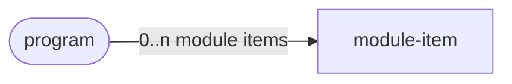

### module-item — one of

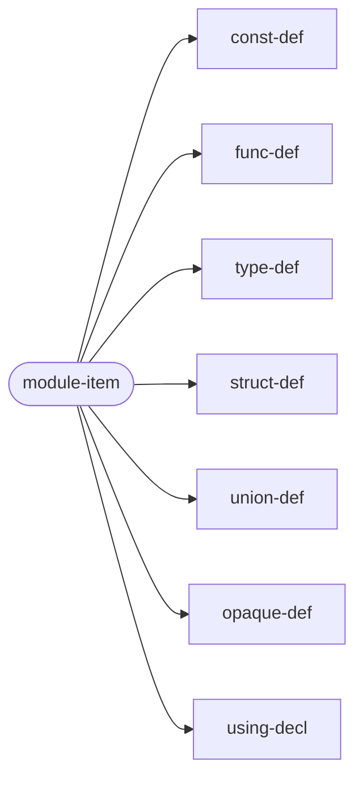

## Path aliases and module constants

### using-decl

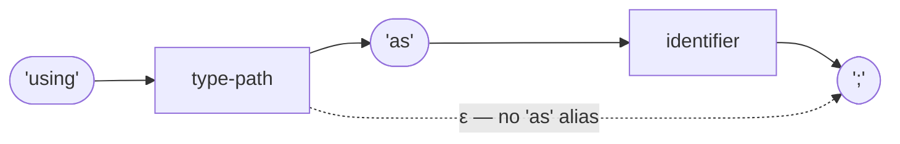

### const-def

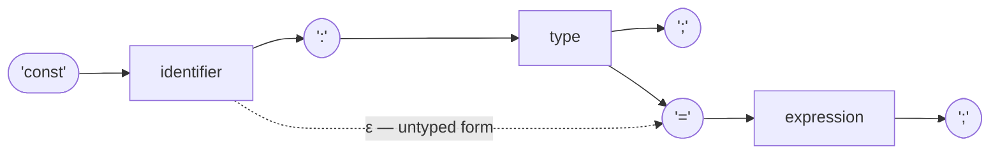

The right branch (`'const' name ':' type ';'`, no initializer) is a **host
constant**; the initializer branch (`'=' expression ';'`) accepts both the
typed and the untyped spelling.

## Functions

### func-def — body form and host-binding form

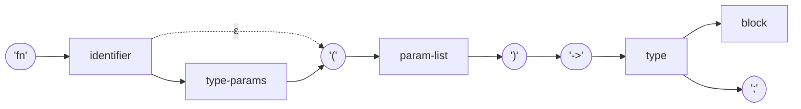

The return type (`'->' type`) is required in both forms: a function with
no value declares `'-> void'`, and one that never returns normally
declares `'-> never'`. The `';'` form is a host binding.

### param-list

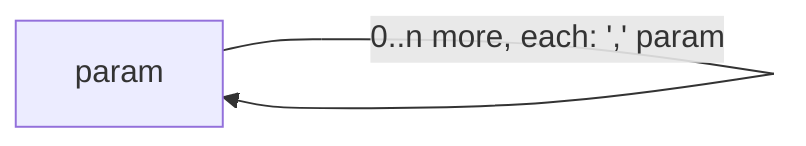

### param

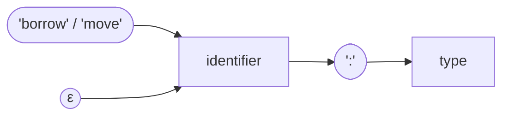

### function-type

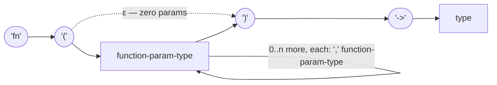

### function-param-type

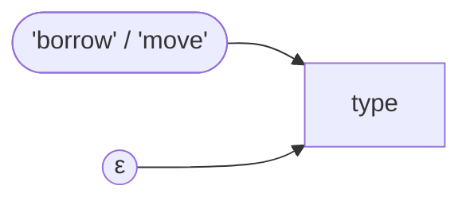

`param-list` is entirely optional (an empty parameter list is valid); the
loop label means `param *( ',' param )` in ABNF. The expression-position
**lambda** (`'fn' '(' param-list ')' '->' type block`) is an expression
form and is defined in Stilla Expression Binding Power Table.md, not here.

## Generic parameters

### type-params

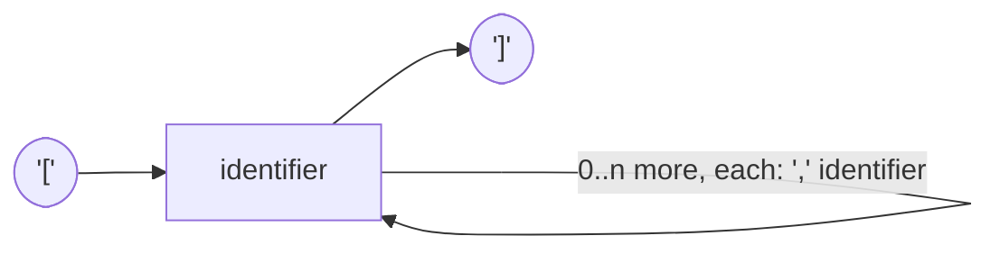

### type-args

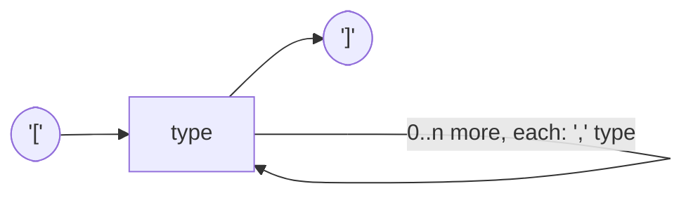

## Types

### type — one of

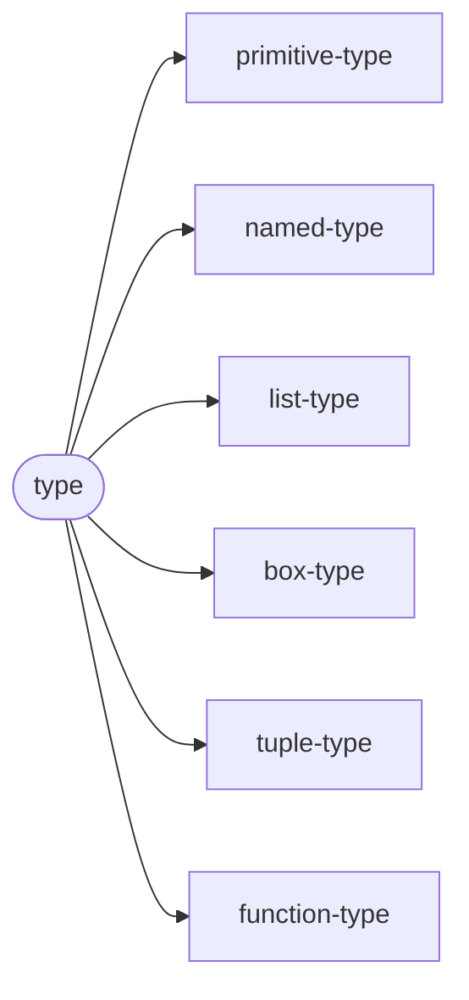

### primitive-type — one of the reserved keywords

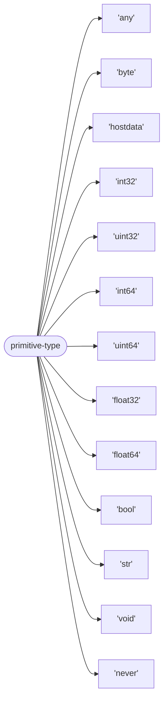

### named-type

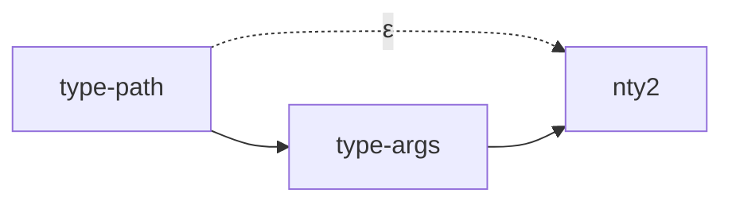

### type-path

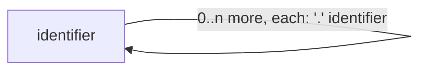

### list-type

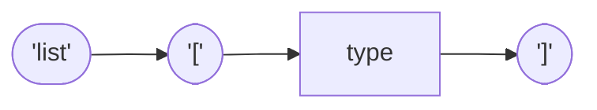

### box-type

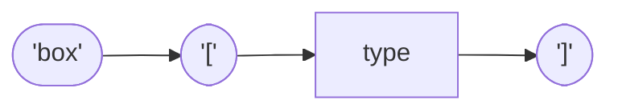

### tuple-type

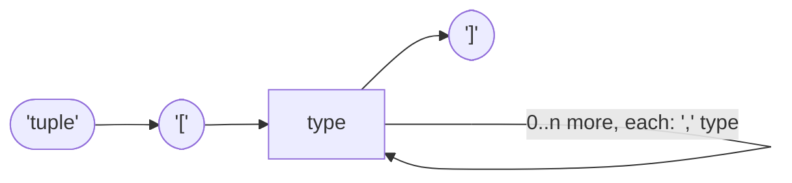

`tuple[]` is not a type — the empty tuple `()` is the unique value of type
`void`. A single-element tuple type `tuple[int32]` is valid and distinct from
`int32`. Path segments may be reserved words as well as identifiers after
`.` and `::` (parser note 4), so `builtin.str` parses.

## Type aliases, structs, unions, opaque types

### type-def

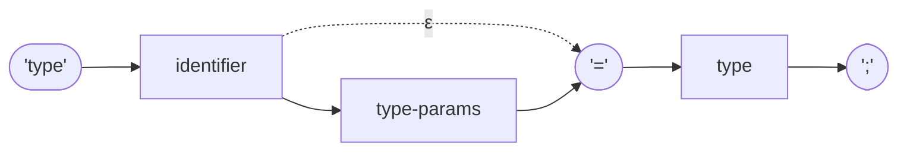

### struct-def

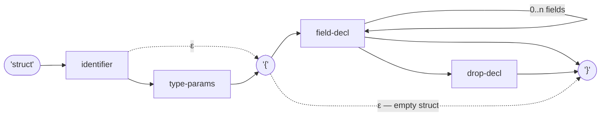

### field-decl

```mermaid
flowchart LR
fda0[identifier] --> fda1(["':'"])
fda1 --> fda2["type"]
fda2 --> fda3(["';'"])
```

### drop-decl

```mermaid
flowchart LR
dda0(["'drop'"]) --> dda1(["'('"])
dda1 --> dda2[identifier]
dda2 --> dda3(["')'"])
dda3 --> dda4["block"]
```

### union-def

```mermaid
flowchart LR
uda0(["'union'"]) --> uda1[identifier]
uda1 --> uda2["type-params"]
uda1 -.->|"ε"| uda3(["'{'"])
uda2 --> uda3
uda3 --> uda4["variant-decl"]
uda3 -.->|"ε — no variants"| uda5(["'}'"])
uda4 -->|"0..n more, each: ',' variant-decl"| uda4
uda4 --> uda6(["','"])
uda6 --> uda5
uda4 --> uda5
```

### variant-decl

```mermaid
flowchart LR
vda0[identifier] --> vda1(["'('"])
vda0 -.->|"ε — no payload"| vda4(["')'"])
vda1 --> vda2["type"]
vda1 -.->|"ε — empty payload"| vda4
vda2 -->|"0..n more, each: ',' type"| vda2
vda2 --> vda4
```

### opaque-def

```mermaid
flowchart LR
oda0(["'opaque'"]) --> oda1(["'type'"])
oda1 --> oda2[identifier]
oda2 --> oda3["type-params"]
oda2 -.->|"ε"| oda4(["';'"])
oda3 --> oda4
```

A struct may contain at most one `drop-decl`, and it must follow all fields.
A union's variant list may carry a trailing comma. Opaque declarations are
legal only in standard-library or host-provided module interfaces (static
semantics).

## Blocks and statements

### block

```mermaid
flowchart LR
blk0(["'{'"]) --> blk1["statement"]
blk1 -->|"0..n statements"| blk1
blk1 --> blk2["expression"]
blk1 -.->|"ε — no final expression"| blk3(["'}'"])
blk2 --> blk3
blk0 -.->|"ε — empty block"| blk3
```

### statement — one of

```mermaid
flowchart LR
stt0(["statement"]) --> stt1["let-stmt"]
stt0 --> stt2["drop-stmt"]
stt0 --> stt3["using-decl"]
stt0 --> stt4["expr-stmt"]
stt0 --> stt5["empty-stmt"]
```

### let-stmt

```mermaid
flowchart LR
lst0(["'let'"]) --> lst1["pattern"]
lst1 --> lst2(["':'"])
lst2 --> lst3["type"]
lst3 --> lst4(["'='"])
lst1 -.->|"ε — inferred type"| lst4
lst4 --> lst5["expression"]
lst5 --> lst6(["';'"])
```

### drop-stmt

```mermaid
flowchart LR
dst0(["'drop'"]) --> dst1[identifier]
dst1 --> dst2(["';'"])
```

### expr-stmt

```mermaid
flowchart LR
est0["expression"] --> est1(["';'"])
```

### empty-stmt

```mermaid
flowchart LR
emt0(["';'"])
```

### expression — out of scope here

```mermaid
flowchart LR
ext0(["expression"]) --> ext1["Stilla Expression Binding Power Table.md"]
```

Parser rule (parser note 1): in the statement loop, an expression followed
by `;` is an expression statement; an expression followed by `}` is the
block's final expression. `let` patterns must be irrefutable (static
semantics).

## Patterns — overview

### pattern — one of

```mermaid
flowchart LR
ptn0(["pattern"]) --> ptn1["wildcard-pattern"]
ptn0 --> ptn2["literal-pattern"]
ptn0 --> ptn3["type-test-pattern"]
ptn0 --> ptn4["tuple-pattern"]
ptn0 --> ptn5["path-pattern"]
ptn0 --> ptn6["list-pattern"]
```

### wildcard-pattern

```mermaid
flowchart LR
wcp0(["'_'"])
```

### literal-pattern — one of

```mermaid
flowchart LR
ltp0(["literal-pattern"]) --> ltp1["integer"]
ltp0 --> ltp2["'-' integer"]
ltp0 --> ltp3["float"]
ltp0 --> ltp4["'-' float"]
ltp0 --> ltp5["string"]
ltp0 --> ltp6["bool-literal"]
```

### type-test-pattern

```mermaid
flowchart LR
ttp0["type-test-type"] --> ttp1[identifier]
ttp0 -.->|"ε — no binding"| ttp2
ttp1 --> ttp2
```

### type-test-type — testable concrete types

```mermaid
flowchart LR
ttt0(["type-test-type"]) --> ttt1["'byte' 'int32' 'uint32' 'int64' 'uint64' 'float32' 'float64' 'bool' 'str'"]
ttt0 --> ttt2["list-type"]
ttt0 --> ttt3["box-type"]
ttt0 --> ttt4["tuple-type"]
ttt0 --> ttt5["function-type"]
```

Static semantics reject `any`, `never`, and `hostdata` as test types; the
test type must be concrete, and no pattern is defined on `hostdata`. A lone
`_` is the wildcard token (lexical maximal-munch rule: `_foo` is an
identifier, a bare `_` is the wildcard).

## Patterns — tuple, path, list

### tuple-pattern

```mermaid
flowchart LR
tup0(["tuple-pattern"]) --> tup1["void-literal"]
tup0 --> tup2(["'('"])
tup2 --> tup3["pattern"]
tup3 --> tup4(["','"])
tup4 --> tup5["pattern"]
tup4 -.->|"ε — two-element tuple"| tup6(["')'"])
tup5 -->|"0..n more, each: ',' pattern"| tup5
tup5 --> tup6
```

### void-literal

```mermaid
flowchart LR
vlt0(["'('"]) --> vlt1(["')'"])
```

### path-pattern

```mermaid
flowchart LR
ppn0["type-path"] --> ppn1["type-args"]
ppn0 -.->|"ε"| ppn2["pattern-tail"]
ppn1 --> ppn2
```

### pattern-tail — one of

```mermaid
flowchart LR
ptl0(["pattern-tail"]) --> ptl1["'{' field-pattern, repeated with ',' separators, optional trailing ',', '}'}"]
ptl0 --> ptl2["'::' identifier, then optional '(' pattern, repeated with ',' separators, ')'"]
ptl0 --> ptl3["identifier — type-test binding"]
ptl0 --> ptl4["ε — identifier-pattern"]
```

### field-pattern

```mermaid
flowchart LR
fpl0[identifier] --> fpl1(["':'"])
fpl1 --> fpl2["pattern"]
fpl0 -.->|"ε — shorthand field"| fpl3
fpl2 --> fpl3
```

### list-pattern

```mermaid
flowchart LR
lsp0(["'['"]) --> lsp1["list-pattern-items"]
lsp0 -.->|"ε — empty list"| lsp2(["']'"])
lsp1 --> lsp2
```

### list-pattern-items

```mermaid
flowchart LR
lsi0(["list-pattern-items"]) --> lsi1["pattern"]
lsi0 --> lsi6["list-rest"]
lsi1 -->|"0..n more, each: ',' pattern"| lsi1
lsi1 --> lsi2(["','"])
lsi2 --> lsi3["list-rest"]
lsi1 -.->|"ε — no rest"| lsi4
lsi3 --> lsi4
lsi6 --> lsi4
```

### list-rest

```mermaid
flowchart LR
lsr0(["'..'"]) --> lsr1[identifier]
```

Parser notes that resolve the identifier-led forms: a `::` immediately
following a type path enters the variant/union branch (note 2, expression
half — see Stilla Expression Binding Power Table.md); an identifier
immediately after a type path (with optional type-args) marks a type-test
binding, and `list`, `box`, `tuple`, `fn`, and primitive-type keywords at
pattern start likewise begin a `type-test-pattern` (parser note 3). There is
no indexed element-read syntax in pattern position — `[` after a path is
always type-args.
