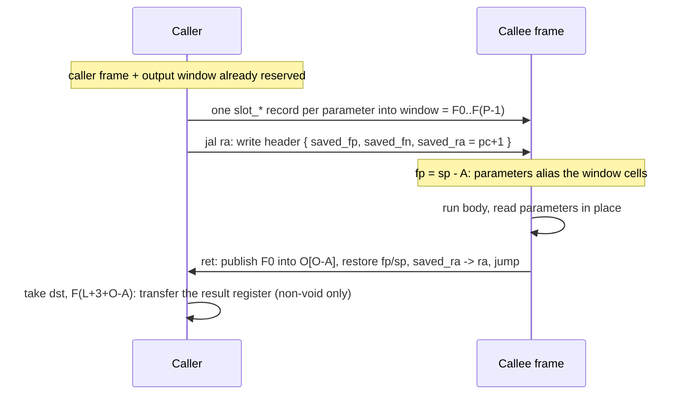

# Stilla LLIR Specification

> **Version:** v1.3 Draft (v10 encoding)
>
> This document defines the fixed-width LLIR projection of a validated CFG:
> the program image, registers, frames, and the call/return contract. It is
> normative for a LLIR backend and interpreter, but does not define a stable
> on-disk format.
>
> In the **v10** encoding, the type of every typed operation is written
> into the logical opcode at lowering time ([Instruction
> Set](Stilla%20LLIR%20Instruction%20Set.md)), the output window is
> **register-addressable** — the caller's output window aliases the callee's
> input registers (Itanium-style overlap), so a call's result lands in a
> caller register and is consumed by a generic register **take** — and
> loading is `read → structural validate → decode → run`: the runtime
> decodes every LLIR record once into a VM-owned, fixed-size executable
> instruction (one decoded instruction per LLIR record, order-preserving,
> relocated by the module's code base) and executes only decoded
> instructions. A LLIR **artifact is module-local**: it carries exactly one
> module's code and metadata, and every cross-module reference is symbolic
> — a canonical module or member symbol resolved by the runtime loader.

## Table of Contents

1. [Scope and pipeline position](#1-scope-and-pipeline-position)
2. [Program image](#2-program-image)
3. [Registers](#3-registers)
4. [Frames](#4-frames)
5. [Calls and returns](#5-calls-and-returns)
6. [Instruction set](#6-instruction-set)
7. [Control flow, effects, and traps](#7-control-flow-effects-and-traps)
8. [Validation and serialization](#8-validation-and-serialization)
9. [Non-goals](#9-non-goals)

---

# 1. Scope and pipeline position

LLIR is a read-only backend projection of a validated, optimized, and
post-drop-lowering CFG. It does **not** replace the canonical AIR, and the
optimizer must not rewrite LLIR.

```text
source → validated SSA CFG → cfg_optimize → cfg_lower_drop
      → cfg_validate → cfg_lower_llir → llir_alloc → llir_result_coalesce
      → cfg_lower_lifecycle → llir_fusion → LlirProgram → validate → interpret
```


Inside `cfg_lower_llir`'s driver the backend work runs as eleven named
stages in a fixed order — **prepare → allocate → lifecycle plan → edge
blocks → budget → intern → body emit → edge emit → control emit → LLIR
rewrites → linearize** — each with one named input/output invariant
([frontend.md](../docs/frontend.md), "Backend: CFG → LLIR"). Two
global invariants hold across all eleven: no stage before linearization
computes, stores, or backfills an absolute PC — records carry
placeholder offsets whose targets are derived from the input CFG, and
only linearize writes PCs and final relative offsets (with
`switch_arms` rows holding symbolic `BlockId`s until it does) — and
lowering never mutates the input CFG.

Lowering preserves the CFG's observable behavior: linear instruction order
is evaluation order, and short-circuiting remains real control flow. It maps
SSA `ValueId N` to a function-private frame register `FN` — or, for the
allocator's volatile hot values, a T temporary, and under F pressure an X
spill cell (§3) — plus the specials
`zero`, `ra`, and `cond` (§3): `zero` reads as the type's zero and
discards writes in the RISC-V `x0` style, `ra` is the fixed link register
of the call convention, and `cond` holds the bool condition the C-type
comparisons write and `cmov` reads implicitly.

The frontend has already proved SSA dominance, ownership, borrow provenance,
and cleanup correctness. LLIR validation checks only LLIR-level invariants
(§8); it does not repeat those analyses. **No execution plan is derived**:
the opcodes are typed at lowering time, so a validated image decodes 1:1
into the interpreter's fixed-size `VmInstr` image at load (one decoded
instruction per record, order-preserving — `vm_pc = module.code_base +
llir_pc`) and steps that image directly; nothing is allocated per executed
instruction.

# 2. Program image

A `LlirProgram` is a **per-module artifact**: exactly one module's global
instruction array plus typed, read-only side tables. There is no
program-global `ModuleId`, `MemberId`, or `HostBindingId` linking and no
whole-program flattened module table — cross-module identity rides only on
canonical module and member **symbols** (byte-exact strings). Every
instruction is exactly 4 bytes (the six-format encoding); the encoding,
sentinel constants, and operand-field rules are defined in the [Stilla LLIR
Instruction Set](Stilla%20LLIR%20Instruction%20Set.md).

```text
LlirProgram                                      // one module artifact
  instructions: []Instr                       // [4]u8 records
  functions: []FunctionDesc              blocks: []BlockDesc   // module-local
  self_symbol: u32                       // SymbolId of this module
  init: u32                              // local FunctionId or no_index
  entry_member: u32                      // SymbolId or no_index (root artifacts)
  symbols: []SymRange                    // SymbolId → {start,len} into strings
  imports: []ImportDesc                  // {module_sym, member_sym} pairs
  exports: []ExportDesc                  // {member_sym, kind, ref, public}, sorted by symbol
  module_slots: []ModuleSlot             // this module's constant slots
  constants: []ConstRecord               types: []TypeDesc
  type_decls: []TypeDeclDesc             type_decl_fields: []TypeId
  union_variants: []UnionVariant         union_payloads: []TypeId
  host_types: []HostTypeDesc
  signatures: []SignatureDesc            params: []ParamDesc
  call_args: []ValueReg
  syscall_descs: []SyscallDesc
  construct_descs: []ConstructDesc
  destructure_dsts: []ValueReg           destructure_dst_types: []TypeId
  destructure_descs: []DestructureDesc
  switch_arms: []SwitchArm               switch_descs: []SwitchDesc
  member_descs: []MemberDesc             drop_descs: []DropDesc
  strings: []u8                          // artifact-owned byte blob
```

**Symbolic linkage.** A `SymbolId` is an index into `symbols`; its bytes are
a canonical module specifier or an exact member name, compared byte-exactly.
`ImportDesc` rows are `(module_symbol, member_symbol)` pairs — a cross-module
member, function, module, or host reference. `ExportDesc` rows are the
module's sorted export table: the module's members plus every function,
keyed by the function's name within the module (the member row of a
function member and its function row coincide); `public` marks the rows
backed by a declared member, and a member load (`load_member`) of a
non-public row is rejected at resolution. Duplicate export symbols, and
lookups of symbols absent from the table, are resolution errors.

- The image has no `call_descs`, `call_direct`, or `call_indirect`.
  Direct calls are `jal ra, addr` (static target) and
  indirect calls are `jalr ra, base, offs16` (dynamic target); neither
  references a call descriptor ([Instruction
  Set](Stilla%20LLIR%20Instruction%20Set.md) §6, §12). `call_args` is the
  shared register table of the `syscall` and `construct` descriptors only.
  `call_args` and `destructure_dsts` rows are 8-bit `ValueReg`s;
  `destructure_dst_types` holds the parallel `TypeId` of each destructure
  result, in the same order.
- The image carries **no per-cell slot-type table.** The types of the
  values in F/X/T cells ride in the opcodes' reps and the records and
  descriptors that create or consume them: `ConstRecord.type_`,
  `ConstructDesc.result_type`, `DestructureDesc.base_type` plus
  `destructure_dst_types`, `MemberDesc`, `DropDesc`,
  `ModuleSlot.type_`, `ParamDesc.type_`, and `SignatureDesc.ret`. The T
  bank has no persistent slot type at all ([Instruction
  Set](Stilla%20LLIR%20Instruction%20Set.md) §3.1.1).
- Trap behavior is fixed by the opcode ([Instruction
  Set](Stilla%20LLIR%20Instruction%20Set.md), [Runtime
  Specification](Stilla%20Runtime%20Specification.md)): the typed
  integer opcodes wrap at their named width (modulo 2³² or 2⁶⁴) and
  never trap on overflow, and the only integer traps are division by
  zero and the signed division-overflow case `i64_min / -1` at the
  64-bit rep — a 32-bit `int32_min / -1` wraps modulo 2³² to
  `int32_min` instead. There is no program arithmetic mode.
- Every ID space is dense and **artifact-local** — `FunctionId`, `BlockId`,
  `TypeId`, `SignatureId`, `ConstId`, `SymbolId`, and each descriptor ID —
  and the ID is the corresponding side-table index. Lowering assigns IDs in
  stable function/block order after filtering removed CFG entities. Only
  cross-module identity is symbolic: module-internal functions, types,
  constants, descriptors, and side-table ranges stay dense local IDs, and
  instructions store symbol or descriptor *indexes*, never inline strings.
- All descriptor and side-table record shapes are fixed in the [Instruction
  Set](Stilla%20LLIR%20Instruction%20Set.md); an opcode whose schema is not
  listed there cannot be emitted. Descriptor ranges are validated before
  execution.
- Side-table rows contain no pointers or slices, and no row holds a
  name inline. Every semantic string — string constants, host-type
  names, module symbols, and member symbols — is a
  `{ start: u32, len: u32 }` range into an artifact-owned byte blob
  (`ConstRecord` string rows, `HostTypeDesc.name_*`, `SymRange`). A
  module's symbol is its canonical resolved import specifier; member
  symbols are exact exported names; comparison is byte-exact.
  Canonicalization is a compiler/module-resolver responsibility — an
  artifact never encodes an importer-relative path ([Instruction
  Set](Stilla%20LLIR%20Instruction%20Set.md) §13). Any other name exists
  only in non-semantic diagnostic metadata outside the artifact.
- `HostTypeDesc.host_module` is the host module's symbol string (a
  `{start, len}` range into the blob), not a numeric module id.
- `TypeDeclDesc` struct rows carry their drop hook as an explicit pair:
  `b` is the local `FunctionId` (`no_index` when absent or imported) and
  `e` is the `ImportDesc` index of an imported hook (`no_index` when
  local or absent). Exactly one of the two may be set.
- Cross-module references inside descriptors are explicit `ImportDesc`
  indexes: `MemberDesc.ref` of a `load_member` row, `SyscallDesc.host_binding_id`,
  `ExportDesc.ref` of a nested-module or host-binding member, and an
  imported struct drop hook. Module-internal `MemberDesc` refs (field
  indexes, slot ids) stay dense local ids.

All function instructions share `LlirProgram.instructions`. A
`FunctionDesc` is:

```text
code_start, code_end, entry_pc: u32        signature_id: u32
f_count: u16   x_count: u32   window_count: u16
```

All PCs in a `FunctionDesc` are **artifact-local instruction indexes**; the
runtime relocates them onto VM instruction pcs by adding the module's
`code_base` (§8.2).

- Its code interval is the half-open range `[code_start, code_end)`. Function
  ranges are ordered and non-overlapping, `entry_pc` lies in its function's
  range, and an instruction may not fall through into a neighboring function.
- `f_count` is the number of directly addressable F cells (≤
  `frame_count_max` = 109, [Instruction
  Set](Stilla%20LLIR%20Instruction%20Set.md) §3.1): parameters
  `F0..F(P-1)` plus the SSA locals, results, and phi-cycle staging cells the
  slot allocator placed (§3.1). `x_count` is the number of X spill cells
  beyond the F bank, addressed by `spill_take`/`spill_put`'s `imm16`
  (≤ 65536 cells; the `XId` field is a `u16` indexing `0..65535`).
  `window_count` is the output window: `max over call sites of
  (3 + A)` — the value area (`A = max(parameter_count, result_count)`
  cells) plus the two header cells the callee writes below it (§4.2).
  The **register budget** is `f_count + window_count ≤ 109`: the top
  `window_count` cells of the frame register range are the window
  aliases (§3.1), so every frame register encoding stays below `0x80`.
  X cells are excluded — they are imm16-addressed only and never
  register-addressable.
- Every F/X cell holds the same raw `u64` `Value` — a cell carries
  no inline representation tag and no fixed-width payload field; bits in a
  cell never identify the type of the value it holds. The opcodes' reps and
  the descriptor-carried types are the single source of operand types; no
  load-time analysis resolves them.
- Operations that need exact dynamic type identity carry it explicitly.
  In particular, `any_pack_*`, `any_unpack_*`, and `type_is` carry an inline
  `TypeId`; there is no cell-level kind that could substitute for it.
- Each `BlockDesc` records its absolute `[start_pc, end_pc)` range.

`pc`, saved return addresses, and `entry_pc` are
absolute instruction indexes in the global array — never byte offsets or host
pointers. A `jal`/B-type branch operand is a signed offset relative to the
instruction's own `pc` ([Instruction
Set](Stilla%20LLIR%20Instruction%20Set.md) §11): B-type offsets are signed
10-bit values, `jr`'s a signed 16-bit offset from its base register,
`jal`'s a signed 20-bit value, and `auipc`'s a signed 20-bit displacement
shifted left 12. A `switch` arm target is likewise a signed offset — the
signed 32-bit modular difference from the `switch` instruction's own `pc` to the
arm's target block ([Instruction
Set](Stilla%20LLIR%20Instruction%20Set.md) §11–§12). B-type and `jal`
targets decode as `pc + signExtend(offset)`; switch targets decode modulo
2^32 as `pc +% arm.target`. The result is the absolute index the instruction
replaces `pc` with. B-type branches,
`switch`, and `j` must target a block in the current function;
`jal ra` instead targets a function entry for a direct call. Any valid `pc`
recovers a unique function by its containing code range.

# 3. Registers

## 3.1 Operand registers

A register operand is a frame register `F0–F108`, a global volatile
temporary `T0–T15`, or one of the three specials `zero`, `ra`, and `cond`.
The full rules — the frame-count bound (`frame_count_max` = 109), the
specials' encodings `0x00`/`0x01`/`0x02`, zero-reading and write-discard on
`zero`, `ra`'s link-only placement, the condition register's read-write
permissions, the T bank's caller-saved semantics, and where each may be
named — are defined in the [Instruction
Set](Stilla%20LLIR%20Instruction%20Set.md) §3. In this document, `FN` means
the frame cell `stack[fp + N]` (§4) — the *logical* frame index `N`; its
register encoding is `frame_base + N` — and `TN` the VM's global volatile
temp cell `fast_regs[temp_base + N]` (§3.2); F and T are both ordinary
operands — no instruction
distinguishes their origin.

The **logical register space is piecewise**: the first `f_count` frame
indexes `F0..F(f_count-1)` name the frame cells `[fp, fp + f_count)`;
the next `window_count` indexes — the **header reserve** `F(f_count)`,
`F(f_count+1)` and the **output-window aliases** `F(f_count+2)..
F(f_count+window_count-1)` — name the window cells `[callBase(fp, f),
callBase(fp, f) + window_count)` (§4.1). Their encodings are `frame_base +
index`, so the register budget
`f_count + window_count ≤ 109` keeps every frame encoding in
`[frame_base, frame_base + 109) = [0x13, 0x80)`; X
cells are never register-addressable (§2). A leaf function
(`window_count = 0`) has no window aliases: its register space is exactly
`F0..F(f_count-1)`.

The LLIR lowering assigns physical value slots with a linear scan over
liveness intervals (blocks in DFS reverse post-order, liveness iterated to
a fixed point for loops). Parameters remain in `F0..F(P-1)` for the
calling convention; later values reuse **any** expired F cell — the scan
is not type-constrained, because cells are raw `u64` values that carry no
type information; exact types ride in the opcodes' reps and descriptors
(§2). A slot may therefore hold different types at different times,
provided their live ranges do not overlap. Copy/move results may coalesce
with their source (equal types only), and a resulting same-slot ownership
transfer has no LLIR record. A cyclic CFG may use the conservative dense
mapping instead. Phi-cycle staging reserves one cell per distinct cycle
type after the value cells; same-type cycles may reuse that cell. **When F
pressure exceeds the 109-cell bank, excess live ranges move to X spill
cells** — `f_count` stays ≤ 109, `x_count` grows — and every record
touching a spilled value expands into `spill_take`/`spill_put` staging
around a T register before linearization ([Instruction
Set](Stilla%20LLIR%20Instruction%20Set.md) §6). Restricted operand
positions — `ret` sources, branch operands, `switch` scrutinees, `jalr`
bases, `slot_*` sources — route through the function's one reserved staging
F cell. Assignment of hot values to the T bank is an allocator strategy;
the frame-window calling convention never depends on it — the allocator may emit only F operands and
the contract holds unchanged. T values may use the full T0–T15 range but
must never be live across a call (§3.1.1 of the Instruction Set).

The **O suffix — the window aliases — is never an allocation target.** The
allocator places live values only in `F0..F(f_count-1)`; the header
reserve and the O aliases are reserved, call-clobbered cells that only the
call machinery (the header write, `slot_*` argument writers, the callee's
`ret`, and the caller's result `take`) touches (§4.2, §5).

## 3.2 VM registers

The interpreter owns five dedicated register arrays:

| Register | Meaning |
| --- | --- |
| `pc` | Absolute index of the instruction being dispatched (the runtime pc is a host word, §7). |
| `sp: u32` | First unused VM stack cell. |
| `fp: u32` | Current frame's first stored slot. Frame register `FN` is the piecewise cell of §3.1 — `stack[fp + N]` for `N < f_count` (locals), `stack[callBase(fp, f) + (N - f_count)]` for `N ≥ f_count` (the window aliases: header reserve plus the O aliases), where `N = frameIndex(FN) = FN - frame_base`; `zero`, `ra`, and `cond` have no stack address. |
| `fast_regs: [19]Value` | The VM's directly-indexed fast bank — `zero` at index 0 (permanently all-zero), `cond` at index 1, `ra` at index 2 (a reserved call-convention hole: never a scratch cell, so its bank cell stays dead), and the T0–T15 temporaries at indexes 3–18, the storage the operand registers name by their raw encoding. Logically clobbered by every `jal ra`/`jalr`/non-self tailcall; the runtime never clears it (liveness is a compile-time invariant, Instruction Set §3.1.1). |
| `ctx` | Non-serializable execution-context handle for module storage, host bindings, opaque objects, and termination state. |

`ra` is **not** a VM scratch register in this table: it is an LLIR
operand register whose storage is the ordinary VM state the call
convention writes on `jal` (`ra = current_pc + 1`) and restores on `ret`
from the header. Its fast-bank index (2) is a reserved hole: reads never
reach it and writes are discarded, so the link never lives there. Only
opcode semantics may update these registers; LLIR operands cannot name
them (`fast_regs` is named *indirectly* through the operand registers,
whose `zero`/`cond`/`ra`/T encodings index it). The
specials carry no state beyond their roles. All index arithmetic and
ranges are checked before use.

A suspended VM snapshot contains `pc`, `sp`, `fp`, `ctx`, the `fast_regs`
bank, and the stack (T may hold live values at any suspension point, so all
19 cells are saved); the program image remains
externally live. On resume, the implementation rebuilds its optional
current-function cache from `pc`. The VM also maintains a cached
`frame = stack.ptr + fp`, refreshed at every call/ret/tailcall, so handlers
access frame cells as `frame[N]` (the canonical semantics remain `stack[fp + N]`).

# 4. Frames

## 4.1 Frame layout

A function's frame is laid out as:

```text
[fp - 3, fp)            incoming header (root uses sentinels)
[fp, fp + L)            F-addressable cells        (L = f_count ≤ 109)
[fp + L, fp + L + X)    X spill cells              (x_count, imm16-addressed)
[fp + L + X, sp)        output window              (window_count)
```

where `L = f_count`, `X = x_count`, and `W = window_count`; the frame ends
at `fp + L + X + W`. `F0..F(P-1)` are parameters; the remaining F cells are
SSA locals, results, and the phi-cycle staging cells. The X cells are spill
storage beyond the F bank, addressable only through
`spill_take`/`spill_put`'s `imm16` ([Instruction
Set](Stilla%20LLIR%20Instruction%20Set.md) §6). The specials and the T
bank are outside the frame — T operands occupy no frame cells and count
against neither F/X/W nor the 109-register bound. Phi-cycle staging cells
sit at the end of the F bank (one cell per distinct cycle type; same-type
cycles share one cell), and conditional ownership is resolved at frontend
joins.

**The window is register-addressable.** The logical register space (spec
§3.1) covers `L + 3 + O` cells, where `O = W - 3` is the output-window
cell count and `L = f_count`: locals `F(0)..F(L-1)` address `[fp, fp + L)`; the
header reserve `F(L)`, `F(L+1)`, `F(L+2)` and the output aliases `O(0)..O(O-1) =
F(L+3)..F(L+3+O-1)` address the window `[callBase, callBase + W)` —
equivalently, **`F(reg) = fp + x_count + reg` for `reg ≥ L`** (X is never
register-addressed). The register budget is **`L + 3 + O ≤ 109`**
(`f_count + window_count ≤ 109`); X stays excluded, imm16-addressed up to
65536 cells. The header reserve is the *maximal* header position (`A = O`,
§4.2): for smaller calls the callee writes its header inside the lower O
aliases — legal because **all O aliases are call-clobbered**.

```text
physical: [fp, fp+L) locals     [fp+L, fp+L+X) X spill cells
          [fp+L+X, fp+L+X+3) header*   [fp+L+X+3, fp+L+X+3+O) output window
logical:  F(0)..F(L-1)          (X: not register-addressed)
          F(L), F(L+1), F(L+2)  F(L+3)..F(L+3+O-1) = O(0)..O(O-1)
callee:   F(0)..F(A-1)  aliases caller O[O-A]..O[O-1]  (top A cells; A = max(params, result))
```

```text
Example — a function with L = 6, X = 1, W = 7 has a 14-cell frame; its
largest call site has A = 4 (W = A + 3). Its register space is 6 + 7 = 13
encodings: F0..F5 locals, F6/F7/F8 the header reserve, F9..F12 the O
aliases (O = 4).
```

## 4.2 Frame window and parameter aliasing

`W` is the output window: the compiler reserves
`W = max over call sites of (3 + A)` cells above the X region, where
`A = max(parameter_count, result_count)` for each call site. A leaf
function with no calls has `W = 0`. For every call, the value area — the
window's top `A` cells, `[callBase + W - A, callBase + W)` — holds the
call's arguments, with slot `k` at the **absolute output-window offset**
`W - A + k`; the three cells below the value area hold the call's return
header (§4.3). **A non-void call's result reuses the top value-area cell**
(`slot O-1` — the argument-0 position): `result_count` is only ever 0
or 1, so the callee publishes its single result into `F0` (= `O[O-A]`)
at `ret`, and the caller reads that same register with a generic `take`
(§5.4). A non-void zero-parameter call still reserves one value-area cell.

The callee's frame is placed directly on top of the caller's, so the two
frames overlap by construction (the stack grows toward higher addresses).
The diagram expands a call with `P = 3, R = 1, A = 3`: the window's top
three cells hold the arguments, and each cell is simultaneously one callee
parameter register and one argument, in signature order:

```text
      ┌───────────────────────────────────────────────┐  ← sp_callee
      │ callee frame: own window / X / F cells,       │
      │ locals (fresh space above sp_caller)          │
      ╞═══════════════════════════════════════════════╡  ← sp_caller = fp_callee + A(=3)
      │ callee F2  ══ O[O-1] ══ window[W-1] ══ arg2   │
      │ callee F1  ══ O[O-2] ══ window[W-2] ══ arg1   │
      │ callee F0  ══ O[O-3] ══ window[W-3] ══ arg0 / result │
      ├───────────────────────────────────────────────┤  ← fp_callee = sp_caller - A(=3)
      │ header: saved_fp / saved_fn / saved_ra        │
      ╞═══════════════════════════════════════════════╡  ← fp_caller + F + X
      │ caller window: remaining W-6 cells            │
      ├───────────────────────────────────────────────┤  ← fp_caller + F
      │ caller X spill cells (X cells)                │
      ├───────────────────────────────────────────────┤  ← fp_caller
      │ caller F cells F0 .. F(L-1)                   │
      └───────────────────────────────────────────────┘
```

The cells between the `═` borders are the same stack region seen from both
frames:

```text
stack range                callee view                     caller view
[fp_callee, sp_caller)     parameters F0..F(P-1)           window top A cells
                                                           (the arguments; the top cell
                                                            doubles as the result)
[fp_callee - 3, fp_callee) call header, written by         the 3 window cells
                           `jal ra`/`jalr`, read by `ret`  below the value area
```

**Callee parameters alias caller window cells.** At a call,
`fp_callee = sp - A` (§5.3 step 4): the callee's parameter registers
`F0..F(P-1)` *are* the caller's window cells that the `slot_*` records
wrote — these are the caller's O aliases `O[O-A]..O[O-1]`,
register-addressable by construction. The callee reads its parameters in
place — no copy or shuffle happens at the call:

- Before the call, the compiler emits exactly one `slot_*` record per
  parameter, writing the argument to its **absolute output-window offset**
  `W - A + k` — the callee's future `F0..F(P-1)` ([Instruction
  Set](Stilla%20LLIR%20Instruction%20Set.md) §6). The `slot_*` records keep
  their imm16 window addressing — the window is *also* register-addressable,
  but the argument-preparation writers are unchanged.
- The call then writes only the header and adjusts `sp`/`fp`: the callee's
  parameters and header live in the caller's reserved window cells, and the
  rest of the callee's frame is reserved above the caller's `sp`. Because
  the window is a reserved part of the caller's frame, the argument writes
  cannot overflow the caller's reservation.
- The alias ends at `ret`: the caller restores `sp` to its own frame end,
  above the window, and the window cells are dead (§5.4).

Two rules follow from the alias:

- **The callee owns the window while it runs.** A callee that stores into a
  parameter register modifies the caller's window cells. This is safe
  because the caller's live values live below the window (`[0, fp + F +
  X)`), the caller never reads the window after the call except through the
  result `take`, and the frontend already proved the transferred arguments
  are dead in the caller.
- **Argument transfer is move-based, not copy-based.** Moving a *Unique*
  argument into the window (`slot_move`) transfers ownership: the caller's
  slot becomes unavailable and the callee owns the value; LLIR cannot
  recover it from the window after the call. A counted argument
  `slot_retain`s (the parameter owner is a new reference); a plain
  argument `slot_copy`s; a borrowed argument `slot_borrow`s a view valid for
  one call.

**Result overlap.** The callee publishes its result into `F0` at `ret`,
which is the caller's register `F(L+3+O-A)` — a *caller register*, not an
imm16 window slot. The lowering must ensure argument 0's ownership is
consumed or released before it is overwritten by the result; the caller
reads that register with exactly one `take` immediately after the call
(§5.2–§5.4). The frontend guarantees the discipline; the black-box tests
fix it.

`tailcall_self` creates no callee frame, so no new alias forms: its arguments
are written by `slot_*` records into the current frame's own window, then
transferred into the reused parameter cells (§5.5).

The call/return contract follows directly from this alias:



## 4.3 Call header

Every frame, including the root frame, has a fixed three-cell header
immediately before `fp`, starting at `fp - 3`:

```text
CallHeader
  saved_fp: u32
  saved_fn: u32
  saved_ra: u32
```

The root header contains `invalid_pc = 0xffffffff` in all three cells;
the equal integer sentinels are distinguished by the header cell's
position, never by cell bits.
Runtime-initiated calls use `vm_internal_pc = 0xfffffffe`, and every
executable pc must be lower. The header is a VM setup detail, not a LLIR
operand. `fp` always addresses stored register `F0`; the header is not
addressable by LLIR operands. For a called frame the header sits inside the
caller's window region — the three cells below the value area (§4.2); a `ret`
reading it restores the caller's `fp`, `sp`, and `ra` (§5.4). A `ret`
reading the root header completes the execution context normally. The
header carries the caller's frame base `saved_fp` — `ret` restores the
caller's `fp` directly from it (§5.4). **`saved_fn` is the caller's
function registry index** (a VM-side id, not an artifact `FunctionId`):
`ret` restores the interpreter's current-function cache from it in O(1),
replacing the scan the caller's pc would otherwise require. **`saved_ra` is the current
callee's ret pc**: `enterCall` writes the just-computed `ra` there, so a
callee's nested calls may freely overwrite `ra` without losing the outer
link — the caller's own incoming `ra` was already saved in the caller's
header.

# 5. Calls and returns

## 5.1 Calling convention

The calling convention is the frame layout of §4 plus the fixed three-cell
header: `jal ra`/`jalr` pushes a header and switches `fp`; `ret` pops it,
restores the caller, and republishes the result through the callee's `F0`
— the caller's register `F(L+3+O-A)`; `tailcall_self` reuses the current
frame. There is no explicit prologue or epilogue and no return-address spill
beyond the header.

## 5.2 Call forms and the result contract

- **Direct call** — `jal ra, addr` with a static, signature-compatible
  function entry target. There is no `CallDesc` and no `call_direct`
  opcode; the callee's signature comes from
  `functions[FunctionId].signature_id` (the static target's `FunctionId`).
- **Indirect call** — `jalr ra, base, offs16` with the function value in
  `base + signExtend16(offs16)`. **The function value is an
  executable entry PC**, not a `FunctionId`: module/function-reference
  lowering, constant materialization, and indirect-call tests all use entry
  PCs. `FunctionId` may still exist in metadata/headers, but it is never a
  `jalr` base. `jalr` carries no `FunctionId` and no `CallDescId`;
  `enterCall` resolves the entry PC to the callee `FunctionDesc` by its
  containing code range. The expected signature of an indirect call site
  is not recorded in the instruction — the frontend guarantees
  `base + offs16` only ever reaches a type-compatible function entry; this
  is a **semantic trust invariant**, not re-proven by the structural
  validator.
- **Result contract.** A callee's `result_count` is 0 (void) or 1. A
  non-void callee publishes its result to `F0` at `ret` — which is the
  caller's output alias `O[O-A]`, register `F(L+3+O-A)` — and the caller's
  fallthrough either consumes that register with a generic **take**
  `take dst, F(L+3+O-A)` (transfers and clears it) or, when the lowering
  **coalesced** the result onto the alias itself (Step 8 — only when the
  result's live range contains no other call), reads it in place with no
  take. When a take is present, its source register is derived from the
  caller's `L + 3 + O` and the callee's `A`
  (`A = L + 3 + O - src`), so a static `jal` loader check and the dynamic
  `enterCall` check both recover the implied `A` from the source register
  and compare it against the actual callee's value area; a static `jal`
  with no take (coalesced) is accepted, while an indirect `jalr` must
  always see a take — its source register is the only dynamic
  `A`-mismatch check. A void callee must see **no** take at its ret pc.
  Ignoring an owned result still requires the lowering to take it to a
  releasable register and release it; only a void/Copy result may be
  taken directly to `zero`.
- **`zero` arguments.** A `zero` argument to a Copy numeric/boolean
  parameter is legal (the cell receives the all-zero pattern); Unique,
  borrowed, function, and aggregate arguments must be real values.
- Three rules govern result destinations: for `ret`, `a = zero` returns an
  actual zero or `false` (void/Copy only); a non-void `ret` reads its
  source register; `tailcall_self` produces no result.

## 5.3 `jal ra` and `jalr`

Both execute as one **failure-atomic `enterCall`**; a failure (invalid or
incompatible target, window bounds, the take-at-return-pc contract, stack
overflow) traps before any header write, `ra` write, or frame switch:

1. Arguments are already in place: the compiler has emitted one `slot_*`
   record per argument into the window — the callee's future parameter
   registers `F0..F(P-1)` (§4.2) — and the caller's frame, window included,
   is already reserved, so these writes cannot overflow the reservation.
2. Resolve the target — `jal ra` uses its static target; `jalr` reads
   `read(base) + signExtend16(offs16)` (the addition overflow, an
   out-of-range target, or a target that is not a function entry traps) —
   and validate the callee `FunctionDesc`: `f_count >= A`, the window
   bounds (`A ≤ O`, the output-window count — the callee's value area plus
   its three-cell header must fit the caller's window), the take-at-return-pc contract
   (non-void callee sees a take whose source register is
   `F(L+3+O-A)`, void callee sees none), and the full callee frame end
   against the stack limit.
3. Write the header at `[fp_callee - 3, fp_callee)`: `{ saved_fp,
   saved_fn, saved_ra }` — the three cells below the value area, inside the
   caller's reserved window region. `saved_fp` is the caller's own frame
   base `fp`; `saved_fn` is the caller's function registry index (a
   VM-side id, recorded so `ret` restores the interpreter's current-function
   cache in O(1) without scanning); `saved_ra` is the just-computed return
   address `current_pc + 1` written to `ra`.
4. Set `fp = sp - A` — the callee's `F0` aliases the caller's output alias
   `O[O-A]` (the first argument), so the arguments are already in
   `F0..F(P-1)`; the call performs no staging.
5. Set `sp = fp + f_count + x_count + window_count` and `pc` to the
   callee's `entry_pc`.

The header write is what makes nested calls safe: the caller's own
incoming `ra` was saved in the caller's header by *its* `enterCall`, so the
callee's nested calls overwriting `ra` never lose the outer link.

```text
Example — caller C (L = 6, X = 1, W = 7) calls the
3-parameter function F; C's frame ends at sp_caller. The call:
  fp_callee = sp_caller − 3                    (F's F0 = C's O[O-3])
  header at [sp_caller − 6, sp_caller − 3): { saved_fp_C, saved_fn_C, saved_ra = pc+1 }
  sp = fp_callee + 6 + 1 + 7 = sp_callee       (F's frame end)
  pc = entry_pc_F
  C's result register = F(6 + 7 − 3) = F10 = O[O-3]
```

## 5.4 `ret` and the result take

A non-void `ret` saves its result register — read under the current `fp` —
before restoring anything; a void `ret` (`a = zero`) has no result. It
then reads the header at `fp - 3` (§4.3):

- **Root frame** (`saved_ra == invalid_pc`, with `saved_fp` and
  `saved_fn` sentinel too — the root header is all three `invalid_pc`
  cells, [Instruction
  Set](Stilla%20LLIR%20Instruction%20Set.md)): a non-void result is
  stored as `ctx`'s normal completion result and the context completes
  normally.
- **Caller frame**: publish the result to `F0` of the *callee's* frame
  (the cell the caller reserved as its output alias `O[O-A]`,
  `callBase(fp_caller) + (W - A)` — the same cell) — then restore the
  frame by its header. `saved_fp` records the caller's frame base
  directly:

  ```text
  sp = fp_callee + A              (A = the returning function's value area)
  fp = saved_fp                   (the caller's frame base, recorded at the call)
  current_fn = saved_fn           (the caller's function registry index, O(1))
  ra = saved_ra                   (restore the link; nested calls may have clobbered it)
  pc = ra
  ```

  (`current_fn` is the VM's cached function for the restored frame; the
  runtime re-derives it for suspended snapshots as before.)

  with the callee's `fp_callee = sp_caller - A` the restored `sp` is exactly
  the caller's frame end — and the result sits in the caller's register
  `F(L+3+O-A)` until the caller's `take` clears it or, for a coalesced
  call (Step 8), is read in place by the fallthrough. A void return writes no
  result.

The result contract — callee return type against destination type — is
fixed by the call-site `take` (or by the coalesced in-place read) and was
validated at load (static) or at `enterCall` (dynamic); `ret` does not
re-read the caller's call instruction, and the restored caller frame base
comes straight from the header's `saved_fp`. A non-void callee requires a
`take` at its ret pc — or no take at all when the call was coalesced
(direct calls only); a void callee requires none.

**`take dst, src`** (the generic transfer with take semantics, [Instruction
Set](Stilla%20LLIR%20Instruction%20Set.md) §8) executes immediately after
the call's fallthrough, before anything may overwrite the result register:
it transfers the source register's ownership to `dst` and clears the
source cell — no retain. Its source is the result alias `F(L+3+O-A)`, a
plain register operand. The ownership moves exactly once: a non-void
callee's result is published to `F(L+3+O-A)` by `ret` and consumed by
exactly one `take` — unless the lowering coalesced the result onto the
alias (Step 8, direct calls only, result not live across another call),
in which case no take exists and the fallthrough reads `F(L+3+O-A)` in
place. A `zero` destination discards the value (`void`/`Copy`
results only, §5.2).

```text
Example — continuing §5.3: `ret` in F (P = 3, R = 1, A = 3) publishes
F0 (the result — C's F10), then restores
  sp = fp_callee + 3 = sp_caller
  fp = sp_caller − (F_c + X_c + W_c) = fp_C
  ra = saved_ra; pc = ra
```

exactly C's frame; the header cells it consumed are the window cells below
the value area and are dead. The caller's first instruction after the call
is `take F8, F10`.

## 5.5 `tailcall_self`

`tailcall_self` creates no header, preserves `fp` **and `ra`**, and cannot
grow the stack: the current frame is reused for the next self-call.

1. The compiler has already emitted the `slot_*` preparation records — one
   per argument at its absolute window offset (the same records a call
   emits, §5.2) — followed by the **leftover-owner kill records**: every
   counted owner still alive at the terminator is released after the
   preparation, so the reused frame starts with exactly the new parameters.
   The record itself carries no descriptor, and the target signature is the
   current function's own, derivable from its FunctionDesc.
2. Atomically move prepared window slot `W - A + k` into parameter cell `Fk`
   for every parameter `k`, clearing each source slot. This installs exactly
   the next call's parameters without retaining or copying ownership again.
   The window slots are this function's own O aliases, call-clobbered by
   definition (§3.1).
3. Mark the remaining F/X cells uninitialized, set `sp` to the current frame
   end, and set `pc` to the current function's `entry_pc`. The header is
   preserved untouched.

# 6. Instruction set

The canonical instruction-set definition — the 4-byte six-format encoding,
the register and special-register operand rules (the F/T two-level model
plus `zero`/`ra`/`cond`), the complete typed opcode tables with per-opcode
logical values, encoded selectors, schemas, reps, and trap behavior, and
the descriptor and side-table records instruction operands reference —
lives in the standalone [Stilla LLIR Instruction
Set](Stilla%20LLIR%20Instruction%20Set.md). This specification references
it for the instruction-level definitions: the encoding, the operand and
special-register rules, the format classes (R/B/I/C/E/U), the opcode
tables, the descriptor records, and the side-table records. The complete
set is **273 logical opcodes**: R-type 116, B-type 20, I-type 31, C-type
64, E-type 38, U-type 4 (the generic `take` sits at the end of the E-type,
the I-type keeps selector 10 reserved so the `slot_*` encodings are
unchanged, and the C-type carries the full 64-bit integer cast matrix, §7).

# 7. Control flow, effects, and traps

Ordinary instructions advance `pc` by one after dispatch. `jal` and the
B-type compare-and-branches replace it with
`pc + signExtend(offset)` — their operand is relative to the instruction's
own `pc`, at instruction granularity (B-type offsets are signed 10-bit
values — the fused conditional branches — and `jal`'s a signed 20-bit
value, [Instruction Set](Stilla%20LLIR%20Instruction%20Set.md) §11); a
compare-and-branch that does not hold falls through to `pc + 1` (the
lowering always places the unconditional `j` carrying the other
target right after it). `switch` replaces `pc` with `pc +% arm.target`
modulo 2³², where
`arm.target` is a signed 32-bit offset relative to the `switch` instruction's
own `pc`; `jr` replaces it with `base + signExtend16(offset)` from its base register
(I-type, reach ±2¹⁵), and `auipc` with the value it computes into its
destination (falling through). Jump reach is a property of the encoding
and is host-width independent: every offset is fully effective on both
32-bit and 64-bit hosts. The runtime pc is a host word — `u64` on 64-bit
hosts, `u32` on 32-bit hosts; on the 32-bit tier a computed `auipc`
target truncates to `u32`, which still covers the whole 32-bit address
space. A compare-and-branch whose target lies beyond the 10-bit window is
expanded by the lowering into an inverted branch skipping a `j`
(the invertible forms — integer `blt`/`ble`/`bltu`/`bleu` with the operands
swapped, `beq`/`bne` incl. the float equality forms, `beqi`/`bnei`,
`tbz`/`tbnz`) or a three-record non-inverting trampoline
(float `blt`/`ble`, NaN-ordered; the immediate `blti`/`bltiu`, which have
no inverting complement); offsets that still overflow are
`error.ProgramTooLarge`, never a silent truncation (Instruction Set
§11.1). None of the branch instructions change `fp` or `sp`, and a target
outside the executable range traps. A system call reads its arguments from
the current frame and accesses host state through `ctx`; it never changes
frames.

The module for a member operation (`store_member`) is the *executing*
module — the one that owns the running function's code. Cross-module member
accesses are symbolic: the record's `MemberDesc` names an `ImportDesc`
row — a `(module_symbol, member_symbol)` pair the runtime resolves through
the target module's export table (module identity otherwise rides on the
module value in the base register, never on a numeric id).

**Effects and the counted lifecycle.** The residual `drop` opcode destroys
a *Unique* owner through its `DropDesc` — an `any` payload by its runtime
tag, a host-backed opaque through `host_types`, `hostdata` through host
disposal — the only destruction that reaches the runtime
([Instruction Set](Stilla%20LLIR%20Instruction%20Set.md) §6, [Runtime
Specification](Stilla%20Runtime%20Specification.md) §6). Counted owners
(`str`, `list[T]`, `box[T]`) never drop: the image carries their lifecycle
explicitly as `release`/`copy_retain` records (and the fused
`replace_copy`/`replace_move`/`release_ret` forms), placed by the lowering's
liveness-differential pass — each counted owner releases exactly once along
every path after its final non-consuming use. The
runtime executes the records; it never infers a death. The frontend resolves
conditional (maybe-unique) ownership into unconditional edge drops at each
construct's join.

LLIR must preserve these source and CFG obligations:

- evaluation is left-to-right and exactly once; `and` and `or` use control
  flow;
- copy, borrow, and move remain distinguishable; a runtime bit-copy cannot
  replace a *Unique* transfer;
- consuming multi-result destructures are atomic;
- post-drop-lowering structural destruction preserves drop-hook-first and
  reverse field/element order; residual `any`, `hostdata`, and host-backed
  opaque drops dispatch through the runtime;
- module initialization/destruction order, export symbols, and constant-slot
  indexes remain distinct and are present in the artifact metadata.

A `trap` opcode, panic, failed host operation, or runtime check immediately
terminates `ctx` and returns control to the host. It does not unwind frames or
run pending destruction. After termination, the interpreter must not
execute another Stilla instruction using that context.

# 8. Validation and serialization

## 8.1 Trust boundary

LLIR is **semantically trusted, structurally validated**: the frontend
guarantees static types, ownership, lifecycle ordering, and call-argument
discipline, and the loader does not re-prove those properties. **This is
not a security boundary for arbitrary external LLIR**: type mismatches,
unconsumed owners, owners left in T across a call, or illegal argument
ownership sequences can produce double releases or use-after-free, so only
images produced by the current frontend in the same trust domain may be
executed. External LLIR must not be executed until it has provenance/
authentication or a separately implemented full semantic verifier; LLIR
implements no such verifier.

The following inputs remain **untrusted and must be checked before
execution**:

- the binary header, version, table counts, multiply/add overflow,
  truncated data, and enum tags;
- opcode/format combinations, reserved codes, register encodings, and
  unused bits;
- function/block/entry PC ranges, block terminator shapes, and static
  branch/call targets — a dynamic `jalr` target is checked when the
  instruction executes, before it modifies VM state;
- side-table IDs, slice `(start, len)` pairs, descriptor kinds, and
  frame/X/window bounds;
- any static value from the image that becomes a slice index, pointer
  offset, or dispatch index.

Values computed at runtime from registers — indexes, pointer offsets, shift
counts, `jalr` targets — cannot be checked at load time: the interpreter
must bounds/null/entry/overflow-check or mask them per opcode semantics at
each use.

## 8.2 Structural validation

Before execution, LLIR validation must reject the invalid shapes enumerated
in the [Instruction Set](Stilla%20LLIR%20Instruction%20Set.md) §14 —
non-dense or out-of-range IDs, invalid or cross-function PCs and missing
terminators, invalid opcode/descriptor and register combinations,
special-register misuse, the reserved class/code/reserved-field
rejections, invalid frame layout (`f_count` beyond 109, `x_count` beyond
65536 — the imm16 addressing bound, `f_count + window_count` beyond 109 —
the register budget, window overflow), out-of-bounds spill/window offsets,
lifecycle shape violations (a `slot_*`/`release_ret` source that is not an F
cell, a special naming a `drop`/`release` source), and the call-shape
constraints (the take-at-return-pc contract — a non-void callee sees a
`take` whose source register is `F(L+3+O-A)`, a void callee sees none —
`cond` consumption across calls and block boundaries, `jal` target shapes).
Validation is **structural only**: it checks shapes, ranges, tags, and
bounds; SSA dominance and ownership dataflow are proven by the frontend and
are not re-analyzed.

**There is no typed dataflow analysis, no execution plan, and no typed
instruction stream.** The opcodes carry their reps and the
descriptor-carried types carry the rest — every operand's type is fixed by
the decoded opcode and the records it references, with nothing derived at
load time. `validate(image)` checks the artifact in place and returns; the
runtime then decodes it. Decoding is the load-time transformation: exactly
one fixed-size VM instruction per LLIR record, in the same order, relocated
by the module's `code_base` — `vm_pc = code_base + llir_local_pc`, so a
LLIR pc identifies its VM instruction and decoded instructions are never
inserted, removed, fused, or reordered. The VM code image is append-only
for the run; loaded modules are cached and never relocated or unloaded, so
assigned pcs stay stable. A load is rejected unless
`code_base + instruction_count` fits in `u32` and stays below the runtime's
reserved continuation sentinels. Module-local function entries and absolute
metadata pcs are relocated by `code_base`; pc-relative branch, jump, and
switch offsets are unchanged. No instruction embeds a pointer, slice, or
module symbol; metadata rides integer handles.

## 8.3 Serialization

The artifact is an in-memory logical format only; it is **not** a
stable persistence ABI. The serialized byte stream is likewise an
internal, versioned projection — magic `LLIR` + version header + the
module symbol and symbolic entry member (string ranges into the blob,
replacing the program-global entry `FunctionId`), little-endian `u32`
table counts in `LlirProgram` field order, then the tables row by row,
hand-encoded per field, bounds-checked and version-rejected on read.
A binary describes **exactly one module artifact**; dependency discovery
uses its import-symbol table, not an embedded bundle or manifest. The instruction records are copied as their four
canonical bytes; little-endian word assembly happens only inside
`encode`/`decode` ([Instruction Set](Stilla%20LLIR%20Instruction%20Set.md)
§2). The reader must not serialize or deserialize the in-memory
representation of Zig `extern struct`s or any Zig ABI layout directly.

**The version number is the format boundary: the binary format version is
16**, and every earlier image is rejected on the version alone. The
instruction stream is the Instruction Set's v10 encoding: the bit layouts,
the typed opcode assignment, the register model (`frame_count_max` = 109,
the fast bank, the specials), the immediate ranges, and the call
convention of §4–§5; any change to the opcode assignment, the ranges, or
any table's row layout is a new version. The built-in reader rejects any
version other than 16 on its magic/version alone, **before the header
symbols or a single table count is decoded** — and no two readers
disagree about a version's table set.

# 9. Non-goals

This specification does not define interpreter dispatch mechanics, value or heap
representation, module-instantiation lifecycle, host vtables, GC, concurrency,
JIT compilation, source maps, debug information, or a stable file format. The
opcode set and its schemas are fixed by [Stilla LLIR Instruction
Set](Stilla%20LLIR%20Instruction%20Set.md); adding an opcode is a specification
change. It is not a security boundary for external LLIR (§8.1), and it
implements no semantic verifier and no development-time semantic audit API
(a standalone plan would be required for either).

## See also

- [Stilla AIR Specification](air.md) — the canonical SSA CFG input
- [Stilla LLIR Instruction Set](Stilla%20LLIR%20Instruction%20Set.md) — the canonical instruction set: the encoding, operand and special-register rules, dispatch model, opcode tables, and descriptor/side-table records
- [Stilla Runtime Specification](Stilla%20Runtime%20Specification.md) — execution behavior
