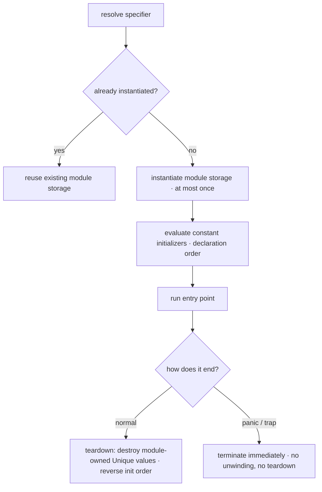
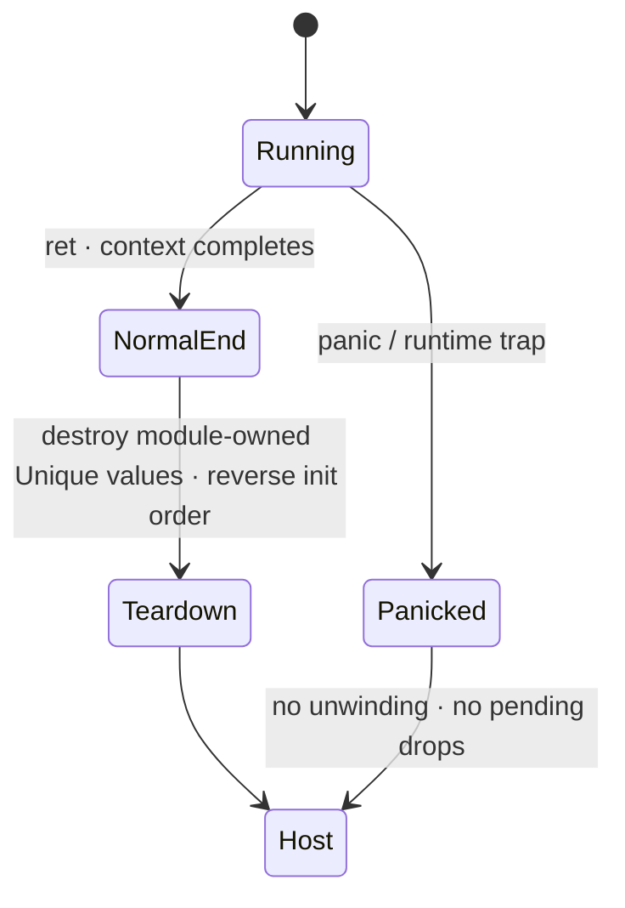

# Stilla Runtime Specification

> **Version:** v1.3 Draft

## Table of Contents

1. [Introduction](#1-introduction)
2. [Module Instantiation](#2-module-instantiation)
3. [Host Environment](#3-host-environment)
4. [Required Standard Interfaces](#4-required-standard-interfaces)
5. [Evaluation Order](#5-evaluation-order)
6. [Destruction at Runtime](#6-destruction-at-runtime)
7. [Termination and Traps](#7-termination-and-traps)
8. [Core Runtime Model](#8-core-runtime-model)

---

# 1. Introduction

## 1.1 Scope

This document — the **Runtime specification** — defines the Stilla v1.3 execution
model and the contract between a Stilla program and its embedding host. It covers:

- the execution context;
- module instantiation, storage, initialization, references, and teardown;
- the host environment: host-provided modules, the `builtin` module contract, and
  the entry point;
- deterministic evaluation order;
- destruction at runtime;
- panic, traps, and termination.

Syntax and compile-time constraints — the type system, ownership checking, generic
specialization, and the static module rules — are defined in the companion **Core
specification**, whose normative grammar is defined in the standalone [`Stilla Core
Grammar Draft.abnf`](Stilla%20Core%20Grammar%20Draft.abnf). This specification is
normative for all conforming implementations.

## 1.2 Relationship to the Core specification

- The Core specification defines what a conforming compiler must accept and reject.
- This specification defines what a conforming implementation must do when the program
  runs, and what the embedding host must provide.
- Where a behavior is described in both documents, the Runtime specification governs
  execution and the Core specification governs what the compiler must accept and reject.

The boundary between the two documents is drawn at the point where a program
transitions from a static artifact into a running execution context.

## 1.3 Execution context

A Stilla program runs inside an **execution context**.

The execution context:

- is created by the embedding host (Host Environment);
- owns all module storage (Module Instantiation);
- is the unit of panic termination (Termination and Traps);
- is disposed of by the embedding host (Host integration contract).

When a context begins relative to host lifecycle, and whether multiple contexts may run
concurrently, is implementation-defined.

## 1.4 Key terminology

These terms are used throughout this specification. Language-level terms (binding,
*Unique*, borrow, move, drop, etc.) are defined in Stilla Core Types & Ownership Specification.

- **execution context** — the unit of program execution created by the host; it owns
  module storage and is terminated as a whole by panic (Execution context, Termination
  and Traps).
- **module storage** — the immutable storage of an instantiated module (Module storage).
- **module instantiation** — creating module storage for a resolved specifier (At most
  once per context).
- **teardown** — normal-context destruction of module-owned *Unique* constants in
  reverse initialization order (Teardown).
- **embedding host / host** — the environment that creates the execution context,
  registers host-provided modules, invokes entry points, and receives control after
  termination (Host Environment).
- **host-provided module** — a module implemented by the host that exposes a statically
  known Stilla-compatible interface (Host-provided modules).
- **runtime trap** — a deterministic runtime failure such as overflow, division by zero,
  invalid list element read, or invalid `any` recovery (Runtime traps and numeric
  behavior).

## 1.5 Conformance

A conforming implementation must:

- instantiate each resolved module at most once per execution context (At most once per
  context);
- initialize module constants in declaration order (Initialization) and destroy
  module-owned *Unique* constants during normal teardown (Teardown);
- provide the required standard interfaces (Required Standard Interfaces);
- evaluate subexpressions in the defined order (Evaluation Order);
- destroy values as specified (Destruction at Runtime);
- terminate on panic and runtime traps without unwinding (Termination and Traps).

---

# 2. Module Instantiation

The runtime is the **linker** for symbolic dependencies. A compiled LLIR
artifact is module-local (LLIR Specification §2): its cross-module
references are canonical `(module_symbol, member_symbol)` pairs, and the
runtime resolves, loads, initializes, and caches modules as they are first
needed. Loading is decoupled from initialization: loading parses,
validates, and decodes an artifact into the VM's instruction image and
publishes it atomically; initialization (constant evaluation, §2.3) runs
the first time the module is actually used.

A resolved module follows one lifecycle per execution context — loaded at
most once, initialized at most once, and torn down (for module-owned
*Unique* constants) only on normal end:



## 2.1 Load-once, initialize-once per context

A canonical module symbol is loaded and instantiated at most once per
Stilla execution context.

The runtime identifies modules by their canonical symbol — byte-exact —
never by a numeric program-global id. Multiple imports of the same resolved
module refer to the same module storage:

```stilla
const a = import("math");
const b = import("math");
```

`a` and `b` denote the same module instance. A canonical module symbol
identifies exactly one active provider: the `ModuleLoader` callback returns
either a Stilla artifact or a registered host module for a symbol;
duplicate providers are an error, so there is no host-versus-Stilla
precedence rule. The VM never resolves importer-relative paths — it passes
the canonical module symbol to the loader unchanged; canonicalization is a
compiler/module-resolver responsibility.

**Atomic publication.** A load either publishes a complete runtime module
or nothing: the loader's artifact is parsed and structurally validated
before its imports are loaded, decoding and relocation happen in temporary
storage, and the module registry entry, code image range, and caches are
published only after every fallible step has succeeded. A malformed
artifact, a missing module or member, a kind mismatch, a duplicate
provider or export, or loader recursion fails as a deterministic
load/runtime trap and never exposes a partial module. The `loading` state
is a provisional, non-executable registry entry used for cycle detection.

**Error taxonomy.** Load failures are distinguished from execution traps:
`module_not_found` (no provider for the symbol), `invalid_artifact`
(malformed or failing structural validation), and allocation failure are
load errors; missing/non-exported members, kind mismatches, and
initialization cycles surface as deterministic runtime traps at the
resolving instruction.

**Lazy dependency loading.** The root module loads eagerly (startup loads
the root artifact, initializes the root module, resolves and validates the
entry export as a parameterless function through the same resolver, then
enters its function pc); dependencies load lazily, when a `module_ref` or
an imported member is first resolved. Successful member resolutions are
cached in the importing module by import-descriptor index.

## 2.2 Module storage

Module storage is immutable after initialization.

Its lifetime extends until the execution context ends.

Module storage follows the same immutable record/member-access model as structs (the
Core specification): member access on module values is ordinary `.` access, and there
is no separate runtime `module` type category.

## 2.3 Initialization

A module is initialized when it is instantiated.

Module constant initializers are evaluated strictly in declaration order (the Core
specification).

An initializer may reference earlier module constants, imported modules, module
functions, types, and imported standard-library modules such as `builtin`; it may not
reference a later module constant (Stilla Core Language Specification).

Imported modules used by an initializer are instantiated as required; because each
specifier is instantiated at most once per context (At most once per context) and
specifiers must resolve unambiguously before execution (Stilla Core Types & Ownership Specification), the
resulting initialization is deterministic.

## 2.4 References and aliasing

`import("specifier")` produces a stable reference to the module instance for the
current execution context (Stilla Core Types & Ownership Specification).

The compiler preserves resolved module identity through statically known aliases:

```stilla
const math = import("math");
const public_math = math;
```

`public_math` denotes the same module storage as `math`.

Imported module references do not transfer ownership of module storage.

## 2.5 Teardown

Module slots and their destruction log live on the module's runtime
record. Module-owned *Unique* constants are destroyed during **normal
context teardown** in reverse initialization order, across all
successfully initialized modules (modules initialized earlier are torn
down later).

Teardown runs only during normal termination of the execution context.

A panic or runtime trap — and a load or initialization failure — performs
raw VM/resource cleanup only: no Stilla unwinding, no module teardown, and
no pending local destruction hooks (Panic).

Host cleanup after termination is outside Stilla source semantics (Host
integration contract).

## 2.6 Import resolution process

The argument to `import` must be a string literal, and `import(...)` may appear only as
a module-level `const` initializer (Stilla Core Language Specification).

The compiler resolves the specifier to its **canonical module symbol**
(byte-exact) at compile time; the artifact carries the symbol, never an
importer-relative path. At runtime one resolver serves Stilla and host
modules alike:

```text
resolve(module_symbol, member_symbol) ->
    function VM pc | module slot value | nested module | host binding
```

The resolver looks the member up in the target module's sorted export
table; a non-exported or absent member, a duplicate export, or a kind
mismatch is a deterministic error. A `syscall` resolves its
`(module_symbol, member_symbol)` pair through a host-module descriptor;
host modules are ready after registration and have no Stilla initializer.

Resolution is implementation-defined behind the `ModuleLoader` callback,
but a symbol must resolve unambiguously before execution.

Import cycles are rejected in Stilla v1.3 (initialization-cycle detection
is a runtime trap).

The standard library is specified separately.

Host-provided modules are registered by the host before compilation or execution
(Host-provided modules).

---

# 3. Host Environment

## 3.1 Host-provided modules

An embedding host may register modules before compilation or execution.

A host module must expose a statically known Stilla-compatible interface (the Core
specification).

Conceptually:

```stilla
struct Database {
    query: fn(str) -> str;
    execute: fn(str) -> int32;
}
```

This structural illustration does not make module values ordinary first-class struct
values. It means their runtime member layout follows the same immutable
record/member-access model.

Source modules, standard-library modules, and host modules use the same `.`
member-access syntax (Stilla Core Types & Ownership Specification).

A standard-library or host-provided module may additionally declare **host-backed opaque
nominal types** (Stilla Core Types & Ownership Specification) — `opaque type Name[params];` — whose values the
implementation or embedding host constructs, stores, and destroys. For each opaque declaration and monomorphic
instantiation the implementation registers a **host type implementation**: a stable host identity
(`host_id`) naming the type's construction and destruction routines (Host integration
contract, Opaque type destruction).

## 3.2 The `builtin` module

`builtin` is an ordinary importable standard-library module (Stilla Core Language Specification): a
program brings it into scope like any other module, for example

```stilla
const builtin = import("builtin");
```

There is no implicitly available module binding; the context instantiates `builtin`
on demand, exactly as it instantiates any other resolved specifier (At most once per
context, Import resolution process).

The required interfaces every Stilla implementation must provide are defined in
**Required Standard Interfaces**. Their bodyless standard-library declarations
are expanded by the frontend as defined by the
[Intrinsics Specification](Stilla%20Intrinsics%20Specification.md).

## 3.3 Entry point

Stilla itself does not require a global entry-point syntax.

A standalone runtime conventionally loads an entry module and invokes:

```stilla
entry.main()
```

where normally:

```stilla
main: fn() -> void
```

is expected.

An implementation may define another entry signature.

A standalone startup is ordered: load the root artifact, initialize the
root module, resolve and validate the entry export (recorded symbolically
in the binary header) as a parameterless function through the same
resolver, then enter its function pc.

An embedding host may directly invoke any exposed module function.

## 3.4 Host integration contract

Control returns to the embedding host/runtime:

- on normal termination, after context teardown (Teardown);
- on panic or runtime trap, immediately, without unwinding (Panic).

The host is responsible for disposing of the terminated execution context and any
host-owned resources.

Such host cleanup is outside Stilla source semantics and must not be described as
execution of Stilla `drop` hooks.

The host may register host-provided modules (Host-provided modules) and may directly
invoke any exposed module function (Entry point).

An `any` value (Stilla Core Types & Ownership Specification) is a type-erased payload with a runtime
type tag — deterministic and comparable — that identifies its concrete payload type.
Stilla inspects the tag only through the two typed-recovery operations, `as` and
`match` type-test patterns, and destroying an `any` destroys the payload by the payload
type's own destruction rules. An `any` argument to or result from a host binding is
transferred as that opaque tagged payload.

A `hostdata` value (Stilla Core Types & Ownership Specification) is an opaque, type-erased payload with no
runtime type tag: its representation is implementation- and host-defined, and Stilla
never inspects or recovers it. A `hostdata` value never appears as an `any` payload —
the top type's tag space covers only the tagged value types — and leaves `hostdata` only
when the complete value is passed to a host binding or destroyed. When Stilla destroys a
`hostdata` value on normal control flow, the host disposes of the opaque payload; that
disposal is host cleanup, not execution of a Stilla `drop` hook. A `hostdata` argument
to or result from a host binding is transferred as that opaque payload.

An **opaque host type** value (Stilla Core Types & Ownership Specification, Host-backed opaque nominal types)
is a nominal value whose runtime representation the host defines. A conforming runtime
uses 64-bit value cells: every cell is a raw `uint64` holding the complete value — the
value's type is never stored in the cell. A cell carries no inline `ValueKind`
representation tag and no fixed-width payload field: the type of a value is determined
uniquely by the validated program — the opcode, descriptors, signatures, type tables,
and object headers — never by bits inside the cell
(Value cell canonical form). An opaque cell holds the host object's non-null pointer
verbatim, using the full host address width, so there is no handle table, no value
indirection, and no 48-bit pointer restriction. The pointer value is runtime
representation, not a Stilla integer: Stilla cannot observe, compare, or construct it, and
only the declaring module's host bindings and the context's destruction machinery touch
it, so user source can never forge or alias one. Destroying an opaque value on normal
control flow invokes the host type's destructor (`host_drop(host_id, value)`, Opaque
type destruction). The context maintains an exact inventory of live host-owned pointers
as ownership crosses the host boundary; a pointer is dereferenced only after the
live-resource registry confirms it, and a fabricated pointer value that is not in the
registry traps before dereference. Context disposal (normal teardown or panic) disposes
every pointer still in that inventory; no unwinding is required and no host resource
leaks. This cleanup inventory is bookkeeping, not a handle table: cells continue to hold
host pointers directly. An opaque value carries its nominal type identity, so it may be
an `any` payload (the Core specification).

There is no host-extension representation-tag namespace to register: because cells carry
no inline kind, a host value's type identity is carried by the program's type tables and
`HostTypeId`/`hostdata` contracts, never by a tag in the cell. `hostdata` and the opaque
host types are distinguished by their declared Stilla types, not by cell bits.

Host pointers use the full host address width. If a newly allocated or host-returned
pointer is outside the range the runtime can represent in a cell, the runtime releases it
through its original owner and traps before publishing the destination or committing
ownership.

---

# 4. Required Standard Interfaces

Every conforming implementation must provide the following minimum interfaces.
Sections 4.1–4.2 and 4.5–4.9 are members of the importable standard-library
`builtin` module; Sections 4.3–4.4 are members of the separately importable
`list` module (Stilla Core Language Specification, Stilla Standard Library).
A member with a Stilla body is an ordinary function; a
bodyless member in the implementation-supplied standard-library bundle is an
intrinsic that the frontend must expand during source-to-AIR lowering, as defined by the
[Intrinsics Specification](Stilla%20Intrinsics%20Specification.md).

Stilla has no closures (Stilla Core Language Specification): a function or lambda may not capture
enclosing local bindings. The list combinators live in the `iter` module (the Standard
Library) — `each`, `each_with`, `fold`, `fold_with`, `consume_each`,
`consume_each_with`, `consume_fold`, `consume_fold_with`, `try_fold`,
`try_fold_with`. Each accepts the per-element operation as an ordinary function-value
parameter — a monomorphic, non-capturing method — and the `*_with` variants additionally
take a borrowed context value the operation may read. Method-passing and context threading
are Stilla's compensation for the absence of closures.

## 4.1 Output

```stilla
builtin.print:
    fn(str) -> void
```

## 4.2 Conversion

Conceptually:

```stilla
builtin.str[T]:
    fn(T) -> str
```

Required supported types:

```text
byte
int32
uint32
int64
uint64
float32
float64
bool
str
```

Calling it with another type is a compile-time error unless the implementation explicitly
extends the interface.

## 4.3 List length

```stilla
list.len[T]:
    fn(borrow list[T]) -> int32
```

The list is borrowed and never consumed.

## 4.4 Integer range

```stilla
list.range:
    fn(int32, int32) -> list[int32]
```

The range is inclusive:

```text
[start, end]
```

If:

```text
start > end
```

the result is an empty list.

## 4.5 Box

```stilla
builtin.box[T]:
    fn(move T) -> box[T]
```

A fresh *Unique* expression transfers implicitly:

```stilla
builtin.box(Tree[int32]::Empty)
```

An existing *Unique* owner requires `move` (Stilla Core Types & Ownership Specification).

## 4.6 Unbox

Ownership extraction:

```stilla
builtin.unbox[T]:
    fn(move box[T]) -> T
```

For an existing *Unique* box:

```stilla
builtin.unbox(move boxed)
```

consumes the box as a whole and returns ownership of `T`.

For a fresh box expression, explicit `move` is unnecessary. If `box[T]` is *Copy* (its
payload is *Copy* — Stilla Core Types & Ownership Specification), `builtin.unbox(boxed)` is also valid and
returns a copy without invalidating the source box.

There is no non-consuming box read: a payload is obtained only by consumption (the Core
specification, *Box construction and unboxing*).

## 4.7 Panic

```stilla
builtin.panic:
    fn(str) -> never
```

`builtin.panic` terminates the current Stilla execution context.

Stilla v1.3 defines **no exception-style or destructor-style unwinding** for panic or
runtime traps. The full termination semantics are defined in **Panic**.

## 4.8 Assert

```stilla
builtin.assert:
    fn(bool, str) -> void
```

`builtin.assert(condition, message)` is an ordinary call for evaluation-order purposes:

1. evaluate `condition`;
2. evaluate `message`;
3. if the condition is `true`, return `()`;
4. otherwise terminate exactly as `builtin.panic(message)` (Panic).

The message expression is therefore evaluated even when the condition is true.

## 4.9 Hash

```stilla
builtin.hash[T]:
    fn(T) -> int32
```

Required supported key types:

```text
byte
int32
uint32
int64
uint64
float32
float64
bool
str
```

Calling it with another type is a compile-time error unless the implementation explicitly
extends the interface.

`builtin.hash` is deterministic and must not depend on per-execution random seeds used
internally by hash-table implementations.

For a fixed conforming implementation version, the same supported value must produce the
same result across execution contexts.

For `str`, `==` compares the byte-for-byte UTF-8 contents, without Unicode
normalization; `!=` is its complement. Distinct string objects with identical
bytes are equal. Values equal under `==` must produce equal hashes, including
equal string contents passed to `builtin.hash`.

For `float32`/`float64`, `+0.0 == -0.0`, so both must hash identically. NaN follows IEEE comparison
behavior and is not equal to itself; equal-hash requirements therefore do not equate
distinct NaN payloads.

The exact hash algorithm and cross-implementation hash value are implementation-defined
unless a standard-library profile specifies them.

---

# 5. Evaluation Order

Stilla uses a single deterministic evaluation-order rule:

> **Unless a construct explicitly states otherwise, subexpressions are evaluated exactly
> once from left to right in source order.**

This includes:

- the callee before call arguments;
- function arguments from left to right;
- the base before a member read;
- binary operator operands from left to right;
- tuple elements from left to right;
- list elements from left to right;
- struct field initializers from left to right;
- cast operands before conversion;
- the `match` scrutinee before selecting an arm;
- the `if` condition before evaluating exactly one selected branch.

`and` and `or` are short-circuiting:

- `a and b` evaluates `b` only if `a` is `true`;
- `a or b` evaluates `b` only if `a` is `false`.

Struct field initializers may be written in any order, but each initializer is evaluated in
its written source order. Struct destruction remains reverse declaration order (Struct
destruction order); literal field order does not change destruction order.

The `iter` combinators evaluate their iterable exactly once and visit elements in defined
forward order (the Standard Library).

`iter.each` visits list elements in increasing index order (the Standard Library).

`iter.fold` is a left fold from the lowest index to the highest index (the Standard
Library).

`iter.try_fold` is a left fold that stops at the first `Break`, leaving the remaining
elements unvisited (the Standard Library).

Module constants are initialized in declaration order (Stilla Core Language Specification).

*Unique* temporaries surviving to the end of one full expression are destroyed in reverse
creation order (*Unique* temporaries).

These rules apply to all conforming implementations and are not optimization hints. An
implementation may optimize only when the observable behavior is unchanged.

---

# 6. Destruction at Runtime

The compile-time constraints of destruction — how `drop` hooks are declared, what a
destruction view may do, and what an explicit `drop` may target — are defined in the Core
specification. This section defines when and in what order destruction happens at runtime.

## 6.1 Automatic destruction

During normal control flow, a *Unique* local owner that has not been moved or explicitly
dropped is automatically destroyed when its scope ends (Stilla Core Types & Ownership Specification).

Local owners are destroyed in reverse creation order.

Ownership state is static (Stilla Core Types & Ownership Specification). For a
**maybe-unique** binding — one released on some but not all paths through a
conditional construct — the compiler inserts destruction on each completing
non-consuming edge before the paths join. Automatic destruction at scope end
therefore applies only to definitely-owned bindings.

For example:

```stilla
{
    let a = open_file("a.txt");
    let b = open_file("b.txt");
}
```

destruction order is:

```text
b
a
```

## 6.2 Struct destruction order

During normal control flow, destroying a struct value proceeds in this exact order:

1. execute the user-defined `drop` hook, if present;
2. destroy *Unique* fields in reverse declaration order;
3. mark the complete value destroyed.

For:

```stilla
struct Connection {
    socket: Socket;
    log: File;

    drop(connection) {
        builtin.print("closing connection");
    }
}
```

destruction conceptually occurs as:

```text
Connection.drop
drop log
drop socket
```

The user hook runs while all fields remain valid. If the hook panics or traps, execution
terminates immediately and remaining field destruction is not guaranteed (Panic).

## 6.3 Structural destruction order

Values containing *Unique* components are destroyed structurally.

The required ordering is:

- struct fields: reverse declaration order;
- tuple elements: reverse element order;
- list elements: reverse index order;
- union payloads: reverse payload order of the active variant;
- `box[T]`: destroy the contained value;
- module-owned *Unique* constants: reverse module initialization order.

Only the active union variant is destroyed.

## 6.4 *Unique* temporaries

A *Unique* temporary that is not transferred into another owner is automatically destroyed
at the end of the containing full expression during normal control flow.

For example:

```stilla
open_file("temporary.txt");
```

constructs and then destroys the returned `File`.

Multiple *Unique* temporaries created within one full expression are destroyed in reverse
creation order.

A **consuming destructure** destroys unbound components — a wildcard `_` arm of a
consuming `match`, unbound fields of a struct pattern, and an exact `[a]` list pattern's
unconsumed remainder — immediately after the pattern binds, in the structural order of
**Structural destruction order** (`air.md`: an exact list pattern's remainder is dropped
at once).

A panic or runtime trap interrupts this rule because Stilla performs no unwinding (Panic).

## 6.5 Explicit destruction

An explicit `drop` statement (Stilla Core Types & Ownership Specification):

```stilla
drop file;
```

performs the same destruction sequence as automatic destruction (Automatic destruction,
Structural destruction order) at that point in control flow.

After the statement, the binding is no longer usable; this is enforced at compile time (the
Core specification).

## 6.6 Opaque type destruction

Destroying a value of a host-backed opaque nominal type (Stilla Core Types & Ownership Specification) dispatches
to the **host type's destructor**:

```text
drop opaque value
    ↓
host_drop(type.host_id, value)
```

The runtime resolves the opaque type declaration's host identity (`host_id`), invokes the
host-side destruction routine with the value, and marks the value destroyed. The routine
releases the host object named by the pointer (Host integration contract) — the value cell
holds the host pointer directly, at the full host address width, so there is no handle-table row or value indirection.
After successful destruction, the runtime removes the pointer from the context's
live-resource inventory so context disposal cannot release it again. This is host cleanup,
not execution of a Stilla `drop` hook: an opaque type has no user-defined hook.

Opaque values participate in structural destruction like any other nominal value
(Structural destruction order): an opaque element of a `list`, `box`, or `tuple`, or an
opaque payload of an `any`, is destroyed by this dispatch when the container is destroyed.

---

# 7. Termination and Traps

## 7.1 Panic

`builtin.panic` (**Panic** in the `builtin` interface) terminates the current Stilla
execution context.

Stilla v1.3 defines **no exception-style or destructor-style unwinding** for panic or
runtime traps.

Once panic or a runtime trap occurs:

- no enclosing Stilla statements resume;
- Stilla performs no pending automatic destruction of live locals or temporaries;
- Stilla performs no pending module teardown;
- no additional user `drop` hook is invoked as a consequence of termination;
- if termination occurs inside a `drop` hook, the remaining hook body and subsequent
  structural field destruction do not run.

Control returns immediately to the embedding host/runtime according to the host integration
contract (Host integration contract).

The host is responsible for disposing of the terminated execution context and any
host-owned resources. Such host cleanup is outside Stilla source semantics and must not be
described as execution of Stilla `drop` hooks.

A panic or runtime trap occurring inside a user `drop` hook terminates the execution
context immediately under the same rule.

## 7.2 Runtime traps and numeric/library behavior

The typing rules for operators and conversions are defined in Stilla Core Types & Ownership Specification. This
section defines their runtime behavior.

**Value cell canonical form.** Every cell is one raw `uint64`; there is no inline
representation tag and no fixed-width payload field, and the value's type is determined
by the validated program, never by cell bits (Host integration contract). The canonical
encoding of each scalar is frozen as follows:

- `bool` is exactly `0` or `1`;
- `byte` is the low 8 bits, with the high 56 bits zero;
- `int32` and `uint32` store their raw low 32-bit pattern sign-extended through
  the high 32 bits; this common cell form preserves both signed and unsigned
  32-bit ordering when the cell is compared as signed or unsigned `uint64`;
- `float32` is the raw low 32-bit pattern, with the high 32 bits zero;
- `int64`/`uint64` use all 64 bits: `int64` the two's-complement pattern, `uint64` the raw
  unsigned pattern;
- `float64` uses all 64 bits as the IEEE 754 binary64 bit pattern; NaN payload bits are
  preserved losslessly — a conforming runtime never canonicalizes, quiets, or collapses
  a NaN payload across a value transfer.

All scalar zeros therefore share the single all-zero bit pattern: the canonical zero of
every scalar type — `bool(false)`, `byte(0)`, `int32(0)`, `uint32(0)`, `float32(+0.0)`,
`int64(0)`, `uint64(0)`, `float64(+0.0)` — is `0x0000_0000_0000_0000`. The `zero` operand
register produces that all-zero pattern for the scalar type its instruction's resolved
operand contract requires. Copy, move, borrow, spill, argument, and return transfers
copy the complete raw cell; no transfer validates, masks, or rewrites payload bits.

- `int32` arithmetic is performed modulo 2³² and never traps on overflow (WebAssembly
  semantics). `int32` division traps on a zero divisor only — the division-overflow
  case `int32_min div -1` wraps modulo 2³² to `int32_min` and never traps (unlike
  WebAssembly, whose `i32.div_s` traps on `min / -1`: the widthless canonical cell of
  the [LLIR Instruction Set](Stilla%20LLIR%20Instruction%20Set.md) executes the
  division at 64 bits and the lowering's `sext32` truncates the exact quotient, so no
  32-bit division overflow exists); `int32` remainder traps on a zero divisor only —
  `int32_min rem -1` is 0 (WebAssembly semantics).
- `int64`/`uint64` arithmetic is performed modulo 2⁶⁴ and never traps on overflow or
  underflow (WebAssembly semantics extended to 64 bits). `int64` division traps on a zero
  divisor and on the division-overflow case `int64_min div -1`; `int64` remainder traps on a
  zero divisor only — `int64_min rem -1` is 0. Unary `-` on `uint64` computes the
  two's-complement negation `0 - x` and never traps; `-` on `int64` wraps on the minimum
  value (`int64_min` negated is `int64_min`, modulo 2⁶⁴) and never traps.
- Integer `div`/`rem` by zero traps for `int32`, `uint32`, `int64`, and `uint64`; `float32`
  and `float64` division follow IEEE 754 (`x / 0.0` is ±infinity for `x ≠ 0`, NaN for
  `0.0 / 0.0`) and never traps.
- `float32` remainder is the truncated remainder `a % b = a - trunc(a / b) × b` (C
  `fmod`, Rust `%`), following IEEE 754 binary32 behavior and never trapping: `x % 0.0`
  is NaN for every `x`, `0.0 % x` is `±0.0` (the sign of the dividend), `±inf % x` is
  NaN for finite `x`, and `x % ±inf` is `x`. `float64` remainder is the same operation in
  binary64, with the same never-trapping rules and the same result signs.
- `uint32` arithmetic is performed modulo 2³² and never traps on overflow or underflow;
  unary `-` on `uint32` computes the two's-complement negation and never traps, while
  `-` on `int32` wraps on the minimum value (`int32_min` negated is `int32_min`, modulo
  2³²) and never traps (Stilla Core Types & Ownership Specification).
- Shifts never trap. For the 32-bit integer types the count is taken modulo 32
  (WebAssembly semantics): only the low five bits of the count participate, so
  `x << 32` is `x`, `x << 33` is `x << 1`, and a negative count shifts by its low five
  bits (`-1` is 31). For `int64`/`uint64` the count is taken modulo 64: only the low six bits
  participate, so `x << 64` is `x`, `x << 65` is `x << 1`, and a negative count shifts
  by its low six bits (`-1` is 63). `>>` on `int32`/`int64` is the arithmetic shift (the
  vacated high bits are filled with the sign bit), `>>` on `uint32`/`uint64` the logical
  shift (filled with zero); `<<` shifts zeros into the low positions for all four
  types, and bits shifted out of the operand width are discarded (the Core
  specification).
- Bitwise operations never trap. `&`, `|`, and `^` operate on the raw
  operand-width patterns — `int32`/`uint32` are bit-identical in their
  32-bit patterns, `int64`/`uint64` bit-identical in their 64-bit patterns
  (signedness is irrelevant: masking, setting, or toggling bits never
  interprets the pattern as a number), every bit of the result is
  defined by the operands alone, and the result is the pattern modulo
  2³² or 2⁶⁴ (the Core
  specification). The instruction set's immediate forms (`andi`/`ori`/`xori`) zero-extend
  the raw 16-bit pattern (mask semantics — never sign-extended), so `x & 0x8000` means
  `x & 0x00008000`; a negative `int32` mask (a pattern with high bits set) does not fit
  the 16-bit field and materializes through a `const` instead.
- Invalid list element reads trap: consuming a short list by destructuring — `match (move
  xs)` against `[a, b]` where `xs` has one element — traps on the `split_list` read
  (non-consuming patterns are length-guarded and never index out of range).
- `array.make` traps on a negative length. `array.get` and `array.set` trap
  when the index is negative or greater than or equal to the array length.
- `string.substring` traps when either offset is negative, `start > end`, or
  either offset exceeds the string's code-point length. `string.repeat` traps
  on a negative count. `string.from_utf8` traps on invalid UTF-8;
  `string.from_codepoints` traps on a surrogate or a value above `0x10ffff`.
- Numeric conversion never traps: `int32 as byte` / `int32 as uint32` truncate to the
  target width (the value modulo 2⁸ / 2³², low bits in two's complement) and `uint32 as
  int32` reinterprets the low 32 bits (Stilla Core Types & Ownership Specification). The
  64-bit integer casts widen and narrow the low bits: `int32 as int64` / `int32 as uint64`
  sign-extend the low 32 bits (two's-complement conversion), `uint32 as int64` /
  `uint32 as uint64` zero-extend them, `byte as int64` / `byte as uint64` zero-extend the low 8
  bits, `int64 as uint64` / `uint64 as int64` reinterpret the full 64-bit cell, and the 64→32/
  64→8 forms keep the low bits (`int64 as int32` / `uint64 as int32` sign-extend the low 32
  bits, `int64 as uint32` / `uint64 as uint32` keep them as the canonical `uint32` cell,
  `int64 as byte` / `uint64 as byte` the low 8 bits).
- Invalid `any` cast traps: recovering an `any` payload under a target type that does not
  match its runtime tag (Stilla Core Types & Ownership Specification).
- `int32 as float32` uses the IEEE 754 conversion with round-to-nearest,
  ties-to-even; precision may be lost.
- `float32 as int32` truncates toward zero; a NaN or out-of-range source saturates to the
  `int32` range (NaN becomes zero) and never traps.
- `float64 as int32`, `float64 as uint32`, and `float64 as byte` truncate toward zero and saturate
  to the target range at binary64 precision (NaN becomes zero) and never trap; the
  widening casts `byte as float64`, `int32 as float64`, `uint32 as float64`, and `float32 as float64`
  are exact (Stilla Core Types & Ownership Specification).
- `float32 as int64` / `float32 as uint64` and `float64 as int64` / `float64 as uint64` truncate toward
  zero and saturate to the 64-bit range at the source's precision (NaN becomes zero):
  the signed forms to `[int64_min, int64_max]`, the unsigned forms to `[0, 2⁶⁴)`; they
  never trap. The reverse casts `int64 as float32` / `int64 as float64` and `uint64 as float32` /
  `uint64 as float64` round to nearest, ties-to-even, at the target precision (`int64 as float64` /
  `uint64 as float64` round values beyond 2⁵³, never exactly for every 64-bit value).
- `float32 as float64` is exact — every binary32 value is representable in
  binary64 — and `float64 as float32` rounds to nearest, ties-to-even; a
  finite `float64` whose magnitude exceeds the binary32 range converts to
  ±infinity (IEEE overflow), never saturates, and never traps.
- `byte as int32` is the identity (Stilla Core Types & Ownership Specification).
- `float32` uses IEEE 754 binary32 representation; `float64` uses IEEE 754 binary64
  representation. `float64` NaN payload bits round-trip losslessly (Value cell canonical
  form).
- Other `float32` and `float64` arithmetic follows IEEE 754 behavior for the respective
  format. `f32_min`/`f32_max` and `f64_min`/`f64_max` follow IEEE 754 `fmin`/`fmax`:
  a NaN operand makes the result NaN, and the zero tie keeps the sign the
  `fmin`/`fmax` specification gives (`fmin(-0, +0) = -0`, `fmax(-0, +0) = +0`); a
  fused multiply-add performs two separate roundings (the multiply, then the add) in
  both formats.
- The `math` functions return their specified IEEE 754 NaN or infinity values
  and do not trap merely because a result is NaN or infinity.
- Floating equality follows IEEE numeric comparison: NaN is unequal to every value including
  itself, while `+0.0 == -0.0` is true.

All of these traps are deterministic.

## 7.3 Host cleanup responsibility

On normal termination, the host performs context teardown (Teardown).

On panic or runtime trap, Stilla performs no unwinding and no pending destruction (Panic);
the host is responsible for disposing of the terminated execution context and any
host-owned resources.

Opaque host-type resources are context-scoped (Host integration contract): opaque values
hold host pointers directly in raw 64-bit value cells — using the full host address
width — while the context maintains the live host-resource inventory used for cleanup.
Context disposal releases every remaining host object in that inventory on normal
teardown and on panic alike (Panic). This is host cleanup, not execution of Stilla `drop`
hooks.

Host cleanup must not be described as execution of Stilla `drop` hooks (Host integration
contract).

---

# 8. Core Runtime Model

The module model is:

```text
source file
    ↓
implicit immutable nominal struct type (module-resident)
    ↓
module-scope const = import("module")
    ↓
stable module reference
    ↓
ordinary `.` value-member access
```

Module values are restricted to module-level bindings (Stilla Core Language Specification), so
module-qualified type lookup remains statically resolvable.

At the member-access level, modules and ordinary structs deliberately use the same
operation:

```text
value.member
```

The ownership model at runtime is:

```text
fresh unique value
    ↓
owner binding
    ├── borrow → temporary/non-owning view
    ├── move owner → ownership transfer
    └── drop owner → deterministic destruction on normal flow
```

Function parameter modes (Stilla Core Types & Ownership Specification) are:

```text
T            Copy value parameter
borrow T     non-owning parameter
move T       ownership-taking parameter
```

For an existing *Unique* owner, ownership transfer is always explicit:

```stilla
consume(move owner)
```

A fresh *Unique* expression may transfer directly:

```stilla
consume(make_value())
```

Box access is construction and ownership extraction (Stilla Core Types & Ownership Specification):

```stilla
builtin.box(move value)     // wrap: take ownership of the payload
builtin.unbox(move boxed)   // consume box and own contained value
```

Struct destruction on normal control flow is (Struct destruction order):

```text
drop owner
    ↓
user drop hook
    ↓
reverse field destruction
    ↓
value dead
```

Normal evaluation is deterministic (Evaluation Order):

```text
left-to-right evaluation
short-circuit and / or
forward sequence iteration
reverse destruction of surviving temporaries
```

Panic is deliberately outside the normal destruction model (Termination and Traps):

```text
panic / runtime trap
    ↓
terminate Stilla execution context immediately
    ↓
no Stilla unwinding
    ↓
embedding host regains control and performs host-defined cleanup
```

As a state machine, the two ways a context leaves execution are symmetric only in that
both hand control to the host; only the normal path runs teardown:



An `any` value (Stilla Core Types & Ownership Specification) carries a deterministic runtime type tag
identifying its concrete payload type; Stilla inspects the tag only through the `as` cast
and `match` type-test patterns. A `hostdata` value is a type-erased opaque payload with no
runtime type tag and no runtime inspection; it leaves Stilla only via host handoff or via
host disposal on destruction, and never appears as an `any` payload (Host integration
contract). An opaque host type value (Stilla Core Types & Ownership Specification) is a nominal value whose
representation and destruction are host-side: the runtime stores the host object's
pointer — at the full host address width, in a raw 64-bit value cell that carries no
inline representation tag — and dispatches destruction to the host
type's destructor (Host integration contract, Opaque type destruction). Unlike `hostdata`, an
opaque value carries its nominal type identity and may be an `any` payload.

The central rules of the language (stated fully in Stilla Core Language Specification) are:

> **Namespace rule.** Runtime member access is ordinary `value.member`; module values are
> simply restricted to module scope.

> **Construction rule.** Types describe values; ordinary functions construct values.

> **Ownership rule.** Borrowing never transfers ownership; moving always transfers
> ownership.

> **Generic rule.** Generics are compile-time templates and must become concrete before
> runtime.

> **Termination rule.** Normal control flow destroys deterministically; panic terminates
> without unwinding.

The resulting runtime surface is therefore:

```text
value.member

Type{...}
Union::Variant(...)

function(...)
generic::[ConcreteTypes](...)

borrow parameter
move owner
drop owner

builtin.box(move value)
builtin.unbox(move boxed)
```

and nothing more is required for the Stilla v1.3 runtime.

## See also

- [Stilla Core Language Specification](Stilla%20Core%20Language%20Specification.md) — the source language's syntax and compile-time constraints
- [Stilla Intrinsics Specification](Stilla%20Intrinsics%20Specification.md) — frontend recognition and expansion before LLIR
