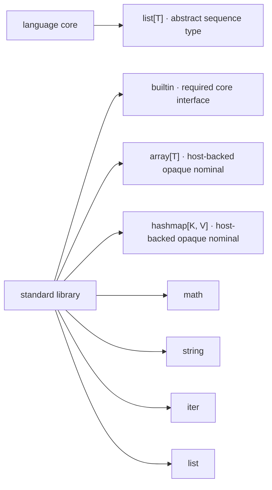

# Stilla Standard Library

> **Version:** v1.3 Draft

# 1. Scope

This document defines the Stilla standard library. It is a companion to the
Stilla v1.3 specifications: *Stilla Core Language Specification* (syntax and
compile-time constraints) and *Stilla Runtime Specification* (execution
behavior).

The standard library is a set of ordinary importable modules. Its types are
not language keywords, and its functions are ordinary module functions.
Module resolution follows the Stilla Core Language Specification; each module here may be
resolved as a standard-library module or provided by an embedding host.

A member with a Stilla body is an ordinary function. A member without a body
or initializer in the implementation-supplied standard-library bundle is an
intrinsic that the frontend must expand into ordinary AIR during source-to-AIR
lowering (the [Intrinsics Specification](Stilla%20Intrinsics%20Specification.md)). The
implementation form is not observable to a Stilla program.

The language core provides only the abstract sequence type `list[T]`:

- immutable;
- abstract storage (an implementation may use reference-counted sharing);
- supported directly by literals and patterns;
  iteration is provided by the `iter` module.

By contrast, the collection modules `array[T]` and `hashmap[K, V]` are not
abstract types. They are concrete implementation-provided types oriented
toward a contiguous-memory model, provided for performance:

- `array[T]` — a concrete dense sequence with contiguous element storage;
- `hashmap[K, V]` — a concrete hash table with contiguous bucket storage.

Because they are library types, no language change is required to alter or
replace them. An implementation may substitute alternative
representations, or add specialized collection modules, without touching the
language core.

`Array[T]` and `HashMap[K, V]` are **host-backed opaque nominal types**
(Stilla Core Types & Ownership Specification, *Host-backed opaque nominal types*): nominal types
declared by the module interface with `opaque type` and no Stilla-visible
representation. The implementation owns the buffer's memory and lifetime, Stilla never
inspects it, and the `array` and `hashmap` module functions are the only
access path. Every container value is *Unique* by declaration (the Core
specification) — never *Copy*, even when the element types are *Copy* — and
only the module's operations construct and destroy values.

**Opaque-container contract.** The Stilla *value* is
the *Unique* opaque container; the opaque buffer it names is not a Stilla
value and cannot be created or inspected in source. A conforming
implementation must ensure that:

- a valid buffer exists only behind the container module's operations —
  the value is produced by `array.make` / `hashmap.empty` and consumed by
  the read / transform / destroy operations. Because the type is opaque
  (Stilla Core Types & Ownership Specification), a token raw-constructed in source (`Array{ … }`)
  is a **compile-time error**, not a runtime hazard — the type system makes
  it unreachable;
- every **consuming** operation — `array.set`, `hashmap.insert`,
  `hashmap.remove` — takes the value by `move` and returns the updated
  value. Source semantics are purely functional — the input value is dead
  after the call, the result owns the continuation — so the implementation is free to
  **mutate the buffer in place** and return the same underlying object:
  without an alias, no persistent data structure, copy-on-write, or
  reference counting is required for the common path;
- `array.clone` / `hashmap.clone` duplicate the buffer into a fresh opaque
  object, giving the result independent storage;
- the buffer's lifetime is **bound to the execution context**: the runtime
  stores each live opaque value as a row of the context's opaque object
  table, and context cleanup — normal teardown or panic — disposes of every
  remaining row via the host type's destructor (the Runtime specification,
  *Host integration contract*, *Opaque type destruction*). Destruction on
  normal control flow is the ordinary `drop` of a *Unique* value: it
  dispatches to the host type's destructor, never to a Stilla `drop` hook.

**Opaque implementation descriptor (informative).** The `opaque type`
declaration in the module interface identifies the opaque implementation. For
each declaration it exposes:

```text
HostTypeDecl {
    module:        "array",
    name:          "Array",
    params:        [T],
    ownership:     unique,
    representation: opaque
}
```

The host maps each monomorphic instantiation (`Array[int32]`,
`Array[float32]`, …) to a stable **host identity** (`host_id`) naming its
construction and destruction routines; the runtime dispatches destruction
through it (the Runtime specification, *Opaque type destruction*). Because
generics are compile-time specialization, the AIR carries no runtime generic:
each instantiation is a distinct concrete nominal type.

The standard library provides:

```text
builtin       required core interface: print, str, box,
              unbox, panic, assert, hash, Option (the Runtime specification)
array[T]      implementation-owned contiguous-memory sequence, Unique opaque nominal
hashmap[K, V] implementation-owned contiguous-bucket hash table, Unique opaque nominal
math          common mathematical constants and functions
string        Unicode text operations and conversions
iter          list combinators: each, each_with, fold, fold_with, consume_each,
              consume_each_with, consume_fold, consume_fold_with, try_fold,
              try_fold_with
list          abstract list operations: len, range, is_empty, contains,
              count, index_of, head
```



Every module here, including `builtin`, is imported like any other module
(Stilla Core Types & Ownership Specification):

```stilla
const builtin = import("builtin");
const array = import("array");
```

# 2. The `array` module

Conceptual interface (a conforming standard library must provide at least this):

```stilla
array.make[T]:
    fn(int32, T) -> Array[T]

array.len[T]:
    fn(borrow Array[T]) -> int32

array.get[T]:
    fn(borrow Array[T], int32) -> T

array.set[T]:
    fn(move Array[T], int32, T) -> Array[T]

array.clone[T]:
    fn(borrow Array[T]) -> Array[T]
```

- `Array[T]` is a **host-backed opaque nominal type** (Scope, the Core
  specification): the module operations construct, read, and destroy an opaque
  contiguous buffer; the Stilla value
  is the opaque host pointer naming it. `Array[T]` cannot be raw-constructed,
  field-accessed, or destructured (Stilla Core Types & Ownership Specification), and only the
  module's operations produce and consume values.
- `Array[T]` is **Unique by declaration** (Stilla Core Types & Ownership Specification): it is
  never *Copy*, even when `T` is *Copy*. It may be moved, borrowed, stored,
  and dropped like any other *Unique* value.
- The element type `T` must be *Copy*. The restriction is enforced by the
  type system at the producing operations: `make`'s `init` and `set`'s
  `value` are plain (*Copy*) parameters (Stilla Core Types & Ownership Specification), so a
  *Unique* `init` or `value` is rejected at compile time. Consequently no
  `Array[Unique]` value is ever produced — the type is uninhabited — and
  `get` / `clone` / `len` never observe a non-*Copy* element. *Unique*
  element storage is provided by `list[T]` (Stilla Core Types & Ownership Specification) with the
  `iter` combinators.
- `array.make(length, init)` constructs a fresh `Array[T]` of the given
  length; every element is initialized to a copy of `init`. A negative length
  produces a deterministic runtime trap.
- `array.len(a)` returns the length; `a` is borrowed, so the owner keeps
  ownership.
- `array.get(a, i)` reads element `i` and returns a copy of it; `a` is
  borrowed. Invalid indexing produces a deterministic runtime trap (the
  Runtime specification). `get` returns an element by value; a borrowed
  *Unique* return is not expressible (Stilla Core Types & Ownership Specification), which is why
  `T` is restricted to *Copy*.
- `array.set(move a, i, v)` consumes `a` and returns the updated array with
  element `i` replaced by `v`. The input value is dead after the call and
  the result owns the continuation, so the implementation may **mutate the buffer in
  place** and return the same underlying object — no persistent structure or
  copy-on-write is required. The value is updated atomically from the
  source's point of view: no observation can see a partially updated array
  (invalid indexing still traps).
- `array.clone(a)` copies the buffer into a fresh `Array[T]` with
  independent storage; `a` is borrowed. `clone` is the only way to obtain a
  second live array naming distinct storage.
- Consuming updates compose by rebinding:

```stilla
let a = array.make(1000, 0);
let a = array.set(move a, 20, 123);
let a = array.set(move a, 30, 456);
let a = array.set(move a, 40, 789);
```

  each step can operate on the same contiguous allocation (Scope).

- Wholesale iteration over `Array[T]` is not provided: the `iter` combinators
  operate on `list[T]`, not on `Array[T]`.
- `array.make`'s `T` is inferred from `init` (Stilla Core Types & Ownership Specification);
  `array.set`'s `T` is inferred from the moved array and `value`;
  `len`, `get`, and `clone` carry `T` only in the token type, so their type
  argument must be written explicitly: `array.get::[int32](a, 2)`,
  `array.len::[int32](a)`, `array.clone::[int32](a)` (Stilla Core Types & Ownership Specification).

Usage:

```stilla
const array = import("array");

let a = array.make(4, 0);
let x = array.get::[int32](a, 2);
let n = array.len::[int32](a);
let a = array.set(move a, 2, 42);
let b = array.clone::[int32](a);
```

# 3. The `hashmap` module

Conceptual interface:

```stilla
hashmap.empty[K, V]:
    fn() -> HashMap[K, V]

hashmap.insert[K, V]:
    fn(move HashMap[K, V], K, V) -> HashMap[K, V]

hashmap.get[K, V]:
    fn(borrow HashMap[K, V], K) -> Option[V]

hashmap.contains[K, V]:
    fn(borrow HashMap[K, V], K) -> bool

hashmap.remove[K, V]:
    fn(move HashMap[K, V], K) -> tuple[HashMap[K, V], Option[V]]

hashmap.len[K, V]:
    fn(borrow HashMap[K, V]) -> int32

hashmap.clone[K, V]:
    fn(borrow HashMap[K, V]) -> HashMap[K, V]
```

- `HashMap[K, V]` is a **host-backed opaque nominal type** (Scope, the Core
  specification): the module operations construct, read, and transform an
  opaque contiguous-bucket table; the
  Stilla value is the opaque host pointer naming it. It cannot be raw-constructed,
  field-accessed, or destructured (Stilla Core Types & Ownership Specification), and only the
  module's operations produce and consume values.
- `HashMap[K, V]` is **Unique by declaration** (Stilla Core Types & Ownership Specification): it
  is never *Copy*, even when `K` and `V` are *Copy*. It may be moved,
  borrowed, stored, and dropped like any other *Unique* value.
- A key type `K` must be *Copy* and hashable; a value type `V` must be
  *Copy*. The restrictions are enforced by the type system at the producing
  operations: `insert`'s `key` and `value` are plain (*Copy*) parameters (the
  Core specification), as are `get`/`contains`/`remove`'s `key`, so a
  *Unique* key or value is rejected at compile time and no
  `HashMap[Unique, V]` / `HashMap[K, Unique]` value is ever produced.
- `builtin.hash` provides hashing for the primitive key types (the Runtime specification).
- `hashmap.insert(move m, key, value)` consumes `m` and returns the updated
  map. The input value is dead after the call and the result owns the
  continuation, so the implementation may **mutate the table in place** and return the
  same underlying object. Inserting a key that is already present replaces
  its value; the map is updated atomically from the source's point of view.
- `hashmap.remove(move m, key)` consumes `m` and returns the updated map
  together with the removed entry as `Option[V]` — `Some(v)` when `key` was
  present, `None` otherwise. As with `insert`, the implementation may remove in place.
- `hashmap.get(m, key)` returns a copy of the value as `Option[V]`; `m` is
  borrowed and the Copy key is passed by value. `get` returns a value by copy; a borrowed *Unique*
  return is not expressible (Stilla Core Types & Ownership Specification), which is why `V` is
  restricted to *Copy*.
- `hashmap.contains(m, key)` and `hashmap.len(m)` borrow `m`; `contains`
  tests presence, `len` returns the entry count.
- `hashmap.clone(m)` copies the table into a fresh `HashMap[K, V]` with
  independent storage; `m` is borrowed.
- Iteration order is unspecified but stable within a single execution
  context. Wholesale iteration over `HashMap[K, V]` is not provided: the `iter`
  combinators operate on `list[T]`, not on `HashMap[K, V]`.

Usage:

```stilla
const hashmap = import("hashmap");
const builtin = import("builtin");

using builtin.Option;

let m = hashmap.empty::[str, int32]();
let m = hashmap.insert(move m, "a", 1);
let m = hashmap.insert(move m, "b", 2);

match (hashmap.get::[str, int32](m, "a")) {
    Option::Some(value) => builtin.print(builtin.str(value)),
    Option::None => builtin.print("missing")
};

let (m, removed) = hashmap.remove::[str, int32](move m, "a");
let b = hashmap.clone::[str, int32](m);
```

`insert`'s `K` and `V` are inferred from the key and value arguments, and
`remove`'s from the moved map and key (Stilla Core Types & Ownership Specification); the other
functions carry `K`/`V` only in the token or result type, so their type
arguments must be written explicitly (Stilla Core Types & Ownership Specification). `Option` is
`builtin`'s type member, brought into scope with `using` (the Core
specification).

**`builtin.Option`** — a compile-time *type member* of the `builtin` module
(the [Core Language Specification](Stilla%20Core%20Language%20Specification.md)), formally:

```stilla
union Option[T] {
    Some(T),
    None
}
```

`Option[T]` is the standard library's designated option type. It is a plain
data union: matchable, and the `Some` payload substitutes the instantiation's
type argument. The `hashmap` and `string` interfaces that return `Option`
are *defined* against this member (`hashmap.get`, `string.index_of` , …), so
a conforming implementation must provide it and user code brings it into scope
with `using builtin.Option;`. The `Some` payload is copied out of the
returned `Option` in a non-consuming `match` and moved out of it in a
consuming `match (move …)`.

# 4. The `math` module

The `math` module provides common mathematical constants and functions.

A conforming implementation must provide the `math` module. Its functions
cannot be written in Stilla source alone; they are normally implemented in the
host language or on top of `builtin` extensions.

Constants:

```stilla
math.pi:
    float32

math.e:
    float32

math.tau:
    float32

math.inf:
    float32

math.nan:
    float32
```

- `pi`, `e`, and `tau` are the correctly rounded `float32` approximations of
  the corresponding mathematical constants.
- `inf` is positive infinity; `nan` is a quiet NaN.
- Float results follow IEEE 754, including NaN and infinity. For example,
  `math.sqrt(-1.0)` is NaN and `math.ln(0.0)` is negative infinity. The
  deterministic trap rules of the Runtime specification concern integer
  operations, invalid indexing, and numeric conversion; these math functions
  do not trap merely because their result is NaN or infinity.
- Results are deterministic within a single execution context. Cross-platform
  bit-exactness is not required.

Functions:

```stilla
math.sqrt:
    fn(float32) -> float32

math.pow:
    fn(float32, float32) -> float32

math.exp:
    fn(float32) -> float32

math.ln:
    fn(float32) -> float32

math.log2:
    fn(float32) -> float32

math.log10:
    fn(float32) -> float32

math.sin:
    fn(float32) -> float32

math.cos:
    fn(float32) -> float32

math.tan:
    fn(float32) -> float32

math.asin:
    fn(float32) -> float32

math.acos:
    fn(float32) -> float32

math.atan:
    fn(float32) -> float32

math.atan2:
    fn(float32, float32) -> float32

math.floor:
    fn(float32) -> float32

math.ceil:
    fn(float32) -> float32

math.round:
    fn(float32) -> float32

math.trunc:
    fn(float32) -> float32

math.abs:
    fn(float32) -> float32

math.min:
    fn(float32, float32) -> float32

math.max:
    fn(float32, float32) -> float32
```

- `math.pow(x, y)` computes `x` raised to the power `y`.
- `math.atan2(y, x)` takes the y-coordinate first, matching IEEE 754 `atan2`.
- `math.round` rounds to the nearest integer value, with ties away from zero.
- `math.floor`, `math.ceil`, and `math.trunc` return `float32` values with the
  corresponding integral value.
- `math.abs` returns the absolute value of a `float32`. Integer absolute value
  is not provided: it is expressible directly in source, and negating the
  minimum `int32` wraps to the minimum itself (integer arithmetic is
  modular, the Runtime specification).
- `math.min` and `math.max` follow IEEE 754 `fmin` and `fmax` semantics.
- `math.asin` and `math.acos` accept arguments in the range `[-1.0, 1.0]`.
  Out-of-domain arguments produce NaN per IEEE 754.
- There is no implicit numeric conversion in Stilla; integer arguments must be
  converted explicitly with `as` (Stilla Core Types & Ownership Specification).

Usage:

```stilla
const math = import("math");

let radius = 2.0;
let area = math.pi * math.pow(radius, 2.0);
let diagonal = math.sqrt(3.0 * 3.0 + 4.0 * 4.0);
```

# 5. The `string` module

The `string` module provides Unicode text operations and conversions between
strings and sequences of bytes or code points.

A conforming implementation must provide the `string` module. Its functions
cannot be written in Stilla source alone; they are normally implemented in the
host language or on top of `builtin` extensions.

Strings are sequences of Unicode code points (Unicode scalar values). All text
processing in this module operates on code points; byte offsets are never
exposed.

Conceptual interface (a conforming standard library must provide at least this):

```stilla
string.len:
    fn(str) -> int32

string.is_empty:
    fn(str) -> bool

string.concat:
    fn(str, str) -> str

string.contains:
    fn(str, str) -> bool

string.starts_with:
    fn(str, str) -> bool

string.ends_with:
    fn(str, str) -> bool

string.index_of:
    fn(str, str) -> Option[int32]

string.substring:
    fn(str, int32, int32) -> str

string.split:
    fn(str, str) -> list[str]

string.join:
    fn(list[str], str) -> str

string.trim:
    fn(str) -> str

string.lower:
    fn(str) -> str

string.upper:
    fn(str) -> str

string.replace:
    fn(str, str, str) -> str

string.repeat:
    fn(str, int32) -> str

string.to_utf8:
    fn(str) -> list[byte]

string.from_utf8:
    fn(list[byte]) -> str

string.to_codepoints:
    fn(str) -> list[uint32]

string.from_codepoints:
    fn(list[uint32]) -> str
```

- `string.len(s)` returns the number of code points in `s`, not the number of
  bytes.
- `string.substring(s, start, end)` returns the substring from code-point
  index `start` up to but not including `end`, per the half-open interval
  `[start, end)`. A negative offset, `start > end`, or an offset greater than
  `string.len(s)` produces a deterministic runtime trap.
- `string.split(s, sep)` splits `s` at every occurrence of `sep`. If `sep` is
  empty, the result is a list of single-code-point strings. An empty `s`
  splits to `[""]`.
- `string.join(parts, sep)` concatenates the strings in `parts` separated by
  `sep`. Joining an empty list yields the empty string.
- `string.index_of(s, needle)` returns the code-point index of the first
  occurrence of `needle`, or `Option::None` if there is no occurrence. An
  empty `needle` matches at index 0.
- `string.replace(s, from, to)` replaces every non-overlapping occurrence of
  `from` in `s` with `to`. An empty `from` inserts `to` between every
  code point (and at both ends).
- `string.repeat(s, count)` repeats `s` exactly `count` times. A negative
  count produces a deterministic runtime trap.
- `string.lower` and `string.upper` perform full Unicode default case
  conversion, which may change the length of the string (for example,
  `"İ".lower`).
- `string.trim(s)` removes leading and trailing Unicode whitespace.
- `string.to_utf8(s)` encodes `s` as a UTF-8 byte sequence.
  `string.from_utf8(bytes)` decodes a UTF-8 byte sequence; invalid UTF-8
  produces a deterministic runtime trap (the Runtime specification).
- `string.to_codepoints(s)` yields the code points of `s`.
  `string.from_codepoints(cps)` accepts any `uint32` value that is a Unicode
  scalar value; surrogates and values above `0x10FFFF` produce a
  deterministic runtime trap (the Runtime specification).
- All functions are deterministic within a single execution context.

There is no `byte` or `uint32` literal form in Stilla (Stilla Core Types & Ownership Specification); byte
and code-point sequences are written with explicit conversions, for
example `104 as byte` and `72 as uint32`, or obtained from
`string.to_utf8` / `string.to_codepoints`.

Usage:

```stilla
const string = import("string");

let s = string.from_utf8([104 as byte, 101 as byte, 108 as byte, 108 as byte, 111 as byte]);  // "hello"
let parts = string.split(s, "l");                     // ["he", "", "o"]
let joined = string.join(parts, "-");                 // "he--o"
let bytes = string.to_utf8(s);                        // [104, 101, 108, 108, 111]
let cps = string.to_codepoints(s);                    // [104, 101, 108, 108, 111]
let upper = string.upper(s);                          // "HELLO"
```

# 6. The `hostdata` type

`hostdata` is not a standard-library module. It is a core primitive type (the
Core specification) carrying an **opaque, host-defined payload**.

- Only the host constructs `hostdata` values, through host functions and
  module members (Core specification, Runtime specification); Stilla never constructs or
  inspects one itself.
- `hostdata` is *Unique* (Stilla Core Types & Ownership Specification): it may be moved, borrowed, stored,
  passed along, and handed to the host, and is never implicitly copyable.
- Containers of `hostdata` as elements — `list[hostdata]`, `box[hostdata]`,
  and `tuple[..., hostdata]` — are *Unique* by the structural rule of the Core
  specification. A `hostdata` value can therefore be stored as an element of a
  container.
- `builtin.str` and `builtin.hash` do not accept `hostdata`, so a `hostdata`
  value cannot be converted to text or used as a `hashmap` key.
- Destruction of a `hostdata` value — automatic (Stilla Core Types & Ownership Specification), explicit `drop`
  (Stilla Core Types & Ownership Specification), or container destruction — returns the opaque payload to the
  host for disposal (the Runtime specification); this is host cleanup, not execution
  of a Stilla `drop` hook.

`hostdata` is not involved in the `array` and `hashmap` containers (The `array` module, The `hashmap` module): a container value is a host-backed opaque nominal type (Stilla Core Types & Ownership Specification, *Host-backed opaque nominal types*) with a distinct nominal identity, not a `hostdata` payload. The two are different abstractions — `hostdata` is the type-erased form ("the host knows what this is, Stilla does not"), while an opaque container is the nominal form ("the compiler knows this is an `Array[int32]`, but not how it is stored"); see Stilla Core Types & Ownership Specification for the full division.

Usage:

```stilla
const os = import("os");

let h = os.open_handle("device");   // a hostdata payload from a host binding
let b = move h;                      // ownership transfers as a whole
let b2 = os.pass_handle(move b);     // handed back to the host
```

# 7. The `iter` module

The `iter` module provides the list combinators `each`, `each_with`, `fold`,
`fold_with`, `consume_each`, `consume_each_with`, `consume_fold`,
`consume_fold_with`, `try_fold`, and `try_fold_with`. Stilla has no closures
(Stilla Core Language Specification): a function or lambda cannot capture enclosing local bindings.
Each combinator therefore accepts the per-element operation as an ordinary
function-value parameter — a monomorphic, non-capturing method (Stilla Core Language Specification).
The `*_with` variants additionally take a **context** value that is borrowed
and passed to every invocation of the operation; context threading is the
language's compensation for the absence of closures. The `consume_*`
variants consume the list and move each element into the operation.

The module is ordinary Stilla source: `fold_with` and `consume_fold_with`
are the recursion kernels (matching `[]` / `[head, ..tail]` and calling the
operation value), and the combinators without a user context — `each`,
`fold`, `consume_each`, `consume_fold` — are derived from them by
threading the operation value through the context slot; `each_with`,
`consume_each_with`, and `try_fold_with` already carry a user context
and are written directly, and the context-free short-circuit kernel
`try_fold` is written directly too (it returns `Result[S, R]` and so
cannot be derived by threading). A `Result::Complete`/`Break` constructor
whose type arguments are not fully constrained by its payloads fills the
remaining ones from the expected instantiation of the same declaration —
the enclosing function's `Result[S, R]` return type (Inferred
specialization, Stilla Core Types & Ownership Specification), so no explicit type arguments are
required.

The module defines the short-circuiting fold result type:

```stilla
union Result[S, R] {
    Complete(S),
    Break(R)
}
```

A step returns `Complete(s)` to continue with accumulator `s`, or
`Break(r)` to stop.

Conceptual interface (a conforming standard library must provide at least this):

```stilla
iter.each[T]:
    fn(
        borrow values: list[T],
        action: fn(borrow T) -> void
    ) -> void

iter.each_with[T, C]:
    fn(
        borrow values: list[T],
        borrow context: C,
        action: fn(borrow C, borrow T) -> void
    ) -> void

iter.fold[T, S]:
    fn(
        borrow values: list[T],
        move state: S,
        step: fn(move S, borrow T) -> S
    ) -> S

iter.fold_with[T, S, C]:
    fn(
        borrow values: list[T],
        move state: S,
        borrow context: C,
        step: fn(move S, borrow C, borrow T) -> S
    ) -> S

iter.consume_each[T]:
    fn(
        move values: list[T],
        action: fn(move T) -> void
    ) -> void

iter.consume_each_with[T, C]:
    fn(
        move values: list[T],
        borrow context: C,
        action: fn(borrow C, move T) -> void
    ) -> void

iter.consume_fold[T, S]:
    fn(
        move values: list[T],
        move state: S,
        step: fn(move S, move T) -> S
    ) -> S

iter.consume_fold_with[T, S, C]:
    fn(
        move values: list[T],
        move state: S,
        borrow context: C,
        step: fn(move S, borrow C, move T) -> S
    ) -> S

iter.try_fold[T, S, R]:
    fn(
        borrow values: list[T],
        move state: S,
        step: fn(move S, borrow T) -> Result[S, R]
    ) -> Result[S, R]

iter.try_fold_with[T, S, R, C]:
    fn(
        borrow values: list[T],
        move state: S,
        borrow context: C,
        step: fn(move S, borrow C, borrow T) -> Result[S, R]
    ) -> Result[S, R]
```

- `iter.each(values, action)` invokes `action(item)` once per element in
  increasing index order (the Runtime specification) and returns `void`. The list is
  borrowed, so its elements are borrowed and no ownership transfers.
- `iter.each_with(values, context, action)` is `each` with a borrowed
  `context` passed to every invocation.
- `iter.fold(values, state, step)` is a deterministic left fold from the
  lowest index to the highest index (the Runtime specification): the accumulator `state`
  is moved into each `step(state, item)` invocation and the returned
  value becomes the next accumulator. The list is borrowed.
- `iter.fold_with(values, state, context, step)` is `fold` with a
  borrowed `context` passed to every step call.
- `iter.consume_each(values, action)` consumes the list as a whole; each
  element is moved into `action(move item)` in increasing index order
  (the Runtime specification).
- `iter.consume_each_with(values, context, action)` is `consume_each`
  with a borrowed `context` passed to every invocation.
- `iter.consume_fold(values, state, step)` is a consuming left fold: the
  list is consumed as a whole and each element is moved into
  `step(state, move item)`.
- `iter.consume_fold_with(values, state, context, step)` is
  `consume_fold` with a borrowed `context` passed to every step call.
- `iter.try_fold(values, state, step)` is a short-circuiting left fold,
  lowest to highest index (the Runtime specification): each `step(state, item)` returns
  `Result[S, R]`; `Complete(s)` continues with accumulator `s`, and the
  first `Break(r)` stops iteration immediately — the remaining elements
  are not visited — and is returned as the result. Completing every
  element yields `Complete(final state)`. The list is borrowed.
- `iter.try_fold_with(values, state, context, step)` is `try_fold` with a
  borrowed `context` passed to every step call.
- The `borrow` parameters are non-owning: call sites pass plain arguments
  (Stilla Core Types & Ownership Specification). For *Unique* `T`, elements are borrowed (`each`, `fold`,
  `try_fold`) or moved exactly once (`consume_each`, `consume_fold`); if
  the instantiated element or accumulator type is *Copy*, the corresponding
  modes have ordinary copy semantics.
- The `context` value is borrowed for the duration of the operation and
  passed to every invocation; it may be any type, including a *Unique* value
  whose ownership remains with the caller.

Usage:

```stilla
const iter = import("iter");
const lists = import("list");

let total = iter.fold(
    lists.range(1, 10),
    0,
    fn(move acc: int32, borrow x: int32) -> int32 {
        acc + x
    }
);

// Short-circuit at the first value greater than 5 (x = 6, accumulator 15):
let capped = iter.try_fold::[int32, int32, int32](
    lists.range(1, 10),
    0,
    fn(move acc: int32, borrow x: int32) -> iter.Result[int32, int32] {
        if (x > 5) {
            iter.Result::Break(acc)
        } else {
            iter.Result::Complete(acc + x)
        }
    }
);

match (capped) {
    iter.Result::Complete(v) => builtin.print(builtin.str(v)),
    iter.Result::Break(v) => builtin.print(builtin.str(v))
};
```

# 8. The `list` module

The `list` module groups the operations on the abstract sequence type
`list[T]`: the length query, the range constructor, and the derived
operations. Element reads happen by list matching instead of by a function
call — a *Unique* element cannot be returned by value without consuming the
list, and no function returns a borrowed value (Stilla Core Types & Ownership Specification, *Borrow
lifetime rule* and *List*). The [Runtime
Specification](Stilla%20Runtime%20Specification.md) defines the execution
semantics of the intrinsic `len` and `range` primitives; the other operations
below are ordinary Stilla source.

Because `list` is the language's type keyword (Stilla Core Types & Ownership Specification), a
source binding for this module must use another name; the specifier itself
is unaffected:

```stilla
const lists = import("list");
let n = lists.len(values);
```

Conceptual interface (a conforming standard library must provide at least this):

```stilla
list.len[T]:
    fn(borrow list[T]) -> int32

list.range:
    fn(int32, int32) -> list[int32]

list.is_empty[T]:
    fn(borrow list[T]) -> bool

list.contains[T]:
    fn(borrow list[T], borrow T, fn(borrow T, borrow T) -> bool) -> bool

list.count[T]:
    fn(borrow list[T], borrow T, fn(borrow T, borrow T) -> bool) -> int32

list.index_of[T]:
    fn(borrow list[T], borrow T, fn(borrow T, borrow T) -> bool) -> Option[int32]

list.head[T]:
    fn(move list[T]) -> Option[T]
```

`len` and `range` are standard intrinsic declarations without a Stilla
definition. The frontend identifies them by their public `list#len` and
`list#range` declarations and expands them while lowering source as defined by
the [Intrinsics Specification](Stilla%20Intrinsics%20Specification.md).

The derived operations are ordinary Stilla source, like the `iter`
combinators. Stilla defines no equality on generic element types (the Core
specification), so the membership operations take an explicit `eq` comparison
function; Stilla has no closures (Stilla Core Language Specification), so the comparison
and the needle are threaded as ordinary function parameters (the [Core
Language Specification](Stilla%20Core%20Language%20Specification.md)). `head` consumes
the list: only a moved element can be returned by value for every `T` (the
Core specification); the remaining elements are dropped.

Stilla has no list-construction primitive beyond literals and `list.range`
(the Runtime specification), so list-producing operations (`reverse`,
`append`, `take`, `drop`, `filter`, `map`) are not expressible in
source and are not provided.
