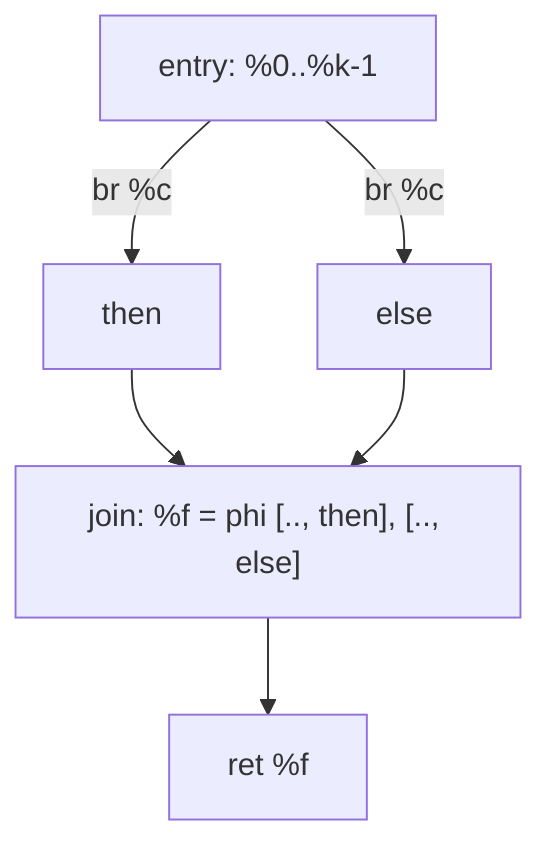
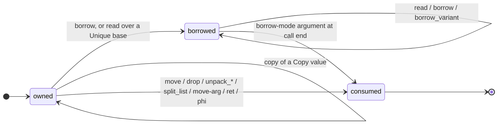

# Stilla AIR Specification

> **Version:** v1.3 Draft
>
> This document defines the AIR itself and is normative for all producers and consumers of it.

## Table of Contents

1. [Introduction](#1-introduction)
2. [Design principles](#2-design-principles)
3. [The control-flow graph](#3-the-control-flow-graph)
4. [Values, instructions, and SSA](#4-values-instructions-and-ssa)
5. [The instruction set](#5-the-instruction-set)
6. [Ownership model](#6-ownership-model)
7. [Module storage and the member table](#7-module-storage-and-the-member-table)
8. [Calls and system calls](#8-calls-and-system-calls)
9. [Data model](#9-data-model)
10. [Textual form](#10-textual-form)
11. [Lowering rules](#11-lowering-rules)
12. [Validity invariants](#12-validity-invariants)
13. [Consumers and non-goals](#13-consumers-and-non-goals)
14. [Worked examples](#14-worked-examples)

---

# 1. Introduction

## 1.1 Scope

The AIR is the boundary between the compile-time and run-time halves of the implementation. It is a **control-flow graph of basic blocks over three-address instructions in static single assignment (SSA) form**, with ownership and destruction made explicit.

The AIR must carry, without reference to source text:

- the full **control flow** of a function — the CFG: blocks, edges, terminators;
- the full **value flow** — SSA: each value defined exactly once, joined by phi nodes at merges;
- the **evaluation order** — linear instruction order inside a block *is* evaluation order (per the Stilla Runtime Specification); short-circuiting is real control flow;
- the **ownership semantics** — every *Unique* value is moved, borrowed, copied, or dropped by an explicit instruction (per the Stilla Core Language Specification);
- the **destruction schedule** — when and in what order values are destroyed (per the Stilla Runtime Specification);
- **module storage** — module members as a statically known member table: runtime constants occupy laid-out storage slots, while function, module-valued, and host-binding members are static references.

The AIR is produced by the frontend (Phase 3 of the pipeline described in [frontend.md](../docs/frontend.md)) and consumed by the runtime and every downstream analysis or backend. It is the **runtime boundary**: consumers receive the AIR alone, so its data model — the type environment (§9.1), the module member tables (§9.6), the syscall signatures (§9.3) — must be interpretable without reference to source text or the source module graph. The AIR is **not** an optimizer IR, a register-based IR, or target code: it fixes no registers, frame layouts, encodings, or ABI, so a consumer may interpret it directly, lower it further, or compile it. The frontend emits a direct, semantically faithful CFG; all optimization is performed by a later consumer.

## 1.2 Conventions

- `%N` denotes an SSA value; `%a`, `%b`, … denote values in examples; `#i` denotes a statically known index.
- Operand order in the text form is operand order in memory and, where evaluation order matters, source order.
- The term **unique** denotes the non-*Copy* ownership class (per the Stilla Core Language Specification).
- Source spans may be attached to any syntax-derived entity for diagnostics; they have no semantic role and are not part of the definitions below.

---

# 2. Design principles

1. **Three-address code.** The AIR is predominantly three-address and single-result: every instruction computes **one result** from **at most two source operands**, with explicit **atomic multi-result destructuring** operations (`unpack_*` / `split_list`) and the multi-result `borrow_variant` projection. The n-ary exceptions — aggregate `construct`, `call`, `syscall`, and `phi` — are n-ary in operands but single-result (or pure effects); the branchless `select` is the sole fixed ternary. A strict canonization into ≤2-operand form is always available by introducing intermediate values, so the property is not lost, merely elided where the operand list is statically typed.
2. **Static single assignment.** Every value is defined exactly once; control-flow merges join values with `phi`. Stilla's immutable bindings and shadowing map onto SSA without any renaming pass: each `let` is a fresh definition, shadowing is a fresh name.
3. **Exactly-once, left-to-right evaluation.** Inside a block, instruction order is source evaluation order (per the Stilla Runtime Specification). Short-circuit `and` / `or` never become instructions — they lower to conditional-branch diamonds so the right operand is evaluated only when required.
4. **Ownership is explicit.** `move`, `borrow`, `copy`, and `drop` are instructions. Every *Unique* value is used at most once per path and destroyed exactly once per path; destruction is materialized in the CFG, not left to the runtime to infer.
5. **Locals are values; only module storage is program-addressable memory.** All local state lives in SSA values. The sole program-addressable memory in the AIR is module storage — statically laid-out slots, written once by the module init function and read afterwards, holding exactly the module's runtime constant members. Function, module-valued, and host-binding members are not storage: they are static references in the member table.

---

# 3. The control-flow graph

A function is a directed graph of **basic blocks**. A block is a linear sequence of instructions terminated by exactly one **terminator**.

- **Entry block.** Every function has exactly one entry block, which has no predecessors; the parameter values `%0..%k-1` are defined there.
- **Terminators.** Exactly one per block, and it is the last instruction. The six forms are `ret`, `j` (unconditional), `br` (conditional), `switch` (union dispatch), `tailcall` (frame-reusing direct self-call, §14.7.1), and `trap` (panic / `never`).
- **Layout.** Blocks are ordered so that fall-through is the common case: an unconditional `j` to the *next* block in layout may be elided by the printer; the in-memory form always carries an explicit terminator.
- **Edges.** `br` has exactly two out-edges; `switch` has one per arm plus an implicit default that is `trap`. Match exhaustiveness is guaranteed by the checker, so the default is unreachable.

```text
terminator ::= "ret" value?                  -- return; bare "ret" for void
             | "j" label
             | "br" value "?" label ":" label
             | "switch" value "{" tag "->" label ("," tag "->" label)* "}"
             | "tailcall" "@" ident ("," value)*   -- frame-reusing self call
             | "trap"
```

**CFG invariants:**

- every block except the entry has at least one predecessor;
- every block ends in exactly one terminator; no instruction follows it;
- every block is reachable from the entry;
- every out-edge of `br` / `switch` names an existing block;
- `phi` nodes appear only at the head of a block, one incoming per predecessor edge, in the same order as the block's predecessor list.

A function is a graph of such blocks; the example below is a canonical `if`-shaped CFG: an entry that branches, two arms that `j` to a single join, and a `phi` at the head of the join that merges one value per edge.



---

# 4. Values, instructions, and SSA

## 4.1 Definitions

- **Value** — one SSA definition: the result of exactly one instruction. Values carry an AIR-native type, an **ownership class** inherited from the type (*Copy* / *Unique*), and a **created state** (owned / borrowed). Whether a value is still *available* at a program point — alive, consumed, or consumed on some paths only — is not a value property: it is an edge-sensitive dataflow property computed by the validator and mirrored by the lowering's consumption bookkeeping. Values are numbered per function in definition order (`%0, %1, …`); the text form also permits symbolic names (`%sum`) for readability.
- **Instruction** — a unit of computation. An instruction either *defines* one or more values (a single result for ordinary ops; several for the atomic destructure ops `unpack_*` / `split_list` and for the multi-result `borrow_variant` projection) or is an **effect** with no results: `drop` or `store_member`.
- **Use** — a reference to a value as an operand. SSA requires that every non-phi use of a value is **dominated** by its definition; a phi's operands are defined in the corresponding predecessor blocks.

```text
instr   ::= value ("," value)* "=" op   -- defining; several results for the atomic destructure ops and borrow_variant
          | effect                   -- drop | store_member
value   ::= "%" ident | "%" number
```

## 4.2 The three-address property

For every *defining* instruction except `construct`, `call`, `syscall`, `phi`, and the fixed ternary `select`, the operand count is at most two; the atomic destructure ops and the `borrow_variant` projection are the only multi-*result* instructions:

```text
%r = op %a           -- unary
%r = op %a, %b       -- binary
```

The four n-ary exceptions are exactly the instructions whose operand list is a **statically typed, fixed-shape list** (field list, argument list, incoming-edge list). They are kept n-ary so the CFG stays small and the dataflow edges remain explicit; the validator checks operand counts against each op's declared arity.

## 4.3 Phi

A join merges one value per incoming edge:

```text
join:
    %m: int32 = phi [%a, then], [%b, else]
    ret %m
```

The phi's type is the **join type** of the merged values:

- identical types join to themselves;
- `never` contributes nothing — a `trap`-terminated block is simply not listed as a phi source, because it never completes;
- a mix coercible to `any` joins as `any`;
- anything else is a compile-time error and never reaches the AIR.

The `T → any` coercion of a mixed join is **not** implicit at the phi: the lowering materializes it on each predecessor edge — `any_pack_copy %x` (*Copy* source) or `any_pack_move %x` (*Unique* source) is appended to the branch block before its `j join`, and the phi joins the homogeneous `any` values. Ownership stays explicit and the phi's operand types are verifiable.

## 4.4 Coercions

Conversions are explicit instructions: `num_cast` for every non-identity pair of `{byte, int32, uint32, int64, uint64, float32, float64}` defined by the [Core Types & Ownership Specification](Stilla%20Core%20Types%20%26%20Ownership%20Specification.md), and the four `any`-ops (`any_pack_copy` / `any_pack_move` / `any_unpack_copy` / `any_unpack_move`) for the top type. The remaining coercions are implicit and materialized at specific points:

- **`never` → T** — a call whose result type is `never` is always immediately followed by `trap`; a `trap` block contributes no value to a phi.
- **T → `any`** — at call boundaries (arguments to `any`-typed parameters, `ret` of an `any`-typed function) and on the predecessor edges of an `any` join. A *Copy* source is `any_pack_copy`'d into the `any` (the source stays owned); a *Unique* source is `any_pack_move`'d (the source is consumed). Both are ordinary instructions emitted by the lowering. `hostdata` is never a source: it does not coerce to `any` (Stilla Core Types & Ownership Specification).
- **`any` → T recovery** — `a as T` for a *Copy* `T` lowers to `any_unpack_copy` (payload copied out, the `any` stays owned); `(move a) as T` — the only legal recovery of a *Unique* payload — lowers to `any_unpack_move`, consuming the complete `any` and transferring payload ownership to the result.

---

# 5. The instruction set

Every op's canonical spelling, value arity, ownership effect, created state, may-trap behavior, and effect class are declared in the machine-readable op schema. The validator checks arity, typing, and the ownership dataflow against it.

**Effect classes.** Every op is classified as one of:

- **pure** — no observable effect beyond its result;
- **pure but may trap** — no observable effect beyond its result, but may raise a runtime trap;
- **side-effecting** — observable beyond its result (for example `store_member` and calls to host bindings).

The optimizer may move or share only pure computations: constant folding, common subexpression elimination, and partial redundancy elimination apply to pure ops only, and a may-trap op is never shared or hoisted in a way that changes its trap behavior.

## 5.1 Constants, parameters, and modules

| op | form | produces | notes |
| --- | --- | --- | --- |
| `const` | `%d = const k` | literal type | int/uint/float/bool/str/void; negative literals are constants |
| `module_ref` | `%d = module_ref "spec"` | module type | static module value; a constant usable in any function |
| `fn_ref` | `%d = fn_ref @name` | function type | a direct reference to a known function |

**Parameters are not ops**: a function's parameters are **SSA roots** — the first `k` values of the function (`%0 … %k-1`), with no defining instruction and types and modes from the function's parameter list. A borrow-mode parameter arrives `borrowed` with origin `call`; a plain/move parameter arrives `owned`.

## 5.2 Arithmetic, comparison, logic, and casts

Operand types and trap behavior (divide-by-zero and `int64_min / -1`,
invalid `any` recovery) are
defined by the [Stilla Core Language Specification](Stilla%20Core%20Language%20Specification.md) and the [Stilla Runtime Specification](Stilla%20Runtime%20Specification.md). Integer arithmetic wraps modulo 2³² (32-bit types) or 2⁶⁴ (`int64`/`uint64`) and never traps on overflow; `div`/`rem` trap on a zero divisor, and the signed `int64` `div` also traps on `int64_min / -1` — `int32_min / -1` wraps modulo 2³² to `int32_min` and never traps (`int32_min % -1` / `int64_min % -1` is 0 and never traps; the [Runtime Specification](Stilla%20Runtime%20Specification.md), the [LLIR Instruction Set](Stilla%20LLIR%20Instruction%20Set.md)) — the constant folder folds overflow to the wrapped value and leaves the trapping cases unfolded, matching what the runtime executes.

| op | form | produces |
| --- | --- | --- |
| `neg` | `%d = neg %a` | same numeric type; `int32`/`int64` minimum negation wraps to the minimum itself (modulo 2³² / 2⁶⁴, never traps); `uint32`/`uint64` negation is two's-complement and never traps (Stilla Core Types & Ownership Specification) |
| `abs` | `%d = abs %a` | same numeric type (`int32`/`float32` — `uint32` has no abs, the identity); `int32` wraps on the minimum (`abs(int32_min)` is `int32_min`, never traps); `float32` is IEEE `fabs` (clears the sign bit — `abs(-0.0) = +0.0`) |
| `clz` | `%d = clz %a` | same integer type (`int32`/`uint32`/`int64`/`uint64`); the count of leading zero bits in the operand-width pattern (`clz(0) = 32` on 32-bit types, `clz(0) = 64` on `int64`/`uint64`); total, never traps |
| `popcount` | `%d = popcount %a` | same integer type (`int32`/`uint32`/`int64`/`uint64`); the count of set bits in the operand-width pattern; total, never traps |
| `not` | `%d = not %a` | `bool` (source `!`) |
| `num_cast` | `%d = num_cast %a` | the target numeric type; every non-identity pair of `{byte, int32, uint32, int64, uint64, float32, float64}` is defined, and casts never trap (the Runtime specification): integer narrowing keeps low bits, widening sign- or zero-extends as the rep demands (`int64 ↔ uint64` reinterprets the cell), float→int truncates toward zero and saturates on NaN/out-of-range values (NaN becomes zero), int→float uses round-to-nearest ties-to-even, `float32 → float64` is exact, and `float64 → float32` rounds to nearest ties-to-even |
| `type_is` | `%d = type_is %a, T` | `bool` — runtime tag test against type `T` (a type-test arm of a `match` over an `any`) |
| `any_pack_copy` | `%d = any_pack_copy %a` | `any` — `T → any` of a *Copy* source; the source stays owned |
| `any_pack_move` | `%d = any_pack_move %a` | `any` — `T → any` of a *Unique* source; the source is consumed |
| `any_unpack_copy` | `%d = any_unpack_copy %a` | `T` — `any as T` for a *Copy* `T`; the `any` stays owned; traps on a tag mismatch |
| `any_unpack_move` | `%d = any_unpack_move %a` | `T` — `(move any) as T`; the complete `any` is consumed, payload ownership transfers to the result; traps on a tag mismatch |
| `add sub mul div rem` | `%d = add %a, %b` | same numeric type; integer arithmetic wraps modulo 2³² (32-bit types) or 2⁶⁴ (`int64`/`uint64`) (never traps on overflow); `div`/`rem` trap on a zero divisor, and the signed `int64` `div` also traps on `int64_min / -1` — `int32_min / -1` wraps modulo 2³² to `int32_min` |
| `min max` | `%d = min %a, %b` | same numeric type; integers compare as signed or unsigned patterns of the operand width (signedness fixed by the opcode), float follows IEEE 754 `fmin`/`fmax` (NaN propagates, `fmin(-0,+0) = -0`); total, never traps |
| `shl shr` | `%d = shl %a, %b` | same integer type (`int32`/`uint32`/`int64`/`uint64` — `byte` has no arithmetic, the float types no bit pattern); never traps — the count is masked mod 32 (32-bit types) or mod 64 (`int64`/`uint64`), `shr` is arithmetic on `int32`/`int64` and logical on `uint32`/`uint64` |
| `bitand bitor bitxor` | `%d = bitand %a, %b` | same integer type (`int32`/`uint32`/`int64`/`uint64` — `byte` has no arithmetic, the float types no bit pattern); bit-identical on the raw operand-width patterns, never traps |
| `select` | `%d = select %c, %a, %b` | `%a` when `%c`, else `%b` — the condition is a `bool`, the then/else values share one scalar *Copy* type (int32/uint32/int64/uint64/float32/float64/byte/bool), and the result is that type; pure and total, the then/else positions are not interchangeable. The if-conversion replaces a branch diamond whose arms are single pure producers with this one op; the LLIR image is `copy cond_reg, %c` + `cmov dst, %a, %b` |
| `concat` | `%d = concat %a, %b` | `str` (source `str + str`) |
| `eq ne lt le gt ge` | `%d = lt %a, %b` | `bool` |

`and` and `or` have **no** instructions: they lower to `br` diamonds. `!` is `not`. Comparison operators do not chain, so no AIR constraint is needed beyond what the checker enforces. (The if-conversion pass, optimizer.md §8.8, may then fold a short-circuit whose right operand is pure scalar into a single `select`.)

## 5.3 Aggregates and projections

`construct` builds a value from components; projections read components. Projections come in two access kinds:

- **read** — non-consuming: copies the component for *Copy* bases, produces a **borrowed view** for *Unique* bases (member reads, borrowed matches) — each borrowed view carries a `BorrowOrigin` anchoring its lifetime;
- **unpack** — consuming destructure: **atomic and multi-result**. One op consumes the base *as a whole* and defines all of its parts at once (destructuring with `move`) — no half-consumed base states exist. The results are the struct fields in declaration order, the tuple elements, the variant's payload values (tag-carrying), or the list items followed by the owned rest. An exact list pattern (`[a, b]`, no `..rest`) defines only the items; the consumed remainder is dropped immediately (the whole list is still consumed). A `[]` arm of a consuming match defines nothing and still consumes the base.

| op | form | produces |
| --- | --- | --- |
| `construct` | `%d = construct %a, %b, …` | struct (fields in declaration order) |
| `construct` | `%d = construct #tag %a, …` | union variant with discriminant `#tag` |
| `construct` | `%d = construct %a, %b` | tuple |
| `construct` | `%d = construct %a, %b, …` | list literal |
| `read_field` | `%d = read_field %b, #i` | struct field `i`, borrowed view |
| `read_tuple` | `%d = read_tuple %t, #i` | tuple element `i`, borrowed view |
| `read_index` | `%d = read_index %l, %i` | list element, borrowed view; bounds check traps — source-level element reads happen through list patterns (Stilla Core Types & Ownership Specification, *List*), so a direct `read_index` of an arbitrary index is reachable only in text-form AIR |
| `tail` | `%d = tail %l` | borrowed sublist view (`[head, ..tail]`) |
| `unpack_struct` | `%a: T, %b: U = unpack_struct %s` | all struct fields (consumes `%s`) |
| `unpack_tuple` | `%a: T, %b: U = unpack_tuple %t` | all tuple elements (consumes `%t`) |
| `unpack_variant` | `%p1: T1, %p2: T2, … = unpack_variant %u, #k` | the payload values of variant `#k`, in declaration order — one result per payload (consumes `%u`); the tag is carried for backend self-containment — the arm's `switch` dispatch already guaranteed the variant |
| `split_list` | `%a: T, %b: T, %r: list[T] = split_list %l` | list items then the owned rest (consumes `%l`; may trap on a short list) |
| `read_tag` | `%d = read_tag %u` | union discriminant, as a tag index |
| `read_payload` | `%d = read_payload %u` | the payload of the active variant, borrowed view — a single-payload variant's single payload (for a multi-payload variant, use `borrow_variant`) |
| `borrow_variant` | `%p1: T1, %p2: T2, … = borrow_variant %u, #k` | the payload values of variant `#k`, in declaration order — one result per payload, the base never consumed; a *Copy* payload is copied out (owned), an *Unique* payload is a borrowed view rooted at the base (mirrors `read_field` of an *Unique* base). Symmetric with `unpack_variant`. The tag is carried for backend self-containment — the arm's `switch` dispatch already guaranteed the variant |

`builtin.box` and `builtin.unbox` are **not** AIR ops. They are intrinsic
declarations that source-to-AIR lowering expands into ordinary AIR (the
[Intrinsics Specification](Stilla%20Intrinsics%20Specification.md)). Neither
returns a borrowed value — Stilla has no borrowed return values (Stilla Core
Types & Ownership Specification, *Borrow lifetime rule*).

## 5.4 Ownership

| op | form | produces |
| --- | --- | --- |
| `copy` | `%d = copy %a` | an owned copy; `%a` must be *Copy* |
| `borrow` | `%d = borrow %a` | a non-owning view of `%a`; origin `root(%a)` |
| `move` | `%d = move %a` | ownership of `%a` transferred; `%a` is dead |
| `drop` | `drop %v` | effect: deterministic destruction; `%v` is dead; `%v` is never *Copy* — the frontend does not emit `drop` for *Copy* values |
| `cleanup_arm` | `%t = cleanup_arm %v` | a `cleanup`-typed token scheduling `%v`'s conditional destruction (§6.4); only `cleanup_disarm` and `cleanup_drop` consume it |
| `cleanup_disarm` | `cleanup_disarm %t` | effect: disarms the token without destroying the payload — emitted on a path where the owner was consumed (moved, taken, transferred) |
| `cleanup_drop` | `cleanup_drop %t` | effect: the scope-end conditional destruction — destroys the owner iff the token is still armed, then disarms it |
`move` of a *Copy* value is semantically a copy with no invalidation — the lowering emits `copy` in that case. Because ownership is exactly *Copy* or *Unique*, `drop` of a *Copy* value does nothing and the frontend never emits it; the lowering's drop emission skips any value whose type is *Copy*. After the optimizer, a dedicated **drop-lowering pass** expands every statically-expandable `drop` in the CFG (§14.4): a struct drop becomes its hook call (when declared) plus an `unpack_struct` and per-field drops, a tuple drop becomes `unpack_tuple` plus element drops, a box drop becomes its ordinary-AIR unboxing expansion plus a drop of the contained value, and a union drop becomes a `read_tag` + `switch` over its variants. Only the drops the CFG cannot express remain single instructions: opaque host types (`host_drop`), `hostdata`, `list[T]`, and `any`. A maybe-*Unique* value is destroyed on each non-consuming edge before its construct's join and is never referenced after the join.

## 5.5 Calls and system calls

| op | form | produces |
| --- | --- | --- |
| `call` | `%d = call %f, %a, %b, …` | return type; n-ary; callee is a function value or a direct function reference |
| `syscall` | `%d = syscall target, %a, …` | return type; host binding; when the return type is `void` or `never` the result may be omitted |

Both are n-ary. Argument evaluation is callee, then arguments left to right, exactly once (per the Stilla Runtime Specification).

## 5.6 Module members and storage

Module members are modeled by a per-module **member table**: the module's runtime value members in declaration order. A member is one of four kinds — a **constant slot** (the only kind that occupies runtime storage), a **function** (a direct reference to its function), a **module value** (a static reference to an instantiated module), or a **host binding** (a declaration without a Stilla body, callable only as a system call).

An intrinsic declaration is expanded while lowering source and does not occupy
a member-table row in canonical AIR. A synthesized function used for a
first-class intrinsic function value is an ordinary `IrFunc`; each use is
rewritten directly to its `fn_ref`.

| op | form | produces |
| --- | --- | --- |
| `load_member` | `%d = load_member %m, #i` | member `#i` of `%m`: a storage read for a constant member, a function value (`fn_ref`) for a function member, a module value (`module_ref`) for a module-valued member |
| `store_member` | `store_member #i, %v` | effect; writes constant slot `#i` — legal only inside `@init` |

A host constant (a `const` declaration without an initializer, Stilla Core Language Specification) is a `ConstSlot` member: `load_member` reads its slot as with any constant member, but `@init` never writes it and no `store_member` targets it — the host supplies the value at instantiation (Module storage and the member table).

An intrinsic constant is different: the frontend materializes its specified
value as an ordinary typed constant. It does not allocate a host slot and does
not require runtime module initialization.

---

# 6. Ownership model

## 6.1 Created state vs. availability

A value is created in one of two **created states**: `owned` or `borrowed`. The created state is a property of the defining instruction, not a dataflow fact. `owned` means the value holds a resource that must eventually be destroyed; `borrowed` means it is a non-owning view. The lowering's consumption bookkeeping tracks an edge-sensitive **availability** dataflow — `Available` / `Consumed` / `MaybeConsumed` — that determines whether a value is usable at each program point. A value in `MaybeConsumed` state has **no uses at all** after its construct's join (a maybe-*Unique* binding is unusable); the lowering inserts a `drop` on each non-consuming edge before the join.

A value's **created state** and its **availability** are two independent axes; the diagram below shows the created-state transitions (consumption — move, drop, unpack, move-mode argument, `ret` — is a separate, edge-sensitive *availability* dataflow over `Available` / `Consumed` / `MaybeConsumed`).



## 6.2 State transitions

| instruction | operand state → | result state | notes |
| --- | --- | --- | --- |
| `const`, parameters (plain/move mode), arithmetic, `num_cast`, `any_pack_*`, `construct`, `call`, `syscall`, `module_ref`, `fn_ref`, `load_member` (constant member, *Copy*) | — | `owned` | |
| `load_member` (constant member, *Unique*) | — | `borrowed` | the module owns the constant; source cannot move or drop it; origin `root(%m)` |
| `load_member` (function / module-valued member) | — | `owned` | a static reference (`fn_ref` / `module_ref`) |
| a borrow-mode parameter | — | `borrowed` | origin `call` — valid throughout the callee |
| `copy` | `owned` or `borrowed`, *Copy* | `owned` | copying a *Copy* value is always legal |
| `borrow` | `owned` or `borrowed` | `borrowed` | origin `root(%a)` |
| `read_*` / `tail` | base `owned` (*Copy*) → base unchanged | `owned` | implicit copy |
| `read_*` / `tail` | base `owned`/`borrowed` (*Unique*) → base unchanged | `borrowed` | origin `root(base)` |
| `read_tag` / `read_payload` / `borrow_variant` | scrutinee unchanged | `owned` (tag) / per above (payload) | |
| `move` | `%a` consumed | `owned` | |
| `unpack_*` / `split_list` | base consumed as a whole; results owned | `owned` | |
| `any_pack_move` / `any_unpack_move` | operand consumed | `owned` | the `T → any` / `any → T` ownership transfers |
| `call` arg, plain/borrow | unchanged | — | borrow params take a view; no ownership change |
| `call` arg, move | consumed | — | ownership transfers |
| `drop` | `%v` consumed | — | effect |
| `phi` | incoming *Unique* values consumed on their edges | `owned` (join) | |
| `ret %v` | `%v` (owned *Unique*) consumed | — | borrowed returns are a compile-time error |

**Unique discipline invariants** (guaranteed by the checker, checked by the validator in simplified form):

- a *Unique* `owned` value is consumed at most once per path (one of: `move`, `drop`, `unpack_*` / `split_list`, a move-mode call argument, a phi, `ret`);
- after consumption there are no further uses on that path;
- a `borrowed` value is never `move`'d, `drop`'d, `unpack_*`'d / `split_list`'d, stored, or returned — its uses are reads, borrows, and borrow-mode arguments only;
- a *Copy* value may be used any number of times.

## 6.3 Phi and ownership

A phi over *Unique* values is legal because CFG join edges are **exclusive by construction**: exactly one predecessor edge is taken, so exactly one incoming value is ever materialized. The phi's result owns whichever value arrived:

```text
then:  %a = …            else:  %b = …
       j join                   j join
join:  %f = phi [%a, then], [%b, else]
       … uses of %f …           ; drops of %f at scope end drop the arrived value
```

Two consequences the lowering must respect:

1. **Ownership transfers to the phi.** A *Unique* value listed as a phi input is *not* destroyed at the end of its producing block; the scope ends *after* the join, and destruction targets the phi result. This is how `let f = if (c) { open_a() } else { open_b() };` destroys exactly the branch that executed.
2. **A unique phi result is destroyed at most once.** The frontend places the `drop` at the phi result's destruction point — the end of the *enclosing* scope — never in the branch blocks.

Stilla source has no loop construct and no loop-carried mutable state (per the [Stilla Core Language Specification](Stilla%20Core%20Language%20Specification.md)); the only loops in the AIR are produced by tail call optimization ([frontend.md](../docs/frontend.md)). A *Copy*-only loop header carries only **Copy** parameters: loop-carried *Unique* state is expressed by the `tailcall` terminator instead of a phi loop (§14.7.1), which reuses the frame and transfers ownership atomically, so no cyclic ownership fixed point over *Unique* values is required in the AIR.

## 6.4 Destruction placement

Destruction is deterministic (per the Stilla Runtime Specification) and materialized by the lowering. A `drop` occurs **only at the semantically prescribed destruction point — after all required uses**: a *Unique* local's destruction point is its scope end, a temporary's is its full-expression end, and no pass moves destruction earlier on liveness grounds to shorten a lifetime — a value with a user `drop` hook makes destruction observable. The placement rules:

- **Scope-end destruction.** Every live *Unique* `owned` local is destroyed when its scope ends during normal control flow: `drop` ops are inserted at the exit of every block that terminates a scope — every `if`/`match` branch and the function epilogue — in **reverse creation order**.
- **Join locals.** A local created by an `if`/`match` expression is a phi result; its `drop` goes at the end of the *enclosing* scope.
- **Unique temporaries.** A temporary surviving to the end of its full expression is destroyed in **reverse creation order** (per the Stilla Runtime Specification): the builder keeps a per-expression temporary stack and emits its `drop`s at the expression's end. `consume(open_file("f"))` moves the temporary into the call and destroys nothing; `open_file("f");` as a statement drops it.
- **Explicit `drop`.** Source `drop name;` is one `drop` instruction at that point in control flow.
- **Conditional destruction.** A maybe-*Unique* binding — released on some but not all paths through a conditional construct — is destroyed unconditionally on every completing edge that did not release it. The consuming edges already transferred or destroyed the owner. Ownership is therefore uniformly dead before the join, the binding has no uses after the join, and AIR needs no runtime ownership state. The `cleanup_arm` / `cleanup_disarm` / `cleanup_drop` op family (§5.4) is the token-based spelling of the same schedule — an armed token, disarmed on consuming paths, destroyed at scope end — but v1 does not emit it: the frontend resolves conditional ownership into the join-time edge drops directly (`cleanupDisable` is a no-op), so cleanup tokens never appear in v1 CFGs; they exist in the op set for text-form and validator coverage.
- **Drop hooks.** `drop %v` where `v`'s struct defines a `drop` hook is *not* left to the runtime: the post-optimization drop-lowering pass expands it into a direct `call` of the hidden hook function (the hook runs while all fields remain valid, [Runtime Specification](Stilla%20Runtime%20Specification.md)), an `unpack_struct` consuming the value, and the per-field drops in reverse declaration order — recursively expanded. A struct without a hook expands to the unpack and field drops alone. The ordering is thereby made explicit in the CFG; only the drops the CFG cannot express stay as single instructions (opaque, `hostdata`, `list`, `any`).
- **Opaque destruction.** `drop %v` where `v`'s type is `opaque(OpaqueDecl)` stays a single instruction: the runtime dispatches to the host type's destructor named by `host_id` (`host_drop(host_id, value)`, [Runtime Specification](Stilla%20Runtime%20Specification.md)) and marks the value destroyed. The CFG cannot express the host dispatch — there is no `drop_array`-style family; the same `drop` op covers every nominal type ([Core Types & Ownership Specification](Stilla%20Core%20Types%20%26%20Ownership%20Specification.md)).
- **Trap paths.** `trap` performs no drops: panic and runtime traps skip all pending destruction. Destruction is therefore always placed on edges that complete normally.

## 6.5 Borrow provenance

Every borrowed value carries a **`BorrowOrigin`** anchoring its lifetime to a **root**: the owner whose availability gates every use of the view. The origin is a property of the produced value, fixed by its defining op:

| produced by | origin | root |
| --- | --- | --- |
| `borrow %a` | `root(%a)` | the base value |
| `read_*` / `tail` over a *Unique* base | `root(base)` | the base value |
| `read_payload` / `borrow_variant` over a *Unique* scrutinee | `root(scrutinee)` | the scrutinee |
| `load_member %m, #i` of a *Unique* constant member | `root(%m)` | the module value — module storage is immutable after `@init`, so this root is never consumed |
| a borrow-mode parameter | `call` | the function-call lifetime: the caller's argument, which the callee cannot consume |

The `root` origin names the **immediate** base; the validator resolves it transitively through view chains (`%v = read_field %w, #i` where `%w` is itself borrowed resolves to `%w`'s root) to the ultimate root: an owned value or the `call` lifetime. **Every use of a borrowed value requires its ultimate root to be `Available` at the use point**; a `call` root needs no check inside the callee. A *Copy* root makes the check vacuous — *Copy* values are never consumed. This availability rule is the AIR form of the borrow-never-outlives-its-lexical-bound rule of the Stilla Core Language Specification; the other restrictions of that rule (a borrowed view may not be moved, dropped, stored, or returned) are ownership checks.

A phi may merge borrowed views only when every incoming resolves to the **same** root; the joined value inherits that root, and the root's availability on each arriving edge is checked by the edge-sensitive phi-input machinery. The lowering emits no phi over views of different roots: a join across owners has no single lexical owner.

---

# 7. Module storage and the member table

The only program-addressable memory in the AIR is **module storage**: the statically laid-out slots of the generated module struct (per the Stilla Core Language Specification and the Stilla Runtime Specification), holding exactly the module's **constant members**. Every module carries a **member table** — its runtime value members in declaration order — and each member is one of four kinds:

```text
ModuleMember =
    ConstSlot(slot_id)       -- runtime constant: occupies storage slot slot_id.
                             --   A *host constant* (a `const` declaration
                             --   without an initializer, Stilla Core Language Specification) is a
                             --   ConstSlot that `@init` never writes and no
                             --   `store_member` targets; the host supplies
                             --   the value at instantiation.
  | Function(func_id)        -- function declaration: direct function reference
  | ModuleRef(module_id)     -- module-valued constant: static module reference
  | HostBinding(binding_id)  -- declaration without a Stilla body: callable
                             --   only as a system call (the syscall target
                             --   names the host registry, not this table)
```

Only `ConstSlot` members are runtime storage. `Function`, `ModuleRef`, and `HostBinding` members are static references: `@init` never writes them and no instruction reads them from a slot. The member-to-slot mapping is explicit — the member table names each constant member's slot — and slots are numbered `0..k-1` among the constant members in declaration order. Member indices (the `load_member` operand) and slot indices (the `store_member` operand) are therefore **distinct index spaces**; nothing in the AIR depends on them coinciding.

- `module_ref "spec"` — a static module value. It is a constant usable in any function; module values are module-scope-only in source, but the AIR may materialize them anywhere because they are statically known references.
- `load_member %m, #i` — resolve member `#i` of module `%m` in its member table. A `ConstSlot` member is read from its slot: an owned copy for a *Copy* type, a **borrowed view** for a *Unique* type — a module-owned *Unique* constant cannot be moved or dropped by source. A `Function` member yields a function value (`fn_ref`); a `ModuleRef` member yields the module value directly, with no slot read. User functions reference module constants and functions this way; chained library paths (`std.math.sqrt`) lower to a chain of `load_member` ops.
- `store_member #i, %v` — write constant slot `#i` of the **current** module. Legal only inside that module's `@init` function; slot writes are immutable once `@init` completes.

Each module has an `@init` function (absent for host modules, which have no Stilla definitions to evaluate). Its job is to evaluate the module's constant members and nothing else:

1. evaluate module constants **strictly in declaration order**, `store_member`-ing each `ConstSlot` member into its slot; module-valued members are never stored — they resolve statically as `ModuleRef` members, and imported modules are instantiated by the runtime in dependency order (per the Stilla Runtime Specification) without `@init` involvement;
2. the runtime records each `store_member`'s slot on the module's runtime record, so it can destroy module-owned *Unique* constants in **reverse initialization order** during teardown (per the Stilla Runtime Specification) without a separate teardown function.

---

# 8. Calls and system calls

## 8.1 `call`

```text
%r = call %f, %a, %b        -- callee is a function value
%r = call @add, %a, %b      -- callee is a direct function reference
```

The callee is either a function value (a `load_member`d monomorphic function, or a function-typed parameter/const — monomorphic functions are first-class) or a direct reference to the function's definition (the common case). When the return type is `void` or `never`, the result is omitted (`call @print, %s`).

Parameter modes are applied at the call site (per the Stilla Core Language Specification):

- **plain** — the argument type must be *Copy*; passed by value; a coercion to `any` materializes as `any_pack_copy`;
- **borrow** — the argument is passed as a view; the caller's ownership is unchanged; a borrow-mode parameter arrives `borrowed`;
- **move** — the argument's ownership transfers: an existing *Unique* owner arrives as `%a' = move %a` (or directly when fresh); the argument is dead after the call; *Copy* `move` lowers to `copy`.

Return: `ret %v` transfers ownership of a *Unique* result to the caller. Borrowed returns are a compile-time error and never reach the AIR.

## 8.2 `syscall`

A call to a **host binding** — a declaration with no Stilla definition,
named by its `(module, member)` identity in the host's module registry
(Runtime Specification §3.1) — lowers to `syscall`, never to `call`; a
host binding has no function body and its body is never lowered. The
target is independent of the module member table (§5.6): it names the
registry binding directly, so the table need not carry a row for it.

```text
%t: File = syscall os#open_file, "a.txt"
```

```text
syscallTarget ::= module "#" member_name   -- text form
```

The target carries the host declaration's `(module, member)` identity.
Argument evaluation is identical to `call` (left to right, once);
`move`/`borrow` modes apply; generic calls were specialized in phase 2, so the
syscall carries a concrete signature. Intrinsic recognition occurred earlier,
while lowering the annotated source declaration: an intrinsic use whose
expansion is host-backed becomes an ordinary, genuine host-binding
`syscall`, and no intrinsic marker, identity, or temporary intrinsic
target remains in canonical AIR (Intrinsics Specification §4).

## 8.3 `never` returns

`builtin.panic` returns `never`. Its call is always followed by `trap`, and no destruction runs after it:

```text
    ; ordinary expansion of builtin.panic("boom")
    trap
```

---

# 9. Data model

The AIR is self-contained: it uses an AIR-native resolved type throughout (the checker's source-level types are not consumed). The op schema below is the single machine-readable contract the parser, printer, and validator share: each op's canonical text spelling, arity, ownership effect, created state, may-trap behavior, and side-effect class are declared once, and the textual grammar, the in-memory op union, and the validity checks all derive from it, so they cannot drift apart.

## 9.1 Types

```text
Ownership      ::= Copy | Unique                      -- ownership class of a value type
TypeId         ::= u32                                -- index into the program's type environment
Type           ::= primitive(PrimitiveKind)           -- int32 | uint32 | int64 | uint64 | float32 | float64 | bool | str | byte
                                                      -- | any | hostdata | void | never
                 | named(TypeId)                      -- index into the type environment
                 | module                            -- the type of module_ref values
                 | cleanup                           -- compiler-only: a cleanup token (air.md §5.4); no
                                                    --   source expression, parameter, or binding ever has
                                                    --   this type (Core Types & Ownership Specification)
                 | list(Type)
                 | box(Type)
                 | tuple([Type])
                 | function(FunctionType)
TypeDecl       ::= struct(StructDecl) | union(UnionDecl) | opaque(OpaqueDecl)
StructDecl     ::= { module, name, ownership: Ownership, drop: Name?, fields: [FieldDecl] }
FieldDecl      ::= { name, type: Type }
UnionDecl      ::= { module, name, ownership: Ownership, variants: [VariantDecl] }
VariantDecl    ::= { name, payloads: [Type] }
OpaqueDecl     ::= { module, name, ownership: Ownership, host_id: HostTypeId }
HostTypeId     ::= { host_module: Spec, type_name: Name }   -- names the host type
                                              -- implementation of the
                                              -- declaring module ([Runtime Specification](Stilla%20Runtime%20Specification.md),
                                              -- Opaque type destruction)
FunctionType   ::= { params: [Param], ret: Type }
```

**Semantics.**

- **Type environment.** Every nominal struct, union, or opaque type used by the program has one entry in the program's type environment, indexed by a stable `TypeId`. Canonical type identity is the `TypeId`; the name strings in `StructDecl` / `UnionDecl` / `OpaqueDecl` are for printing and diagnostics only — the validator never compares names. The frontend materializes the concrete `TypeDecl` for every entry (fields, variants, ownership, drop hook, opaque `host_id`); the AIR text form carries no declarations (§10), so a text-parsed program's entries are name-only (`TypeDecl.unknown`) and every layout query on them returns null.
- **Opaque types.** An `opaque(OpaqueDecl)` entry is a host-backed opaque nominal type ([Core Types & Ownership Specification](Stilla%20Core%20Types%20%26%20Ownership%20Specification.md)): it declares **no fields and no variants**, its `ownership` is the declared class — *Unique* for every v1.3 opaque type — and its `host_id` names the host type implementation behind it. The type is a normal nominal value type: it may be borrowed, moved, dropped, stored in containers, and `any`-packed; only the *inspection* operations are excluded (construct, field/tuple projection, unpack, read_tag/read_payload/borrow_variant, read_index over it). The source-level checker rejects those before lowering ([Core Types & Ownership Specification](Stilla%20Core%20Types%20%26%20Ownership%20Specification.md)), so the AIR never carries a construction or projection over an opaque type; the validator's schema checks are the same guard for text-form programs.
- **Transparent aliases** expand during type resolution and leave no entry; structural types (`list`, `box`, `tuple`, function types) stay inline in `Type`.
- **Ownership resolution.** A named type's ownership resolves through its declaration: a struct or union is *Copy* iff every owned component is *Copy*; an opaque type is *Unique* by declaration, regardless of its type arguments. A struct with a user drop hook is always *Unique* — *Copy* destruction does nothing, so a drop hook implies *Unique*; the two never contradict.
- **Type members are compile-time** (per the Stilla Core Language Specification): they exist here as declarations and never occupy module storage. The division is exact — type members go in the type environment (names), value members go in the member table.

## 9.2 Values and instructions

```text
Value        ::= { id: u32, type: Type, ownership: Ownership?,
                   state: ValueState, origin: BorrowOrigin?, def: Instr? }
ValueState   ::= owned | borrowed
BorrowOrigin ::= root(Value) | call
Instr        ::= { results: [Value], op: Op }
```

- `ownership` is the ownership class from the type; it is null only when the type environment is absent (text-form-parsed AIR). The frontend resolves named ownership via the type declaration.
- `state` is the created state — a definition-time property; availability is an edge-sensitive dataflow property, not stored on the value.
- `origin` is non-null iff the state is `borrowed`; it carries the borrow provenance.
- `def` is the instruction that defines the value; it is null for parameter SSA roots.
- `results` holds one value for single-result ops and several for the atomic destructure ops `unpack_*` / `split_list` and for `borrow_variant`; pure effects have no results.

## 9.3 Ops

```text
Op ::= const(ConstValue) | module_ref(Spec) | fn_ref(Name)
     | neg(Value) | abs(Value) | clz(Value) | popcount(Value) | not(Value) | num_cast(Value) | type_is(Value, Type)
     | any_pack_copy(Value) | any_pack_move(Value)
     | any_unpack_copy(Value) | any_unpack_move(Value)
     | add(Bin) | sub(Bin) | mul(Bin) | div(Bin) | rem(Bin) | min(Bin) | max(Bin) | shl(Bin) | shr(Bin) | bitand(Bin) | bitor(Bin) | bitxor(Bin) | select(Select) | concat(Bin)
     | eq(Bin) | ne(Bin) | lt(Bin) | le(Bin) | gt(Bin) | ge(Bin)
     | copy(Value) | borrow(Value) | move(Value) | drop(Value)    -- drop is an effect
     | cleanup_arm(Value) | cleanup_disarm(Value) | cleanup_drop(Value)  -- §5.4, §6.4
     | load_member(LoadMember) | store_member(StoreMember)  -- store_member is an effect
     | construct(Construct) | read_field(Proj) | read_tuple(Proj)
     | read_index(Index) | tail(Value)
     | unpack_struct(Value) | unpack_tuple(Value) | unpack_variant(UnpackVariant)
     | split_list(Value) | read_tag(Value) | read_payload(Value)
     | borrow_variant(BorrowVariant)
     | call(Call) | syscall(SysCall) | phi(Phi)

ConstValue   ::= int(i64) | float(f32) | bool | string | void
Bin          ::= { a: Value, b: Value }
Proj         ::= { base: Value, index: u32 }
Index        ::= { base: Value, index: Value }
Construct    ::= { tag: u32?, args: [Value] }
LoadMember   ::= { module: Value, member: u32 }     -- member index: position in the module's value-member declaration order
StoreMember  ::= { slot: u32, value: Value }        -- slot id: constant members only
UnpackVariant::= { base: Value, tag: u32 }    -- the results are the variant's `payloads`, one per payload value, in declaration order
BorrowVariant::= { base: Value, tag: u32 }    -- like `UnpackVariant`, but the base is never consumed (§5.3)
Call         ::= { callee: direct(DirectCallee) | value(Value), args: [Value] }
DirectCallee ::= { name: Name, func: IrFunc? }
SysCall      ::= { target: SysCallTarget, args: [Value], sig: FunctionType? }
SysCallTarget::= host_module({ module, member })   -- names the Runtime §3.1
                                                   --   host-registry binding;
                                                   --   not a member-table index
Phi          ::= { incoming: [PhiIn] }              -- one per in-edge, in preds order
PhiIn        ::= { value: Value, pred: BasicBlock }
Select       ::= { cond: Value, a: Value, b: Value } -- the fixed ternary: %a when %c, else %b (§5.2)
```

`SysCall.sig` is the host binding's specialized concrete signature (parameter modes and types, result type): generic host bindings were specialized in phase 2, so the call site carries the resolved signature; `sig.ret` is `never` for panicking declarations. It mirrors `call`'s callee signature (direct callee: the function's params/ret; value callee: the function type). The signature is null only for text-form-parsed AIR — the text form carries no parameter modes (§10) — and the validator skips signature checks for null (the frontend always writes it).

## 9.4 The op schema

```text
OpInfo ::= { text: Name,             -- canonical spelling
             arity: zero | one | two | three | nary,
             consumes: none | op0 | op1 | both | all,
             created: owned | borrowed | operand | none,
             may_trap: Bool,         -- trap behavior per the Runtime specification
             effects: Bool,          -- observable beyond the result
             multi: Bool }           -- defines several results (the atomic
                                     -- destructure ops unpack_* / split_list
                                     -- and the borrow_variant projection)
```

Every op has exactly one schema row. `arity` fixes the operand count — the fixed ternary `select` is the sole `three`-arity op; the n-ary aggregate `construct`, `call`, `syscall`, and `phi` are `nary`. `consumes` declares which operands the op consumes. `created` declares the result's created state: `owned`, `borrowed`, `operand` (the result state depends on the operand — the `read_*` projections yield owned results over *Copy* bases and borrowed views over *Unique* bases), or `none` (pure effects). `may_trap` and `effects` together give the op's effect class; `multi` marks the ops that define several results.

## 9.5 Control flow

```text
Terminator ::= ret(Value?) | j(BasicBlock)
             | br({ cond: Value, then_: BasicBlock, else_: BasicBlock })
             | switch(Switch) | tailcall(TailCall) | trap
Switch     ::= { disc: Value, arms: [SwitchArm] }   -- disc is a read_tag result
SwitchArm  ::= { tag: u32, block: BasicBlock }      -- implicit trap default
TailCall   ::= { name: Name, func: IrFunc?, args: [Value] }
BasicBlock ::= { id: u32, name: Name, instrs: [Instr], terminator: Terminator,
                 preds: [BasicBlock] }              -- in-edges, in phi order
Param      ::= { name: Name, mode: plain | borrow | move, type: Type }
IrFunc     ::= { id: u32, name: Name, params: [Param], ret: Type,
                 entry: BasicBlock, blocks: [BasicBlock], values: [Value],
                 module_spec: Spec? }
```

- A block's `instrs` are the linear instructions; the `terminator` is exactly one, and it is the last instruction.
- `preds` lists the in-edges in phi order.
- `values` is the per-function value table in order; values `0..params.len-1` are the parameter SSA roots (`def == null`).
- `module_spec` is the declaring module, set by the frontend.
- `tailcall` is the frame-reusing direct self-call (§14.7.1): an **exit** like `ret`/`trap` — no out-edge. `func` resolves to the enclosing `IrFunc`.

## 9.6 Modules and the program

```text
SlotMeta     ::= { type: Type }   -- unique constant slots destroy in reverse store
                                -- order, via the runtime's per-module teardown log
ModuleMember ::= { name: Name, type: Type, kind: MemberKind }
MemberKind   ::= const_slot(u32?) | function(IrFunc?) | module_ref(Spec) | host_binding
IrModule     ::= { name: Spec, init: IrFunc?, funcs: [IrFunc],
                   members: [ModuleMember]?, slots: [SlotMeta] }
IrProgram    ::= { modules: [IrModule], funcs: [IrFunc],
                   types: [TypeDecl], entry: IrFunc? }
```

- `init` is the module's `@init` function; it is absent for host modules.
- `members` is the member table in declaration order — exactly one row per member index, the `load_member` operand space; `slots` is the module storage layout — constant members only, a **distinct index space** from member indices. A `const_slot` member's `type` is the constant's type and its null slot marks a storage-less void constant; a `function` member's `type` is the monomorphic signature and its `func` is null for a generic template (templates are never lowered; each used specialization is a separate `IrFunc`). `members` is null only for text-form-parsed AIR — the text form carries no member declarations (§10) — and the frontend always materializes it, possibly empty.
- The type environment is the program's `types`: one entry per nominal struct, union, or opaque type in use, including monomorphic generic specializations. Each `TypeDecl` carries the concrete layout (§9.1) — the frontend fills them; a text-form-parsed program's entries are name-only (`TypeDecl.unknown`), and every layout query on them returns null.

---

# 10. Textual form

The text form is the canonical printable representation: used for AIR dumps, tests, and golden files. It is a debug format, not a persistence format — the in-memory structures are authoritative. The printer may omit types where inferable, omit `j` to the next block in layout (fall-through), and use symbolic names instead of `%N`. Constant literals may appear inline wherever a value operand is expected (they are `const` instructions in memory).

```text
ir      ::= module*
module  ::= "module" string "{" func* "}"
func    ::= "func" "@" ident "(" params? ")" ("->" type)? "{" block+ "}"
params  ::= param ("," param)*
param   ::= ("borrow" | "move")? ident ":" type
block   ::= label ":" instr* terminator
label   ::= ident
terminator ::= "ret" value?                      -- bare "ret" for void
             | "j" label
             | "br" value "?" label ":" label
             | "switch" value "{" tag "->" label ("," tag "->" label)* "}"
             | "tailcall" "@" ident ("," value)*   -- frame-reusing direct self-call
             | "trap"
type    ::= "int32" | "uint32" | "int64" | "uint64" | "float32" | "float64" | "bool" | "str" | "byte"
          | "any" | "hostdata" | "void" | "never"   -- primitives
          | "module"                                -- special type
          | ident                                   -- named type, dotted paths allowed
          | ident "[" type ("," type)* "]"         -- generic instantiation (Option[int32])
          | "list" "[" type "]" | "box" "[" type "]"
          | "tuple" "[" type ("," type)* "]"
          | "fn" "(" ("borrow" | "move")? type ("," ("borrow" | "move")? type)* ")" "->" type
instr   ::= value ":" type ("," value ":" type)* "=" op   -- defining; multi-result for the atomic destructure ops and borrow_variant
          | effect                     -- drop / store_member
op      ::= "const" literal
          | "module_ref" string
          | "fn_ref" "@" ident
          | ("neg" | "abs" | "clz" | "popcount" | "not" | "num_cast" | "any_pack_copy" | "any_pack_move"
             | "any_unpack_copy" | "any_unpack_move"
             | "copy" | "borrow" | "move") value
          | ("add"|"sub"|"mul"|"div"|"rem"|"min"|"max"|"shl"|"shr"|"bitand"|"bitor"|"bitxor"|"concat"|"eq"|"ne"|"lt"|"le"|"gt"|"ge") value "," value
          | "select" value "," value "," value
          | "type_is" value "," type
          | "load_member" value "," number
          | ("read_field"|"read_tuple") value "," number
          | "read_index" value "," value
          | ("tail" | "unpack_struct" | "unpack_tuple" | "split_list") value
          | ("unpack_variant" | "borrow_variant") value "," number
          | ("read_tag"|"read_payload") value
          | "construct" ("#" tag)? [ value ("," value)* ]
          | "call" ("@" ident | value) ("," value)*
          | "syscall" target ("," value)*
          | "phi" "[" value "," label "]" ("," "[" value "," label "]")*
effect  ::= "drop" value
          | "store_member" number "," value
```

The op spellings are the canonical spellings from the op schema. The `load_member` and `store_member` indices are member and slot indices respectively; a named `type` is a reference into the type environment. The text form carries no member or type declarations and no syscall signatures, so interpreting the indices and names requires the module's member table and the program's type environment, which only the frontend supplies; a text-parsed program's member tables are null, its type entries are name-only, and its syscall signatures are null. Named types are interned in first-use order, so parse → print → parse round-trips exactly.

---

# 11. Lowering rules (source → AIR)

The frontend walks the annotated, monomorphic AST with a builder that appends instructions to the current block and introduces blocks at control-flow points. The mapping:

| source construct | AIR |
| --- | --- |
| literal, `const` value | `const` |
| parameter | the parameter SSA root |
| module-valued const / import | `module_ref` |
| module member reference | `load_member` (member lookup: constant members read their slot, function members yield a `fn_ref`, module-valued members yield the module value — chained for library paths) |
| nominal struct / union / opaque types | one `TypeDecl` in the type environment per type in use (including monomorphic generic specializations), translated from the module's type members into AIR-native types; an opaque type becomes `opaque(OpaqueDecl)` with the declared ownership and the host identity of its monomorphic instantiation |
| binary arithmetic / comparison / bitwise | one `add`…`ge`, `bitand`/`bitor`/`bitxor` |
| branchless select | `select %c, %a, %b` — the condition, then, and else values; produced only by the optimizer's if-conversion (frontend.md Pass 8) — source lowering never emits it (a conditional expression lowers to a `br` diamond with a join phi) |
| `!` | `not` |
| `and` / `or` | `br` diamond, join phi |
| `a as T` | `num_cast` (the [Core Types & Ownership Specification](Stilla%20Core%20Types%20%26%20Ownership%20Specification.md) cast set) or `any_unpack_copy` / `any_unpack_move` |
| coercion to `any` | `any_pack_copy` (*Copy*) or `any_pack_move` (*Unique*) at the boundary |
| `let name = expr` | evaluate `expr`, bind result as a fresh value |
| `let pattern = expr` | destructure: `read_*` views or the atomic `unpack_*` / `split_list` |
| `if` | `br` then/else, join phi; no `else` → `void` join |
| `match` (union) | `read_tag` + `switch`; per-arm payload binds — `read_payload` (single payload) or `borrow_variant` (multi-payload, non-consuming); join phi |
| `match` (other patterns) | `eq`/`br` chains, projections, `tail` |
| `match (move s)` | `unpack_variant` binds (tag-carrying); scrutinee wholly consumed |
| `move name` | `move` (or `copy` for *Copy*); old value dead |
| `drop name;` | `drop` |
| member access / list-pattern element read | `read_field` / `read_index` (bounds check traps) |
| call | `call` (direct or value); modes applied per the call rules |
| host binding call | `syscall` (never `call`); `never` return → `trap` |
| standard intrinsic call | ordinary-AIR expansion during source lowering; `never` return → `trap` |
| struct / variant / tuple / list literal | `construct` (written order) |
| `box` / `unbox` | equivalent aggregate/lifecycle expansion |
| module constants | `store_member` in `@init`, declaration order — constant members only; module-valued members are not stored |

**Destruction placement** runs after the walk: for each scope that ends normally, `drop` its live *Unique* locals in reverse creation order; append per-expression temporary drops at full-expression boundaries; never on `trap` paths. The ownership analysis has already proved every *Unique* value is destroyed exactly once — the lowering only materializes the schedule.

**Ordering guarantees.** Instruction emission order *is* evaluation order (per the Stilla Runtime Specification): callee before arguments, arguments left to right, base before member/index, index after base, operands left to right, scrutinee before arm selection, struct field initializers in written order, tuple/list elements left to right. No reordering pass exists or is permitted to reorder observable effects.

**Optimizer contract.** The mid-level optimizer ([frontend.md](../docs/frontend.md)) is a *consumer* of the CFG: it rewrites instructions, blocks, and phis but must preserve the validity invariants and observable behavior. Folding/propagation may replace an instruction with a constant but never change a `div`/`rem` by zero into a non-trap; dead-block elimination must fix up phi incoming lists and predecessor sets; drop elision must not remove a user `drop` hook that performs output; every optimized function must re-parse to the same CFG shape.

---

# 12. Validity invariants

These invariants are the contract every producer of the AIR must uphold — the frontend on every lowered program, and the optimizer before and after every rewrite. They are checked by the AIR validator; the checks are schema-driven, so the invariant set and the op union cannot drift.

**Structure**

- one entry block; the entry has no predecessors; every block reachable from the entry;
- exactly one terminator per block, last instruction;
- `phi` only at block heads; one incoming per predecessor, in `preds` order; a `trap`-terminated block has no out-edge and is therefore never a `phi` predecessor — its producing path contributes no `phi` input;
- arity: every op has its declared operand count (≤2 except the four n-ary forms); `read_tuple` index < element count per the static type; `store_member` only in `@init`;
- members: `load_member`'s member index names a member of the module's member table and the member's kind matches the load (a constant member is read from its slot, a function member yields a function value, a module-valued member yields a module value); `store_member`'s slot index names a constant member's slot. The module identity of a `load_member` base resolves through its `module_ref` / module-valued `load_member` chain (a phi of module values resolves when every incoming names the same module). Modules without a member table (text-form AIR) and unresolvable base identities skip the check;
- types: `read_field` bases are structs and the field index names a field of the `StructDecl` (result typed as that field); `unpack_struct` consumes a struct and defines exactly its fields; `construct` with a `#tag` and `unpack_variant #k` keep the tag within the `UnionDecl`'s variants and match the payload arity; `read_tag` / `read_payload` / `borrow_variant` bases are unions; `switch` arm tags are exactly the union's variants — exhaustive, with the implicit `trap` default unreachable and no bogus tags;
- opaque bases: no `construct`, `read_field` / `read_tuple`, `unpack_struct` / `unpack_tuple` / `unpack_variant`, `read_tag` / `read_payload` / `borrow_variant`, or `read_index` may target an `opaque(OpaqueDecl)` type — an opaque value is only borrowed, moved, dropped, stored, passed, `ret`'d, phi-merged, or `any`-packed ([Core Types & Ownership Specification](Stilla%20Core%20Types%20%26%20Ownership%20Specification.md); the checker rejects the excluded operations in source, and the schema applies the same rule to text-form programs);

**SSA**

- each value defined exactly once; `Value.def` points to its instruction;
- non-phi uses dominated by their definitions (structured CFGs make this checkable in one pass);
- phi operands are defined in their named predecessor block.

**Ownership (edge-sensitive dataflow)**

- a `borrowed` value is never `move`'d, `drop`'d, `unpack_*`'d / `split_list`'d, stored, or returned; never passed to a move-mode parameter;
- `copy` / `move` / `drop` / `unpack_*` / `split_list` / `any_pack_move` / `any_unpack_move` / phi / `ret` operands that are *Unique* are `owned` (never `borrowed`, never already consumed in that instruction);
- a forward analysis over the CFG tracks each *Unique* value as `Available` / `Consumed` / `MaybeConsumed` per program point, merging at joins (`Available ⊔ Consumed = MaybeConsumed`): a consuming op requires its operand *available*; a `MaybeConsumed` value has no uses after the join and is dropped on every non-consuming incoming edge; a phi input is checked against its **arriving edge's** exit state, so the loop-carried phis of tail-call optimization validate per edge;
- a destructure consumes its base atomically (`unpack_*` / `split_list`): one op, base `Available` on arrival and `Consumed` afterwards — there is no partial-consumption state to track;
- `drop` of a *Copy* value is absent (the frontend never emits it);
- a borrow-mode parameter is the only way a value arrives `borrowed`;
- a `load_member` of a *Unique* constant member arrives `borrowed` — the module owns the constant and source cannot move or drop it;
- named ownership: a `named`-typed value's ownership resolves through its type declaration; a struct with a user drop hook is always *Unique* — a drop hook and *Copy* ownership contradict; an opaque type is *Unique* by declaration ([Core Types & Ownership Specification](Stilla%20Core%20Types%20%26%20Ownership%20Specification.md)) — `Array[int32]` is unique even though `int32` is *Copy*;
- borrow provenance: every use of a `borrowed` value is checked against its ultimate root — `root` origins resolve transitively through the view chain, `call` origins need no check inside the callee. An owned root must be `Available` at the use point; a consumed or maybe-*Unique* root is a violation (an owner dropped or moved while a view of it is still used);
- a value's origin is non-null iff its state is `borrowed`;
- a phi over borrowed views joins views of one root, which the result inherits; the root's availability on each arriving edge is checked by the edge-sensitive phi-input machinery.

**Semantics**

- `div`/`rem` operand types are numeric; `num_cast` operands and result range over every non-identity pair of `{byte, int32, uint32, int64, uint64, float32, float64}` (the [Core Types & Ownership Specification](Stilla%20Core%20Types%20%26%20Ownership%20Specification.md));
- call arguments match the callee's signature in types and modes (direct callee: the function's params; value callee: the function-type signature), and the result is typed as the signature's return; syscall arguments match the syscall's signature (a syscall without a signature — text-form AIR — skips the check): a move-mode parameter consumes its argument, which must be owned and available (never borrowed); a plain/borrow parameter passes a view; the result type matches `sig.ret`;
- `read_index` bases are lists; `read_tag` bases are unions;
- no `ret` of a `borrowed` value.

**Producer guarantees** — the checker enforces these at the source boundary; they need flow analysis the AIR does not carry, so the validator checks their preconditions only:

- the active-variant payload typing of `read_payload` inside a `switch` arm — the validator checks only that the base is a union, not which arm is live;
- the payload *types* of `borrow_variant` / `unpack_variant` — the tag is carried in the AIR, so the variant is known; the validator checks the base is a union, the tag names one of its variants, and the result count matches the variant's declared payload arity, but the payload *types* themselves (the variant's declared payload types with the instantiation's arguments substituted) are not re-derived — it trusts the checker for them;
- the `any_unpack_*`-after-`type_is` discipline — recovery of a payload must follow a successful tag test.

---

# 13. Consumers and non-goals

Consumers of the CFG:

- **runtime interpreter/compiler** — executes function bodies; blocks, terminators, and explicit `drop`s make evaluation order and destruction unambiguous; module instantiation runs `@init` in topological order.
- **static analysis / mid-level optimizer** ([frontend.md](../docs/frontend.md)) — the CFG is the base for a fixed sequence of semantics-preserving rewrites: tail call optimization (which rewrites calls in tail position into frame-reusing branches — *Copy* carriers into a loop-header phi loop, move/*Unique* carriers into the `tailcall` terminator, §14.7), constant folding, common subexpression elimination, partial redundancy elimination, copy propagation, dead-block elimination, drop elision, and phi simplification. Optimization is permitted only when the observable behavior is unchanged; drop elision must not remove a user drop hook that performs output, and no pass may move a destruction earlier than its prescribed point.

Non-goals: no register allocation, no instruction scheduling, no cost-model-driven optimizer in this document. The mid-level optimizer is a fixed, small set of CFG→CFG rewrites that preserve observable behavior; tail call optimization is the first of them, the remainder (folding, propagation, dead-block elimination, drop elision, phi simplification) follows. The `any` runtime representation (tagging) is a runtime concern; the AIR only requires that a value coerced to `any` carries its payload.

---

# 14. Worked examples

Source snippets and their lowered AIR. Arg values `%a`, `%b`, … are the function's parameters in order.

## 14.1 Arithmetic

```stilla
fn add(a: int32, b: int32) -> int32 {
    a + b
}
```

```text
func @add(a: int32, b: int32) -> int32 {
entry:
    %r: int32 = add %a, %b
    ret %r
}
```

## 14.2 Short-circuit `and`

`and`/`or` are control flow, not instructions:

```stilla
if (a and b) { … }
```

```text
entry:
    %a1: bool = …                  ; evaluate a
    br %a1 ? rhs : false_
rhs:
    %b1: bool = …                  ; evaluate b, only when a is true
    j join
false_:
    %f: bool = const false
    j join
join:
    %r: bool = phi [%b1, rhs], [%f, false_]
    br %r ? then : done
```

## 14.3 `match` with a `switch`

```stilla
let message =
    match (result) {
        Result::Ok(value) => "ok: " + builtin.str(value),
        Result::Err(error) => "error: " + error
    };
```

(`Result::Ok(str) | Result::Err(str)`, tag indices 0 and 1.)

```text
func @msg(result: Result) -> str {
entry:
    %tag: uint32 = read_tag %result
    switch %tag { #0 -> arm_ok, #1 -> arm_err }
arm_ok:
    %v: str   = read_payload %result        ; Copy scrutinee: copy
    %pre: str = const "ok: "
    %r1: str  = concat %pre, %v
    j join
arm_err:
    %e: str   = read_payload %result
    %pre2: str = const "error: "
    %r2: str  = concat %pre2, %e
    j join
join:
    %message: str = phi [%r1, arm_ok], [%r2, arm_err]
    ret %message
}
```

`_`, literal, tuple, struct, and list patterns lower to the same primitives: `eq` + `br` for literals, `read_*` projections and discriminant tests for shapes, `tail`/`read_index` for `[head, ..tail]`. A non-consuming `match` binds a single-payload variant with `read_payload` and a multi-payload variant with `borrow_variant` (non-consuming views of the scrutinee); a `match (move value)` binds payloads with `unpack_variant` (tag-carrying) and the scrutinee is wholly consumed.

A `match` over an `any` value with **type-test** patterns does *not* lower to a `switch`: the tag space is open, so each arm becomes a `type_is` test followed by a `br` chain that falls through to the next test, and the selected arm recovers the payload with an `any_unpack_copy` (non-consuming match) or `any_unpack_move` (`match (move a)`). A wildcard `_` arm is required because the tag space is open.

## 14.4 Ownership: borrow, move, drop

```stilla
fn inspect(borrow file: File) -> void { … }
fn consume(move file: File) -> void { … }

let a = open_file("a.txt");
inspect(a);
inspect(a);
consume(move a);
let b = open_file("b.txt");
consume(move b);
```

```text
func @main() -> void {
entry:
    %a: File = syscall os#open_file, "a.txt"
    call @inspect, %a                    ; borrow param: %a stays live
    call @inspect, %a
    %a2: File = move %a                  ; %a dead
    call @consume, %a2
    %b: File = syscall os#open_file, "b.txt"
    %b2: File = move %b
    call @consume, %b2
    ret
}
```

An explicit `drop name;` is a single `drop` instruction. A statement that is a *Unique* temporary call drops the temporary at the end of its full expression:

```stilla
open_file("temporary.txt");
```

```text
    %t: File = syscall os#open_file, "temporary.txt"
    drop %t                          ; end of full expression
```

A `drop` whose destruction the CFG can express is expanded after optimization (the **drop-lowering pass**, §6.4): a struct (hook or not) into a hook call + `unpack_struct` + reverse-declaration-order field drops, a tuple into `unpack_tuple` + reverse element drops, a `box[T]` into its ordinary-AIR unboxing expansion plus a drop of the contained value, and a union into a `read_tag` + `switch` destroying the active variant's payload. The only `drop` instructions that remain are the ones the runtime must dispatch dynamically — opaque host types (`host_drop`), `hostdata`, `list[T]`, and `any` — so a `drop` in the final AIR always denotes host-side or dynamically-dispatched destruction.

## 14.5 `never` and traps

```stilla
let v = builtin.panic("boom");       // never coerces to any type
```

```text
    ; ordinary expansion of builtin.panic("boom")
    trap
```

The `trap` block contributes no phi input and performs no drops.

## 14.6 Module init, syscalls, and cross-module calls

```stilla
// app.st
const greeting: str = "hello";
const calc = import("calc");
fn add(a: int32, b: int32) -> int32 { a + b }
```

```text
module "app" {
    ; member table: #0 greeting: str    (const — slot 0)
    ;               #1 calc: module     (module value — no slot)
    ;               #2 add: fn (int32, int32) -> int32   (function — no slot)
    func @init() -> void {
    entry:
        %g: str = const "hello"
        store_member #0, %g                  ; slot 0: greeting
        ret
    }
    func @add(a: int32, b: int32) -> int32 {
    entry:
        %r: int32 = add %a, %b
        ret %r
    }
}
```

```stilla
// use.st
const app = import("app");
app.add(1, 2)
```

```text
module "use" {
    func @main() -> int32 {
    entry:
        %app: module = module_ref "app"
        %add: fn (int32, int32) -> int32 = load_member %app, #2   ; member #2: add (function)
        %one: int32  = const 1
        %two: int32  = const 2
        %r: int32    = call %add, %one, %two
        ret %r
    }
}
```

The `app` member table has three members in declaration order: `greeting` (#0, a constant — stored in slot 0), `calc` (#1, a module value — a `ModuleRef` member, resolved statically and never stored), and `add` (#2, a function — referenced directly, never stored). `@init` stores only the constant member. The runtime instantiates `"calc"` before `"app"` and `"app"` before `"use"` (topological order), each at most once; `use` reaches `app.add` by member index #2 — a member lookup, not a slot read.

## 14.7 Tail call optimization

Tail call optimization rewrites calls in tail position — a `call` whose result is immediately `ret`ed, or a `void`/`never` call directly followed by `ret` — into frame-reusing jumps. Only direct calls to a known function are candidates; a call through a function *value* has no statically known target. Before:

```stilla
fn countdown(n: int32) -> int32 {
    if (n == 0) { 0 } else { countdown(n - 1) }
}
```

```text
func @countdown(n: int32) -> int32 {
entry:
    %z: int32 = const 0
    %c: bool  = eq %n, %z
    br %c ? base : recur
base:
    ret %z
recur:
    %one: int32 = const 1
    %nm1: int32 = sub %n, %one
    %r: int32   = call @countdown, %nm1
    ret %r
}
```

After: the `call` + `ret` in `recur` becomes a `j` to a **loop header**, with one phi per parameter merging the initial entry values with the loop-back arguments, so the frame is reused and the recursion runs as a loop. The entry block must have no predecessors, so a no-pred **trampoline** forwards to the header:

```text
func @countdown(n: int32) -> int32 {
entry:
    j header
header:
    %n1: int32 = phi [%n, entry], [%nm1, recur]
    %z: int32 = const 0
    %c: bool  = eq %n1, %z
    br %c ? base : recur
base:
    ret %z
recur:
    %one: int32 = const 1
    %nm1: int32 = sub %n1, %one
    j header
}
```

Every use of a raw parameter in the body is rewritten to its header phi result, so the loop-carried value is genuinely SSA (`%n1` is defined in `header`, which dominates the body) and the phi's loop-back incoming is the fresh argument value. The rewrite is valid only when no live *Unique* value's destruction would be reordered: the reused frame holds the parameter (now the phi result via the back-edge) and the arguments, and everything else the caller owned is already destroyed before the tail position, so the destruction schedule is unchanged. The validator's edge-sensitive ownership analysis checks each header phi's incoming against its arriving edge. A *Copy*-only candidate requires all-*Copy* loop-carried parameters and no live *Unique* local on the tail edge — a move-mode parameter's loop-back is **not** a phi (no loop phi over *Unique* values); it is expressed as the `tailcall` terminator instead (§14.7.1), which carries the *Unique* / move-mode state atomically into a reused frame. The destruction schedule is trivially valid in both forms: the phi loop holds only *Copy* state, and `tailcall` transfers ownership as the tail position itself, so nothing is reordered.

### 14.7.1 The `tailcall` terminator (move / *Unique* loop-carried state)

A direct self-recursive tail call that carries a move-mode (possibly *Unique*) argument cannot reuse a *Copy*-only loop header, so the lowering represents it as the **`tailcall`** terminator instead of a phi loop:

```text
recur:
    %nextS: S   = step(%state, ...)          ; produces the next accumulator
    %values: list[T] = tail %values
    tailcall @self, %values, %nextS, %ctx, %step
```

The `tailcall` terminator is the frame-reuse form of a *direct self-call*: it transfers each argument's ownership into the callee's parameter slot for the next frame and jumps to the entry, reusing the current frame instead of allocating a new one. It is **atomic with respect to ownership**: the current frame's locals that are no longer needed are destroyed, and the argument values are moved into the (reused) parameter slots *first*, so the old parameters' storage is dead by the time the callee body re-reads it. There is no `ret` to consume the result — the next frame's `ret` is the whole call's return — so the Core tail-call guarantee (recursion written as iteration does not grow the stack, [Stilla Core Language Specification](Stilla%20Core%20Language%20Specification.md)) holds even when the loop-carried state is *Unique*.

Rules (the validator enforces them):

- `tailcall` appears only in tail position: block `B` ends in `tailcall @self, %a, …`, and every path from `B` to a `ret` passes through a reused frame — there is no result to return, so the enclosing function's `ret` is reached only via the final self-frame's `ret`. The target is always the enclosing `IrFunc`.
- Argument types match the callee's parameter types; argument modes follow the parameter modes: a plain/borrow parameter takes a view, a move parameter transfers ownership of a *Unique* argument and consumes it. A borrow-mode argument must not name a local the reuse destroys (its root must outlive the frame reuse); the validator checks availability on the tail edge.
- No *Unique* value is live across the `tailcall` except by being an argument: after the transfer the current frame holds no *Unique* local whose destruction the reuse would reorder.
- Every maybe-*Unique* candidate was resolved by edge drops at its conditional join, so no conditional owner state crosses the tail edge.

Backends and the runtime interpreter execute `tailcall` by reusing the current frame's slots; an optimizing backend may lower it to a machine jump. The mid-level optimizer treats `tailcall` as a control-flow edge to the function's entry, not as the phi-loop shape, so *Unique* loop-carried state needs no cyclic ownership fixed point in the AIR itself.

## 14.8 Constant folding

The mid-level optimizer replaces ops over constant operands with their result:

```text
entry:
    %two: int32   = const 2
    %three: int32 = const 3
    %five: int32  = add %two, %three
    ret %five
```

becomes:

```text
entry:
    %five: int32 = const 5
    ret %five
```

Dead-block elimination removes blocks unreachable from the entry — a removed block's `drop`s and `syscall`s were unreachable too, so no reachable effect is deleted. Both rewrites preserve observable behavior: folding changes no side effect.

## See also

- [Stilla Core Language Specification](Stilla%20Core%20Language%20Specification.md) — the source language and its compile-time constraints
- [Stilla Runtime Specification](Stilla%20Runtime%20Specification.md) — execution behavior
- [Stilla Intrinsics Specification](Stilla%20Intrinsics%20Specification.md) — frontend recognition and expansion before LLIR
- [frontend.md](../docs/frontend.md) — the compilation pipeline that produces this AIR
